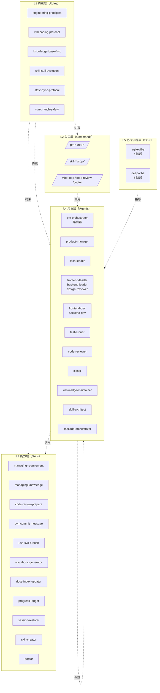

# 架构总览

> AIVibeCodingProj 的整体设计、五层架构、核心约束与设计权衡。

## 设计原则

### 1. 三端原生（Cursor + Claude Code + CodeBuddy）

不做"中间抽象层"——而是直接用三套工具的**原生设施**：

| 资产类型 | Cursor 原生 | Claude Code 原生 | CodeBuddy 原生 |
|---|---|---|---|
| 行为规则 | `.cursor/rules/*.mdc` | `CLAUDE.md` 通过 `@import` 引用 .mdc | `.codebuddy/rules/*.mdc`（与 .cursor/ 同 .mdc 格式） |
| 角色（Agent） | （没有 native agent；通过 commands 与 rules 模拟） | `.claude/agents/*.md` | `.codebuddy/agents/*.md`（与 .claude/ 同 schema） |
| 命令 | `.cursor/commands/*.md` | `.claude/commands/*.md` | `.codebuddy/commands/*.md`（与 .claude/ 同 schema） |
| 知识包（Skill） | 通过 rule 引用 SKILL.md | 通过 agent frontmatter `skills:` 字段引用 | 同 Claude（用户级 `~/.codebuddy/skills/` junction） |
| 配置 | `.cursor/mcp.json`（由 sync-mcp 镜像 .mcp.json） | `.claude/settings.json` + `.mcp.json`（项目根） | `.codebuddy/settings.json` + `.mcp.json`（共享） |
| 主入口 | `AGENTS.md`（Cursor 原生记忆文件） | `CLAUDE.md`（Claude 原生记忆文件） | `CODEBUDDY.md`（CodeBuddy 在 CODEBUDDY.md 缺失时自动 fallback 到 AGENTS.md） |

**三端共享关系**——所有跨端共享资产以 `.codebuddy/` 为**单一源**，`.cursor/` 与 `.claude/` 通过 **symbolic link** 引用同一份内容（编辑任一路径效果相同）：

| 共享资产（源） | 引用点（symlink） | 维护脚本 |
|---|---|---|
| `.codebuddy/rules/*.mdc` | `.cursor/rules/*.mdc` → `../../.codebuddy/rules/*.mdc` | `sync-codebuddy.sh/.ps1`（重建 symlink） |
| `.codebuddy/commands/*.md` | `.cursor/commands/*.md` 与 `.claude/commands/*.md` 同源 | 同上 |
| `.codebuddy/agents/*.md` | `.claude/agents/*.md` → `../../.codebuddy/agents/*.md` | 同上 |
| `.claude/settings.json` ↔ `.codebuddy/settings.json` | （**仍是 cp**——保留未来端专属 hook 分叉空间） | 同上 |
| `.mcp.json`（项目根） | （三端共享，直接读） | 无需脚本 |
| `.cursor/commands/*.md`（部分） | （Cursor 端额外的 sub-commands；保持 `sync-commands.sh` 兼容） | `sync-commands.sh/.ps1`（剥 frontmatter） |

> **为什么改用 symlink？** 原 ADR-0004 采用 cp 模式，导致同一资产在三端存 3 份、编辑后必须手动 sync、commit history 噪音翻倍。改用 symlink 后实现"三端共享 = 单一源"，违反不可能。详见 [ADR-0005](ADR/0005-symlink-three-way-share.md)。

ADR 演进路线：[ADR-0002](ADR/0002-cursor-claude-dual-native.md)（双端原生）→ [ADR-0004](ADR/0004-codebuddy-native-mirror.md)（三端 cp 镜像，被 0005 部分 supersede）→ [ADR-0005](ADR/0005-symlink-three-way-share.md)（三端 symlink 共享）。

### 2. 单一源原则（Single Source of Truth）

| 资产 | 单一源位置 | 其他位置 |
|---|---|---|
| Skill 定义 | `.codebuddy/skills/<group>/<name>/SKILL.md` | rules/agents 通过引用使用 |
| SOP 定义 | `.codebuddy/sop/<name>.md` | agents 读取，commands 引用 |
| 需求知识 | `requirements/<id>/spec/`（快照） + `notes.md`（演进） | 不复制到其他地方 |
| 项目知识 | `context/project/<name>/<topic>.md` | 用 markdown link 引用 |
| 状态机 | `requirements/<id>/meta.yaml`（结构化） + `process.txt`（人类可读日志） | INDEX.yaml 缓存（由 doctor 校验一致性） |

**违反单一源最直接的代价**：用户不知道改哪个、AI 读到旧版本、INDEX 漂移。
**模板的对策**：`/doctor` 命令把"INDEX 与实际不一致" / "占位符遗留" / "断链"标为不健康。

### 3. 状态先写后做（State-Sync Protocol）

详见 `.cursor/rules/45-state-sync-protocol.mdc`。

阶段切换、任务完成、agent 委派——**任何外部可观察的状态变化前**，必须先把状态写入 `meta.yaml` + `process.txt`，再做实际动作。

为什么：
- AI 会话可能中途中断
- 人也可能临时切走
- 下次接手必须能从 `meta.yaml` 读出"上次到哪"，从 `process.txt` 读出"上次为什么这么做"

执行者：`managing-requirement` Skill 的 6 种 operation 全都遵守这个顺序。

### 4. 不允许静默修改 Skill

详见 `.codebuddy/skills/_meta/self-evolution-protocol.md` 与规则 `30-skill-self-evolution.mdc`。

Skill 是协作的标准操作手册。如果 AI 可以随手改，几个 session 后没人知道为什么 Skill 变成现在这样、变更基于哪次实践——整套体系就废了。

强制流程：诊断 → 拟定 → **输出提案给用户** → 用户回复 y/n → 应用 + 记录变更历史。

### 5. 知识库优先（Knowledge-Base First）

详见 `.cursor/rules/20-knowledge-base-first.mdc`。

任何 agent 在做技术判断前必须**先**读项目知识库（`context/project/<name>/`）。
绝不"凭直觉"或"凭代码扫描"决策——除非知识库明确说"该处尚未沉淀"。

执行者：`session-restorer` Skill 在每个 agent 启动时强制加载 INDEX；`knowledge-maintainer` agent 在每个需求收尾时把可复用发现回写到知识库。

## 五层架构



| 层 | 含义 | 对应目录 | 计数 |
|---|---|---|---|
| L1 约束 | "不能做什么"的硬规则 | `.codebuddy/rules/*.mdc`（源） + `.cursor/rules/*.mdc`（symlink） | 10 |
| L2 入口 | 用户触发的命令 | `.codebuddy/commands/`（源） + `.claude/commands/`、`.cursor/commands/`（symlink） | 16 |
| L3 能力 | 可复用的标准操作手册 | `.codebuddy/skills/core/` + `.codebuddy/skills/project/`（单一源 + junction 链入三端） | 11 + 0 |
| L4 角色 | 各阶段的专业 Agent | `.codebuddy/agents/`（源） + `.claude/agents/`（symlink；Cursor 通过 commands+rules 模拟） | 14 |
| L5 流程 | 端到端协作流程定义 | `.codebuddy/sop/` | 2 + 模板 |

## Vibecoding 协议

来自规则 `10-vibecoding-protocol.mdc`，5 条核心约束：

1. **30 分钟原则**：单次 vibe-loop 目标必须能在 30 分钟内拿到可见反馈
2. **小步快跑**：单次提交对应单一改动
3. **可视反馈**：改完后必须跑预览/截图/单测
4. **状态先写**：改之前先在 process.txt 写打算做什么
5. **3-Time Rule**：同类操作做到第 3 次，触发 `/skill-new` 把它封装

整条 SOP 流程都在这 5 条之上构建。

## 资产数量统计

```text
Phase 0:   目录骨架 + INDEX 占位 + svn:ignore + 文档骨架     ≈ 25 KB
Phase 1:   8 条 .cursor/rules + AGENTS.md + CLAUDE.md       ≈ 50 KB
Phase 2:   14 agents + 16 commands × 3（三端镜像） + 2 配置  ≈ 145 KB
Phase 3:   11 skills + 5 references + 4 _meta + 3 SOP       ≈ 90 KB
Phase 4:   PowerShell + bash 脚本（init / doctor / new-* / sync-commands / sync-mcp / sync-codebuddy） + 11 文档 ≈ 110 KB
Phase 5:   .codebuddy/ 三端补齐 + CODEBUDDY.md + ADR-0004 + PHASE5-FINDINGS  ≈ 30 KB
─────────────────────────────────────────────────────────────────
v0.1 总计：                                                  ≈ 450 KB
```

## 关键设计决策

记录在 `.codebuddy/docs/ADR/`：

- [ADR-0001](ADR/0001-record-decisions.md) —— 用 ADR 记录决策
- [ADR-0002](ADR/0002-cursor-claude-dual-native.md) —— 双工具原生 vs 抽象层（CodeBuddy 部分被 ADR-0004 升级）
- [ADR-0003](ADR/0003-skill-single-source.md) —— Skill 单一源（不为 Cursor / Claude / CodeBuddy 各写一份）
- [ADR-0004](ADR/0004-codebuddy-native-mirror.md) —— CodeBuddy 升级为第三端原生（cp 镜像；§1-§2 被 ADR-0005 supersede）
- [ADR-0005](ADR/0005-symlink-three-way-share.md) —— 三端共享改用 symlink（`.codebuddy/` 为单一源）

## 何时这套架构**不**合适

| 场景 | 推荐 |
|---|---|
| 单次写一个脚本/小工具 | 直接和 AI 聊，不要走 SOP |
| 不是软件项目（写文档/写报告） | 用更简单的 prompt 模板 |
| 完全脱机环境 | 看具体 AI 客户端是否支持脱机；本模板的 commands 不需要联网，但 AI 客户端本身需要 |
| 团队还没准备好"按流程协作" | 先用 agile-vibe 走几个需求建立习惯，再考虑是否上 deep-vibe |

---
*文档版本：v0.1.0-alpha (Phase 4 完成)*
