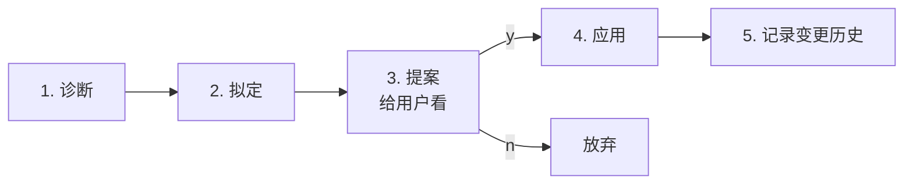

# Skill 指南

> Skill 是可被 AI 加载执行的「能力包」——把成功经验固化成"这件事就这么做"的标准操作手册。
>
> 本框架内置 11 个 core skill。用户可在 `.codebuddy/skills/project/` 下添加项目专属 skill。

## 怎么用

### 隐式调用（最常见）

Skill 通常**不需要用户显式触发**——agent 在自己的 prompt 里被告知"做 X 时调用 Y skill"。

例如：
- `closer` agent 收尾时自动调用 `managing-requirement` 与 `progress-logger`
- 任何 dev agent 提交代码前调用 `svn-commit-message` 生成符合规范的 commit msg

### 显式查看

```text
/skill-list                  列出所有可用 skill
```

直接读 `.codebuddy/skills/INDEX.md`。

### 显式调用某个 skill

```text
请按 .codebuddy/skills/core/svn-commit-message/SKILL.md 给我生成一个 commit message
```

或者在主会话直接说："照 doctor skill 跑一遍体检"。

### 创建/演进 skill

```text
/skill-new                   创建新 skill（委派 skill-architect）
/skill-evolve <name>         触发 self-evolution-protocol
```

## 11 个 Core Skill 速查

| Skill | 一句话 | 主要被谁用 |
|---|---|---|
| `skill-creator` | 按模板创建 skill 骨架 | `skill-architect` / `/skill-new` |
| `managing-requirement` | 需求生命周期 6 种 operation 的统一入口 | 主会话（PM 角色）/ `pm-*` 命令 / `req-*` 命令 |
| `managing-knowledge` | 把项目级发现写回 `context/project/` | `knowledge-maintainer` |
| `code-review-prepare` | 把 svn diff + AC + design 打包成评审 JSON | `code-reviewer` / `/code-review` |
| `svn-commit-message` | 生成 Conventional Commits 风格的提交信息 | 所有 dev agent |
| `use-svn-branch` | SVN 分支创建/切换/列出/清理 | dev agent / best-of-n 实验 |
| `visual-doc-generator` | 生成 6 类 mermaid 图 | 写文档的 agent |
| `docs-index-updater` | 文档增删改后同步 INDEX.md / INDEX.yaml | 任意写文档 agent / 收尾时 |
| `progress-logger` | 按 16 种事件类型规范化 process.txt 日志 | 所有写日志的 agent |
| `session-restorer` | 从 meta+process+plan 恢复会话上下文 | 主会话 第一步 |
| `doctor` | 4 维度健康检查（**只诊断不修复**） | `/doctor` |

每个 skill 的详细定义在 `.codebuddy/skills/core/<name>/SKILL.md`。

## 怎么写一个 Skill

### 1. 用脚手架命令

```text
/skill-new
```

会问：
- skill 名称（kebab-case）
- group：`core` 还是 `project`
- 一句话描述
- 是否需要 references / scripts / assets 子目录

→ 委派 `skill-architect` 按模板创建骨架。

### 2. 填实内容

按 `.codebuddy/skills/_meta/SKILL_TEMPLATE.md` 的 9 段填：

```markdown
---
name: your-skill-name
description: |
  一句话讲清楚此 skill 何时使用。AI 用 description 决定要不要加载。
tools: [Read, Write, Bash]   # 可选
model: claude-sonnet-4        # 可选
depends_on: [other-skill]     # 可选
---

# Your Skill Name

## 1. 何时使用
（触发条件）

## 2. 输入
（接受什么参数 / 上下文）

## 3. 步骤
1. ...
2. ...

## 4. 输出
（产出什么文件 / 状态变化）

## 5. 边界与陷阱
（已知坑 / 不适用场景 / 常见误用）

## 6. 引用
（references/ 下的文档；外部链接）

## 7. 相关 Skill
（与之协作的其他 skill）

## 8. 变更历史
（自进化记录）
```

### 3. 6 条 skill 写作原则

详见 `.codebuddy/skills/_meta/skill-authoring-guide.md`：

1. **description 决定加载** —— AI 用它判断是否调用，写得越具体越好
2. **可执行的步骤** —— 不是叙述"应该做什么"，而是"接下来这样做"
3. **边界即护栏** —— 写明"不该用此 skill 做什么"
4. **单一责任** —— 一个 skill 一件事；多件事拆多个 skill
5. **自包含** —— 不要假设 AI 已经看过别的文档
6. **触发自进化的明确条件** —— 写明在什么情况下应该 evolve

### 4. 注册到 INDEX

```text
/skill-list
```

实际上是直接读 `.codebuddy/skills/INDEX.md`——所以新 skill 写完后**必须**手工或通过 `docs-index-updater` 加到 INDEX。

## 自进化协议（Self-Evolution Protocol）

> 完整定义：[`.codebuddy/skills/_meta/self-evolution-protocol.md`](../skills/_meta/self-evolution-protocol.md)

执行任务时如果发现 skill 内容**过时 / 错误 / 遗漏**，按 5 步流程优化：



### 触发条件

| 编号 | 触发 |
|---|---|
| T1 | 执行报错（按 skill 指引跑命令失败，原因是 skill 内容错） |
| T2 | 逻辑修正（skill 步骤缺关键环节，需要 AI 自己"打补丁"才能完成） |
| T3 | 用户明确反馈（"这个步骤不对" / "其实应该这样") |
| T4 | 发现更优路径（多次实践证明替代方案更好） |

### 提案格式

```markdown
## Skill 优化提案

**Skill**: .codebuddy/skills/core/<name>/SKILL.md
**触发条件**: T1 / T2 / T3 / T4
**问题**: <具体描述>
**变更点**:

- 第 N 行：原文 `xxx` → 改为 `yyy`（理由：...）
- 新增 ## Attention 段：...

**已应用变更前后 diff** 见下：
\```diff
- 旧
+ 新
\```

**变更历史会追加**：
> 2026-04-29: <one-liner 描述>

是否应用？(y/n)
```

### 关键约束

🚨 **AI 不允许静默修改 Skill 文件**——任何变更前必须先输出提案、等用户回复 y。

> 这是模板最重要的硬规则之一。规则文件：`.cursor/rules/30-skill-self-evolution.mdc`。

## Skill 与 Agent 的关系

| | Skill | Agent |
|---|---|---|
| **本质** | "做某件事的标准操作手册" | "扮演某种角色的 AI 实例" |
| **粒度** | 一个具体动作（如：生成 commit msg） | 一个职责范围（如：所有前端实现） |
| **复用** | 跨多个 agent 与命令 | 通常只在自己的角色上下文里 |
| **演进** | 严格 5 步协议 | 通过人工迭代 + ADR |
| **存放** | `.codebuddy/skills/<group>/<name>/SKILL.md` | `.claude/agents/<name>.md` |

> 类比：Skill 是"配方"，Agent 是"厨师"。同一个配方多个厨师都能用。

## 项目专属 Skill

`.codebuddy/skills/project/` 是给落地项目放专属 skill 用的，不进核心模板。

例如某项目用了 SAP 系统，可以加：

```text
skills/project/sap-rfc-call/SKILL.md
```

里面包含 SAP RFC 调用的标准步骤、常用 endpoint、错误处理。

落地新项目时，project/ 通常一开始是空的，随着实践积累慢慢长出来。

## 常见问题

### "Skill 调用了但 AI 没真的按它做"

原因 99% 是 description 写得不够清楚 → AI 没识别出该调用此 skill。

修：把 description 重写得更具体（写明**触发场景**而非**功能描述**）。

例：

```diff
- description: 生成 commit message
+ description: |
+   在用户做完一组改动并准备提交（svn status 有改动文件）时，
+   按 Conventional Commits 规范生成 commit message。
+   不要在没有改动时调用。
```

### "新加了 skill，/skill-list 看不到"

跑 `/doctor`——多半是 INDEX 没更新。

或手工：

```powershell
# 看 .codebuddy/skills/INDEX.md 是否有这个新 skill 的条目
Select-String -Path skills\INDEX.md -Pattern '<your-skill-name>'
```

### "想跨项目复用 .codebuddy/skills/"

模板提供了 `init.ps1 -SkillsJunction -SkillsSource <path>` 选项——把 `.codebuddy/skills/` 建成 junction 指向共享源。

注意：junction 之后所有项目共享 skill，演进会影响多个项目。**只对完全成熟的 skill 这么做**。

---
*v0.1.0-alpha — Phase 4 完成时的 11 个 core skill + 4 个 _meta 元资产。*
