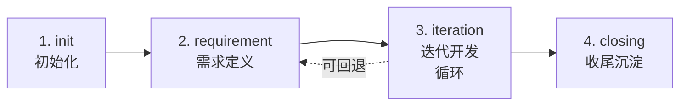
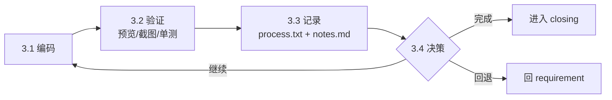
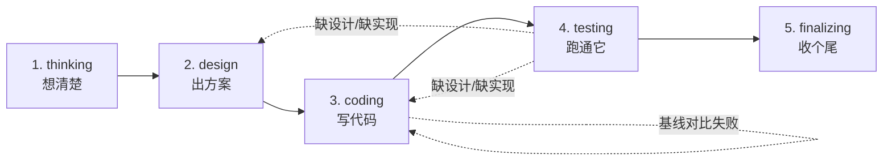

# SOP 指南

> SOP（Standard Operating Procedure）定义了"从需求到交付"的协作流程。
> 本框架内置两套，按场景切换。
>
> SOP 不是"必须严格遵守的指令"——它是"约定好的协作姿势"。允许在阶段间灵活回退、跨阶段并行——但**每次切换阶段必须留痕到 process.txt**。

## SOP 选型矩阵

| 场景 | 推荐 |
|---|---|
| 单人小功能、bugfix、原型探索、技术 spike | **agile-vibe** |
| 跨团队需求、架构变更、需要正式评审、合同型需求 | **deep-vibe** |
| 不确定？默认从 agile-vibe 开始；半路觉得太轻量了再切 deep-vibe | agile-vibe |

## agile-vibe（默认）

**适用**：功能探索、快速原型、bugfix、技术改进、单人或小组 vibecoding。

**4 阶段**：



| 阶段 | 主要产出 | 主导角色 |
|---|---|---|
| 1 init | meta.yaml / process.txt / plan.md / notes.md 骨架 | （脚本） |
| 2 requirement | `spec/需求简述.md` | `product-manager` |
| 3 iteration | 代码 + `tasks/features.json` + process.txt 迭代记录 | **用户与主会话直接协作**（vibe-loop） |
| 4 closing | `spec/最终需求.md` + 评审 + 沉淀 | `code-reviewer` + `closer` + `knowledge-maintainer` |

**iteration 阶段的循环（vibe-loop）**：



**关键约束**：

- 单次 vibe-loop 目标 **≤ 30 分钟**（30 分钟原则）
- 每次循环必须 **跑可见反馈**——预览/截图/单测，不能仅 grep 自查
- iteration 不强制委派 dev agent——用户与主会话直撸为主，复杂改动才切 agent

详见 [`.codebuddy/sop/agile-vibe.md`](../sop/agile-vibe.md)。

## deep-vibe（重型）

**适用**：跨团队需求、需要正式评审的架构变更、需要完整设计文档作合同的需求。

**5 阶段**：



| 阶段 | 主要产出 | 主导角色 |
|---|---|---|
| 1 thinking | `spec/需求文档.md`（含 AC） | `product-manager` |
| 2 design | `design/技术方案.md` + `前端方案.md` + `后端方案.md` + `协议定义.md` + `方案评审.md` | `tech-leader` + `frontend-leader` + `backend-leader` + `design-reviewer` |
| 3 coding | 代码 + `tasks/features.json` + 每任务的 dev 笔记 | `frontend-dev` + `backend-dev` |
| 4 testing | `design/测试报告.md`（含基线对比） | `test-runner` |
| 5 finalizing | `spec/最终需求.md` + `design/代码评审.md` + `notes.md` 整理 + 知识沉淀 | `code-reviewer` + `closer` + `knowledge-maintainer` |

**design 阶段的子阶段**：

| 子阶段 | 任务 | 角色 |
|---|---|---|
| 2.1 复杂度评估 | 由 tech-leader 评估，决定后续协作模式 | tech-leader |
| 2.2 框架方案 | 整体技术选型、模块划分 | tech-leader |
| 2.3 细化方案 | 前端/后端各自细化 | frontend-leader + backend-leader |
| 2.4 评审 | 完整性 / 一致性 / 可行性 / 风险 | design-reviewer |

**关键约束**：

- 阶段 4 的测试必须做**基线对比**（哪些是新增失败 / 历史遗留 / 新增通过）
- 阶段 5 的代码评审必须**三视角**（实现质量 / 与需求一致 / 与方案一致）
- design 评审不通过不能进入 coding（评审是 hard gate）

详见 [`.codebuddy/sop/deep-vibe.md`](../sop/deep-vibe.md)。

## 切换 SOP

### 新需求时选

`/pm-new` 会问一次。回车默认 `agile-vibe`。

### 中途切换

修改 `requirements/<id>/meta.yaml`：

```yaml
sop: deep-vibe   # 原来是 agile-vibe
```

并在 `process.txt` 追加一行说明原因：

```text
[2026-04-29 16:30] sop_change: agile-vibe → deep-vibe（理由：发现需要跨团队协作，要正式设计文档）
```

切换后主会话会按新 SOP 的阶段流转。

> 注意：`agile-vibe` 的 phase 编号（1.init / 2.requirement / 3.iteration / 4.closing）与 `deep-vibe`（1.thinking / 2.design / ...）**不兼容**。切换时通常要把 `phase` 字段也改成新 SOP 的合法值——参考 [`.codebuddy/sop/<new-sop>.md`](../sop/) 的阶段定义。

## 自定义 SOP

1. 复制 `.codebuddy/sop/_template_sop.md` 为 `.codebuddy/sop/<your-name>.md`
2. 按模板里的 frontmatter 填阶段定义、状态机、与其他 SOP 的关系
3. 跑 `/sop-list` 验证
4. 更新 `.codebuddy/sop/INDEX.md`
5. 在 `meta.yaml` 中用 `sop: <your-name>`

## 主会话边界（重要）

无论哪个 SOP，**主会话只负责编排与委派**：

- 读状态文件、判断当前阶段、记录状态
- 通过 subagent 启动对应阶段执行者
- 变更留底（process.txt、meta.yaml）

**主会话严禁**：

- 直接修改 `spec/`、`design/`、`tasks/` 下的**阶段产物**（这些必须由对应 agent 产出）
- 替代阶段 agent 整理用户回答（参见 [AGENT_GUIDE.md](AGENT_GUIDE.md) 的"用户回答回流规则"）
- 直接回答本应由阶段 agent 继续澄清的问题

详见 `.cursor/rules/10-vibecoding-protocol.mdc`。

> 例外：agile-vibe 的 iteration 阶段允许用户与主会话直撸（不强制走 dev agent）——但仍要按 vibe-loop 协议留痕。

## SOP 间的回退

```text
deep-vibe.coding ─失败/重新设计─▶ deep-vibe.design
agile-vibe.iteration ─需求改了─▶ agile-vibe.requirement
deep-vibe.* ─发现太重─▶ agile-vibe.*  （需用户确认 + 在 notes.md 记录）
```

回退也要在 `process.txt` 留痕：

```text
[2026-04-29 16:35] phase: 3.coding → 2.design（理由：发现 backend 数据模型需要重新设计）
```

## 这些不是 SOP 应该处理的事

| 反例 | 应该走 |
|---|---|
| "怎么写一个 React 组件" | 不需要 SOP，直接和 AI 聊 / 跑 `/vibe-loop` |
| "今天我要做什么" | 不需要 SOP，看 `/pm-status` |
| "重构整个项目" | 这是元任务，先开一个 deep-vibe 需求专门讨论 |
| "AI 写不出代码" | 这是 vibecoding 协议的事，看 `.cursor/rules/10-vibecoding-protocol.mdc` |

---
*v0.1.0-alpha — Phase 4 完成时的 2 个 SOP 实现 + 模板。*
