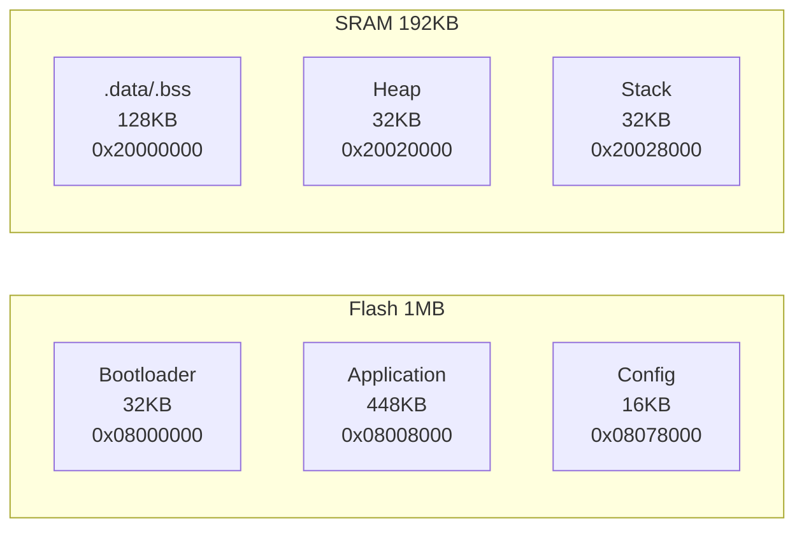

# 知识库文档标准模板

> 本文档定义 knowledge-base-generator 生成的 .md 文件必须遵循的格式规范。
> 所有知识库文档必须通过本模板的检查清单验证。

## 文档结构模板

```markdown
# <标题：一句话概括本文档覆盖范围>

> 来源: <原始来源路径或"首次扫描">
> 创建时间: YYYY-MM-DD
> 最近更新: YYYY-MM-DD（如已更新过）

## 概述（可选，仅架构层顶层文档需要）

<2-3 句话说明本文档在项目中的位置和阅读顺序>

## <核心主题 1>

### <子主题 1.1 或直接正文>

<正文规范见下文 §内容格式规范>

## <核心主题 2>

...

---

*关键源文件: `<path1>`, `<path2>`*
```

## 内容格式规范

### 代码引用格式

**必须格式**：每个引用的代码实体必须标注文件路径和大致行数/大小。

```markdown
**文件**：`Assets/Scripts/Framework/GameRoot/GameRoot.cs`（12.5 KB，300+ 行）
```

**类/接口引用**：
```markdown
`ClassName`（继承自 `BaseClass`，实现 `IInterface1`, `IInterface2`）
```

**代码块**：必须标注语言，关键逻辑加行内注释。

```csharp
// 注释使用中文（遵循项目约定）
public class Example : MonoBehaviour
{
    private int _counter;  // 私有字段用下划线前缀
}
```

### 表格使用标准

| 列数 | 适用场景 | 必含列 | 示例标题 |
|---|---|---|---|
| 2 列 | 特性描述、选项对比 | `特性` `说明` | 设计模式名称 → 一句话说明 |
| 3 列 | 属性/方法速查 | `字段/方法` `类型` `说明` | 接口方法名 → 返回类型 → 职责 |
| 4 列 | 生命周期对照、选项决策 | `阶段/方法` `时机` `用途` `标志` | hook 名 → 调用时机 → 典型用途 → 关键状态 |
| 5 列 | 选项决策带推荐 | 同 4 列 + 推荐 | — |

**表格必须满足**：
- 表头行用 `|---|---|---|` 分隔
- 代码实体用反引号包裹（如 `` `SysInitial()` ``）
- 不允许超过 5 列（超过时拆分为多个表格）

### Mermaid 图使用规范

**必须使用的场景**：
- 任何涉及 ≥ 3 个参与者/模块交互的流程 → `sequenceDiagram`
- 任何涉及状态切换的流程 → `stateDiagram-v2`
- 类继承关系 → `classDiagram`
- 架构分层 → `graph TD` 或 `flowchart`

**禁止使用的场景**：
- 2 个参与者以内的简单调用 → 表格或文字描述即可

**格式要求**：
- 每个 mermaid 图前加一行说明文字（如"下图展示 X 的完整生命周期："）
- 参与者名称用缩写（如 `GR` 代表 `GameRoot`），图中用 `Note` 注释全称
- 不要在图内写超长中文（超过 10 个字改用 `Note`）

### 格式层级检查清单

生成每个文档后逐项自检：

#### 结构检查
- [ ] 有 `# <标题>`（一级标题，仅一个）
- [ ] 有创建时间和来源标注
- [ ] 至少 2 个 `## <核心主题>` 二级标题
- [ ] 文件末尾有源文件引用

#### 内容密度检查
- [ ] 每 50 行至少有 1 个代码引用或表格或 mermaid 图
- [ ] 不允许连续 20 行纯文字描述（无代码/表格/图）
- [ ] 所有"流程描述"都配有 mermaid 图或表格

#### 可追溯性检查
- [ ] 每条技术事实都有 `<file>:<line>` 或类名引用
- [ ] 不存在"X 系统负责 Y"这种无代码实体的描述
- [ ] 不存在"应该是"、"可能是"等猜测性表述
- [ ] 不存在未标注的假精确数字（`~70%`、`约 300 个`）；如为估算须写"抽样估算"或改用"少数/多数/绝大多数"
- [ ] 所有 `[text](path)` 内部链接的目标文件都存在；指向未生成知识库须显式标 `[待生成]`

#### AI 可读性检查
- [ ] 表格和 mermaid 图前后有空行（Markdown 解析兼容）
- [ ] 文件路径用反引号，目录路径不加反引号
- [ ] 代码块标注了正确的语言标识
- [ ] 没有裸 URL（都已用 `[text](url)` 格式）

## 分类特定格式要求

### architecture/ 文档额外要求
- [ ] 首文档（overview.md）必须有项目架构分层图（mermaid flowchart）
- [ ] 每个生命周期文档必须有 sequenceDiagram
- [ ] 设计模式文档每个模式必须配代码示例
- [ ] 配置总览（`config-files.md`）必须含三类配置对比表 + 决策表 + 各文件类型标注
- [ ] 外部数据配置（`table-config-system.md`）必须含加载管线图（mermaid graph + sequenceDiagram）+ 管理层缓存策略 + 读取决策树

### conventions/ 文档额外要求
- [ ] 每份 how-to 必须有 "前置条件" + "完整模板" + "验证方法" 三段
- [ ] 代码模板可直接复制粘贴使用
- [ ] 标注常见错误和解决方案（至少 2 条）

### systems/ 文档额外要求
- [ ] systems-index.md 必须有一张完整的 System 表格（名称 | 路径 | 职责 | 状态绑定）
- [ ] 深度文档必须有生命周期图或关键 API 表
- [ ] 非核心 System 可在索引表中标注 "详见源码" 而非生成空文档

### uictrl/ 文档额外要求
- [ ] uictrl-framework.md（若存在）必须有：两层架构图（mermaid flowchart）、Property 类型速查表（type | NGUI 组件 | 用途）、CreateUI/DestroyUI 代码模板
- [ ] uictrl-architecture.md 必须有继承链图
- [ ] uictrl-common-components.md 每个组件必须有：名称 | 路径 | 核心 API | 典型用法

### gameplay/ 文档额外要求
- [ ] 核心接口/抽象类必须有完整方法签名表
- [ ] 继承树用 mermaid classDiagram 或文字缩进树
- [ ] 如需描述算法，用伪代码而非大段中文叙述

### hardware/ 文档额外要求（嵌入式项目特有）

嵌入式项目知识库的核心价值在于 **"不用翻数据手册就能找到关键信息"**。

#### 寄存器表格式
- [ ] 必须包含四列：`寄存器名称 | 偏移 | 位宽 | 功能说明`
- [ ] 对关键寄存器进一步展开为位字段表：`位段 | 名称 | 读写 | 复位值 | 说明`

```markdown
### USART_CR1 控制寄存器 1（偏移 0x0C）

| 位段 | 名称 | 读写 | 复位值 | 说明 |
|---|---|---|---|---|
| 0 | SBK | rw | 0 | 发送断开帧 |
| 2 | RE | rw | 0 | 接收使能 |
| 3 | TE | rw | 0 | 发送使能 |
| 5 | RXNEIE | rw | 0 | 接收缓冲区非空中断使能 |
| 12 | M | rw | 0 | 字长（0=8位, 1=9位） |
| 13 | UE | rw | 0 | USART 使能 |
```

#### 中断向量表格式
- [ ] 必须五列：`位置 | 优先级 | IRQ号 | 处理函数 | 触发源`
- [ ] 代码中必须有对应的 `void XXX_IRQHandler(void)` 函数签名引用

#### 内存布局图
- [ ] 必须用 mermaid flowchart 或 ASCII art 展示 Flash/SRAM 分区
- [ ] 每个分区标注：起始地址、大小、用途



#### 引脚配置表格式
- [ ] 必须六列：`Pin | 功能 | 复用(AF) | 方向 | 上下拉 | 最大速度`
- [ ] 表后附 CubeMX/配置工具截图（如存在）

#### 时钟树
- [ ] 必须有简化的 ASCII 时钟树路径（如 `HSE(8MHz) → PLL(×336, /2, /8) → SYSCLK(168MHz) → AHB /1 → APB1 /4 → APB2 /2`）
- [ ] 各总线最终频率必须明确（不是分频系数）

#### 启动流程
- [ ] 汇编阶段和 C 阶段必须分开描述
- [ ] 汇编阶段用**文字步骤**（不要用 mermaid，汇编不适用流程图），附文件引用
- [ ] C 阶段可以用 mermaid sequenceDiagram

### frontend/ 文档额外要求（Web前端项目特有）
- [ ] 组件树用缩进文字树或 mermaid flowchart
- [ ] 每个基础组件必须有 Props 表（`Prop | 类型 | 默认值 | 说明`）
- [ ] 路由表必须四列：`路径 | 页面组件 | 权限要求 | 懒加载`

### data/ 文档额外要求（数据/AI项目特有）
- [ ] 数据 schema 必须有完整 DDL 或类型定义
- [ ] 模型架构必须有层级结构表（`层类型 | 输入Shape | 输出Shape | 参数量`）
- [ ] 数据管道用 mermaid flowchart 展示完整拓扑

## 反模式（禁止的写法）

| 反模式 | 问题 | 正确写法 |
|---|---|---|
| "X 系统负责管理 Y 和 Z" | 无代码实体，AI 无法验证 | "`XSystem`（`path/to/XSystem.cs`）提供 `DoY()` 和 `DoZ()` 方法" |
| "详见源码" 出现在深度文档中 | 深度文档的目的就是避免读源码 | 提取关键签名，引用行号 |
| 一段超过 20 行的纯文字 | AI 难以提取结构化信息 | 拆成表格或列表 |
| 表格超过 5 列 | 显示混乱 | 拆成两个 3-4 列表格 |
| mermaid 图中写超长中文 | 渲染效果差 | 用缩写 + Note 注释 |
| "可能还有 X，Y，Z..." | 猜测性表述 | 标注 `[待验证]` 或直接略过 |
| "~70% 的表使用 X" 但无统计脚本 | 假精确数字，AI 会当事实引用 | 写"抽样估算多数"或补 grep 命令让读者自查 |
| `[README](../other-kb/INDEX.md)` 但目标未生成 | 死链，AI 追引用时无法解析 | 加 `[待生成]` 标签或删除链接 |

## 变更历史

| 日期 | 版本 | 变更 | 触发原因 | 操作者 |
|---|---|---|---|---|
| 2026-07-15 | 0.1.2 | 联动 SKILL v0.2.2：可追溯性检查追加两项（假精确数字禁令 + 内部链接有效性）；反模式表追加两条（假精确数字 + 死链） | 首次全量审查 wepop-xlua 产物发现假精确数字与虚引用两类缺陷 | 主会话 |
| 2026-07-15 | 0.1.1 | architecture/ 额外要求追加配置文档格式检查：config-files.md 须含三类对比表+决策表，table-config-system.md 须含加载管线图+缓存策略+决策树 | 用户要求配置按数据归属拆三类独立文档，需配套格式检查 | 主会话 |
| 2026-07-14 | 0.1.0 | 初始创建，与 SKILL.md 配套作为文档模板标准 | 3-Time Rule | 主会话 |
