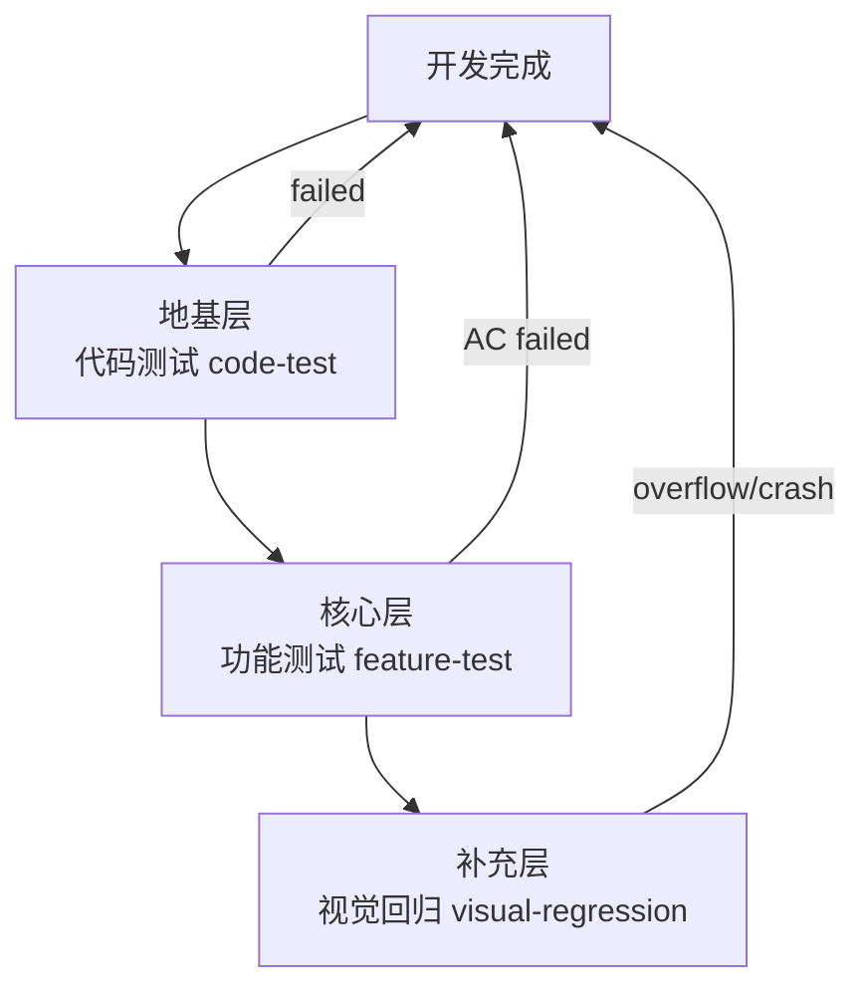

# self-testing skill

> **核心理念**：测试的核心不是"代码能跑"，是"**用户目标能达成**"。
> 本 skill 以**功能测试**（Feature Verification）为主线，代码测试与视觉回归为辅助支撑。

## 何时启动

- SOP = agile-vibe，阶段 3 iteration 收尾前（用户即将判定"功能基本完成"时）
- 用户说"跑一下自测" / "验证一下" / "验一下 AC" / "自测一下"
- code-reviewer 步骤 2.5 反馈 ac-verification.md 缺失或不合规

## 三层测试模型



| 层 | 性质 | 触发 | 核心产物 | 30 分钟原则占比 |
|---|---|---|---|---|
| **地基·代码测试** | 防低级 crash | 有单测的项目 | `test-report/code-test.log` | ≤ 5 分钟 |
| **核心·功能测试** ⭐ | 用户视角验 AC | **每个需求必做** | `test-report/ac-verification.md` + `screenshots/ac-N-step-M.png` | 15-25 分钟 |
| **补充·视觉回归** | 布局不溢出 | UI 类改动 | 3 视口静态截图 | ≤ 5 分钟 |

---

## 第 1 层 · 功能测试（Feature Verification）· 核心 · 必做

**目标**：以用户视角，逐 AC 真实操作产物，证明"功能真的达成"。

### 执行流程

1. **加载 AC 清单**：从 `spec/需求简述.md` / `spec/需求文档.md` 提取 AC-1 … AC-N
2. **启动产物**：
   - Flutter sim：`flutter run -d windows`
   - Web 页面：`npm run dev` + 打开对应 URL
   - 命令行工具：直接跑目标命令
3. **逐 AC 执行**：
   - 设计 ≤ 5 步用户操作路径（"我作为用户，会怎么用这个功能"）
   - 逐步操作 + 每步（或关键步）截图到 `requirements/<req-id>/screenshots/ac-<N>-step-<M>-<desc>.png`
   - 观察实际现象，与预期对比
4. **填写报告**：逐 AC 填入 `test-report/ac-verification.md`（模板见 `references/ac-verification-template.md`）

### 通过标准

- ✅ 每个 AC 有对应操作截图（≥ 1 张，命名 `ac-<N>-step-<M>-<desc>.png`）
- ✅ 无法验证的 AC 显式标 `未验证 / 理由: <说明>`（不是留空、不是填 ✅）
- ✅ 末尾勾选 3 项诚实声明

### 反面案例（禁止行为）

| ❌ 错误行为 | ✅ 正确做法 |
|---|---|
| 看代码觉得应该 pass，AC 表全填 ✅ | 必须真实操作产物，观察现象再判定 |
| 只截 1 张"最终形态大合影"就算全 AC 通过 | 每 AC 独立截图链，展示操作过程 |
| 复用上一 session 的截图 | 每次自测都要重新截，mtime 应在 phase 3 内 |
| 未验证的 AC 静默漏掉 | 显式标"未验证 / 理由: ..." |

---

## 第 2 层 · 代码测试（Code Test）· 地基 · 有单测项目才做

**目标**：跑单测防低级 crash / regression，5 分钟内出结果。

### 执行

| 语言/框架 | 命令 |
|---|---|
| Flutter/Dart | `flutter test 2>&1 \| tee test-report/code-test.log` |
| Java (Maven) | `mvn test 2>&1 \| tee test-report/code-test.log` |
| Java (Gradle) | `./gradlew test 2>&1 \| tee test-report/code-test.log` |
| Go | `go test ./... -v 2>&1 \| tee test-report/code-test.log` |
| Node.js | `npm test 2>&1 \| tee test-report/code-test.log` |
| Python | `pytest -v 2>&1 \| tee test-report/code-test.log` |

### 豁免

无单测项目（如 UI-only demo / 纯脚本工具）→ 在 `ac-verification.md` 顶部注明：

```
本项目无单测框架，仅执行第 1 层功能测试。
```

---

## 第 3 层 · 视觉回归（Visual Regression）· UI 改动才做

**目标**：证明"不同视口下没溢出没崩"，对齐 `80-phet-sim-checklist.mdc §七 M1`。

### 触发条件

改动涉及以下路径任一：
- `lib/**/screens/`
- `lib/**/view/`
- `lib/common/widgets/`

### 执行

1. `flutter run -d windows`
2. 分别调整窗口至以下 3 个视口，各截 1 张全景图：

| 视口尺寸 | 场景 | 文件名 |
|---|---|---|
| 375×667 | 手机竖屏 | `screenshots/<sim>-mobile-portrait.png` |
| 1024×768 | 平板横屏 | `screenshots/<sim>-tablet-landscape.png` |
| 1920×1080 | 桌面 | `screenshots/<sim>-desktop.png` |

3. 观察：黄黑警戒条纹 / 红色 error banner / RenderFlex overflowed → 阻塞

### ⚠️ 重要边界

**视觉回归 ≠ 功能测试**。3 视口静态截图只证明"布局没崩"，**不能代替**第 1 层的逐 AC 操作证据。

---

## ac-verification.md 模板

见 `references/ac-verification-template.md`（本 skill 独立文件）。

---

## 诚实边界（对齐 60-citation-and-honesty.mdc）

### 绝对禁止

- ❌ 未真实操作产物却在 ac-verification.md 报告 ✅
- ❌ 用"看代码觉得应该过"填入 ✅
- ❌ 用历史 session 遗留截图冒充本次证据
- ❌ 把静态 3 视口截图当作 AC 验证证据（3 视口只证明"没崩"）
- ❌ 把"部分失败"包装成"全部通过"
- ❌ **全部 AC 填 `⚠️ 静态推演` / `未验证` 却勾选诚实声明第 1 条** —— 相当于"本次自测未执行"却报告 pass（详见下方"零真操作"边界）

### 正确做法

- ✅ 每个 ✅ 都必须能对应到"我做了操作 X → 观察到现象 Y → 与预期 Z 一致"
- ✅ 未跑的 AC 显式标 `未验证 / 理由: <说明>`
- ✅ 部分失败的 AC 如实标 ⚠️ 或 ❌，failures 段列具体现象
- ✅ 每次自测使用本次运行产出的截图（mtime 在 phase 3 期间）
- ✅ **真操作 AC 数 ≥ 1** 才允许勾选诚实声明第 1 条；全部为静态推演/未验证 → 报告 header 标 `self-test not executed · reason: <说明>`，视为"未执行"（等同 test_exempt，但需 code-reviewer 单独判定放行）

### 零真操作边界（新增 · 2026-08-05）

实证触发：`req-verify-selftest-color-vision` 4 AC 全填 `⚠️ 静态推演` 却勾了诚实声明——字面上没谎报，但**闭环并未被真实验证过**。规则如下：

**3 场景判定**：

| 场景 | 真操作 AC 数 | 诚实声明第 1 条 | 报告 header | 处置 |
|---|---|---|---|---|
| **正常自测** | ≥ 1 | ✅ 可勾 | 正常 | code-reviewer 走步骤 2.5 常规验 |
| **零真操作** | 0（全 ⚠️/未验证） | ❌ **禁止**勾 | 必须写 `self-test not executed · reason: <说明>` | code-reviewer 判定：若理由合理（如"当前环境无 GUI"）→ 参照 test_exempt 放行；若无合理理由 → Blocker 退回 |
| **偷跑作弊** | 0 但勾了第 1 条 | ⚠️ 违规 | 未标 not executed | code-reviewer **Blocker**：以"零真操作报告 pass"退回，要求补跑或改 header |

**为什么要单列这条**：`60-citation-and-honesty.mdc` 的"诚实边界"只禁止"编造事实"，但**未禁止"不做事却勾声明"**。本条堵住这个漏洞——诚实声明第 1 条的语义是"本次自测**已执行**"，零真操作等价于"未执行"。

---

## 与其他协作产物的联动

| 联动对象 | 关系 |
|---|---|
| `.codebuddy/sop/agile-vibe.md` §阶段 3 第 9 条 | 本 skill 是该强制约束的**执行手册** |
| `.claude/agents/code-reviewer.md` 步骤 2.5 | 本 skill 产出的 ac-verification.md 是 reviewer 的**验证对象** |
| `.codebuddy/scripts/check-before-done.{sh,ps1}` 检查 6 | 脚本做软警告兜底 |
| `.codebuddy/rules/80-phet-sim-checklist.mdc §七 M1` | 第 3 层视觉回归的具体规范 |
| `.codebuddy/rules/60-citation-and-honesty.mdc` "报告测试结果时" | 诚实声明的规则依据 |
| `.codebuddy/rules/10-vibecoding-protocol.mdc` 第 3 条"可视反馈优先" | 本 skill 是该原则的**产物化落地** |

---

## 变更历史

> 2026-08-06 by req-verify-selftest-color-vision γ 收尾（用户确认 C=c2 · 简化模式）：
> 联动脚本增强：`check-before-done.{sh,ps1}` 加"零真操作"程序化检测（警告级 · c2 模式）。
> - sh + ps1 加 Check 6.5：若 AC 表全 ⚠️/未验证/静态推演 · header 未标 `self-test not executed` · 但勾选诚实声明 ≥ 3 项 → **Warning**（不阻塞门禁 · 保留 LLM 自律主责）
> - 从"仅 skill 层 LLM 自律"升级为"脚本层协同警告"，让 code-reviewer 与主会话都能看到明确的信号
> - 未选择"阻塞级"（c1）：因为强耦合 ac-verification.md 表格格式关键字 · 且若强阻塞会影响已跑需求的收尾 · 保留渐进演进空间（若未来出现第 3 次"漏"实证 · 走 3-Time Rule 升级为 c1）
> - 触发原因：审查发现脚本检查 6 只数复选框 · 不数 AC 表内容 · `req-verify-selftest-color-vision` 那次的偷跑漏洞至今未被程序化封堵
> - 兼容性：向后兼容 · 只在明确"零真操作+勾声明+无 not-executed header"组合下警告 · 正常自测（≥1 真操作 · 如本报告 AC-2）不受影响
> - 联动改动：`.codebuddy/scripts/check-before-done.ps1` v1.2.0（Diff-2 ps1 豁免关键字双语对齐）· `.claude/agents/code-reviewer.md` 删除 experience-injector.sh 死引用段

> 2026-08-05 by 主会话（用户确认 y · Diff-3）：v0.1.1 · 补"零真操作"边界。
> - "绝对禁止"段追加第 6 条：全 AC 为 ⚠️/未验证 却勾诚实声明第 1 条 → 视为违规
> - "正确做法"段追加第 5 条：真操作 AC ≥ 1 才允许勾第 1 条；全静态推演须标 `self-test not executed`
> - 新增"零真操作边界"子段：3 场景判定表 + code-reviewer 处置指引
> - 实证触发：`requirements/req-verify-selftest-color-vision/test-report/ac-verification.md` 4 AC 全 ⚠️ 静态推演却勾了诚实声明（本会话 review 发现的 Blocker-2）
> - 联动改动：`.codebuddy/scripts/check-before-done.ps1` v1.1.0（Diff-1 中英文文件名统一）

> 2026-07-31 by 主会话（用户确认 全 y · 4 Diff 组合）：初版。
> - 以功能测试（Feature Verification）为核心，代码测试与视觉回归为辅助层
> - 承载"用户视角验 AC"的方法论 + ac-verification.md 强制产物规范
> - 与 agile-vibe.md v0.2.1 阶段 3 第 9 条 + code-reviewer.md 步骤 2.5 联动
> - 触发原因：用户 2026-07-31 提出"AI vibecoding 开发完后自主功能测试方案"的建议 + 澄清"代码测试 ≠ 功能测试"的核心缺口
