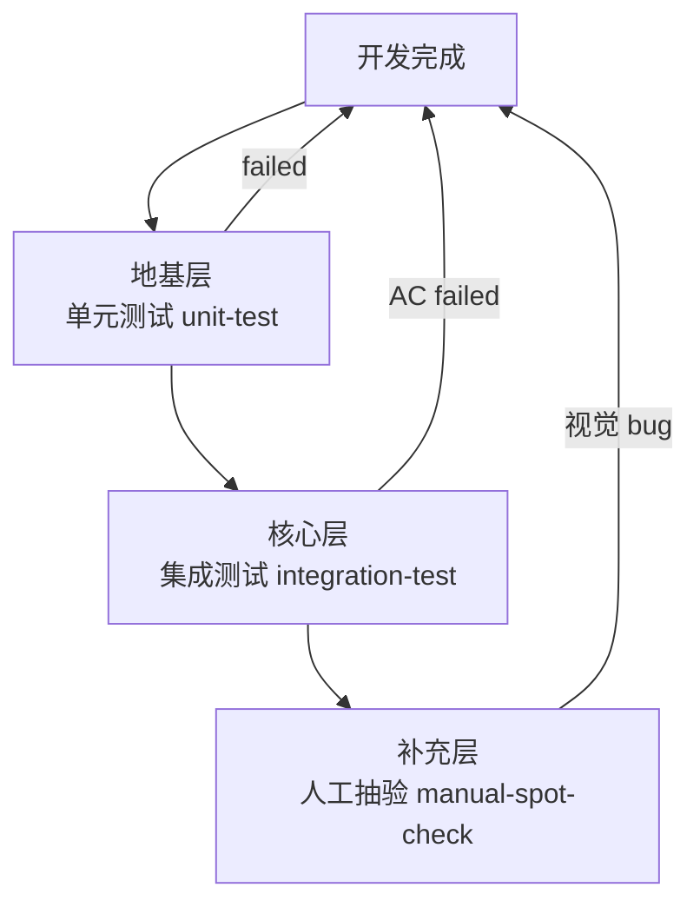

# self-testing skill

> **核心理念**：测试的核心不是"代码能跑"，是"**用户目标能达成**"。
> **v0.2.0 变更**：AI 无 GUI 截图能力 · 强制截图 = 强制打断用户 · 本 skill 转向**自动化断言优先** · 视觉证据降为**可选**。

## 何时启动

- SOP = agile-vibe，阶段 3 iteration 收尾前（用户即将判定"功能基本完成"时）
- 用户说"跑一下自测" / "验证一下" / "验一下 AC" / "自测一下"
- code-reviewer 步骤 2.5 反馈 ac-verification.md 缺失或不合规

## 三层测试模型（v0.2.0 · 自动化优先）



| 层 | 性质 | 触发 | 核心产物 | 是否强制 |
|---|---|---|---|---|
| **地基·单元测试** | 防低级 crash | 有单测的项目 | `test-report/unit-test.log` | 有单测项目必做 |
| **核心·集成测试** ⭐ | integration_test 断言 AC | **每个需求必做** | `integration_test/*_test.dart` + `test-report/integration-test.log` | **强制** · 无豁免视为未自测 |
| **补充·人工抽验** | 视觉/交互类 AC · AI 覆盖不到 | 用户按需 | 用户口头/文字描述验证结果（可选截图） | **不强制** |

---

## 第 1 层 · 集成测试（Integration Test）· 核心 · 必做

**目标**：以 integration_test 断言逐 AC · 无需人工介入 · 无需截图。

### 执行流程

1. **加载 AC 清单**：从 `spec/需求简述.md` / `spec/需求文档.md` 提取 AC-1 … AC-N
2. **编写/更新** `integration_test/<sim>_test.dart`：每 AC 对应 ≥ 1 个 `testWidgets` group
3. **运行**：`flutter test integration_test/<sim>_test.dart -d windows 2>&1 | tee test-report/integration-test.log`
4. **填写报告** `test-report/ac-verification.md`：每 AC 引用 `test file:line` + 通过状态（不需要截图）

### AC 类型划分（v0.2.0 新增）

| AC 类型 | integration_test 能否覆盖 | 处置 |
|---|---|---|
| **数据/状态类**（如"点 Red · perceived color = Red"）| ✅ 能 | 写断言 · 报告引用 test file:line |
| **交互流程类**（如"拖动 slider · 值从 400 变 700"）| ✅ 能 | 写 `tester.drag` · 报告引用 test file:line |
| **崩溃/溢出类**（如"3 视口均无 RenderFlex overflowed"）| 🟡 部分能 | 单 viewport 能 catch · 多 viewport 靠 flutter analyze |
| **视觉美观类**（如"主图居中好看 · 颜色协调"）| ❌ 不能 | 标 `未验证 / 理由: 需人工抽验` · 转第 3 层 |

### 通过标准

- ✅ 每个数据/交互类 AC 有对应 test 断言 · integration-test.log 显示 pass
- ✅ 视觉/美观类 AC 显式标 `未验证 / 理由: 需人工抽验`（不填 ✅）
- ✅ 末尾勾选 3 项诚实声明（要求同 v0.1.x）

### 反面案例（禁止行为）

| ❌ 错误行为 | ✅ 正确做法 |
|---|---|
| 看代码觉得应该 pass · AC 表全填 ✅ | 必须有 integration_test 断言通过 · 或明确标未验证 |
| 数据类 AC 明明能自动化却标"未验证" | 优先写断言 · 只对真的自动化不了的（视觉/美观）标未验证 |
| 让用户手动截图证明 AC 通过 | v0.2.0 起**禁止**要求用户为强制自测截图 |

---

## 第 2 层 · 单元测试（Unit Test）· 地基 · 有单测项目才做

**目标**：跑单测防低级 crash / regression，5 分钟内出结果。

### 执行

| 语言/框架 | 命令 |
|---|---|
| Flutter/Dart | `flutter test 2>&1 \| tee test-report/unit-test.log` |
| Java (Maven) | `mvn test 2>&1 \| tee test-report/unit-test.log` |
| Java (Gradle) | `./gradlew test 2>&1 \| tee test-report/unit-test.log` |
| Go | `go test ./... -v 2>&1 \| tee test-report/unit-test.log` |
| Node.js | `npm test 2>&1 \| tee test-report/unit-test.log` |
| Python | `pytest -v 2>&1 \| tee test-report/unit-test.log` |

### 豁免

无单测项目（如 UI-only demo / 纯脚本工具）→ 在 `ac-verification.md` 顶部注明：

```
本项目无单测框架，仅执行第 1 层集成测试。
```

---

## 第 3 层 · 人工抽验（Manual Spot-Check）· 视觉/交互类 AC · 不强制

**目标**：覆盖 integration_test 不能自动化的部分（视觉美观 · 布局居中感 · 教学卡片可读性等）。

### 触发条件

以下 **任一** 情况 · 用户按需抽验（AI 不主动索要截图）：

- integration_test 覆盖不到的 AC（`AC 类型划分`表第 4 行）
- 用户主动想看效果
- code-reviewer 提出视觉疑虑

### 执行

- **AI 侧**：不主动要求用户截图 · 只在报告中标 `未验证 / 理由: 需人工抽验` + 一句话说明可能的视觉风险
- **用户侧**：按需 `flutter run -d windows` 自行观察 · 结果口头/文字反馈即可 · 可选截图存 `screenshots/`

### v0.2.0 关键变化 · 3 视口截图降级

原 v0.1.x "UI 改动强制 3 视口截图" → v0.2.0 **降为可选**：

- **默认**：integration_test 若含 `expect(find.byType(RenderFlex), matcher_no_overflow)` 类 layout 断言 → 跳过截图
- **推荐但不强制**：新 sim 首次上线 / 大改 layout · 用户可自主决定是否补 3 视口截图
- **`80-kratos-sim-checklist.mdc §七 M1` 联动**：M1 段同步降为可选（批次 4 联动改动）

### ⚠️ 边界

**人工抽验 ≠ 强制门禁**。AI 不允许因"视觉未验证"阻塞需求推进 · 用户明确要求抽验时才做。

---

## ac-verification.md 模板（v0.2.0）

见 `references/ac-verification-template.md`（本 skill 独立文件 · 已同步 v0.2.0）。

---

## 诚实边界（对齐 60-citation-and-honesty.mdc）

### 绝对禁止

- ❌ 未真实跑 integration_test 却在 ac-verification.md 报告 ✅
- ❌ 用"看代码觉得应该过"填入 ✅
- ❌ 把"视觉未验证"包装成"全部通过"
- ❌ **全部 AC 填 `未验证` 却勾选诚实声明第 1 条** —— 相当于"本次自测未执行"却报告 pass（详见下方"零真操作"边界）
- ❌ **主动索要用户截图作为强制门禁证据**（v0.2.0 新增 · AI 不允许因缺截图阻塞）

### 正确做法

- ✅ 数据/交互 AC 每个 ✅ 对应 integration_test 断言通过 · 报告引用 test file:line
- ✅ 视觉/美观 AC 显式标 `未验证 / 理由: 需人工抽验`
- ✅ 每次自测使用本次运行产出的 integration-test.log
- ✅ **integration_test 通过 AC 数 ≥ 1** 才允许勾选诚实声明第 1 条

### 零真操作边界（v0.2.0 语义调整）

**判定基准从"截图 ≥ 1"改为"integration_test 通过 AC ≥ 1"**：

| 场景 | integration_test 通过 AC 数 | 诚实声明第 1 条 | 报告 header | 处置 |
|---|---|---|---|---|
| **正常自测** | ≥ 1 | ✅ 可勾 | 正常 | code-reviewer 走步骤 2.5 常规验 |
| **零真操作** | 0（全"未验证"） | ❌ **禁止**勾 | 必须写 `self-test not executed · reason: <说明>` | code-reviewer 判定：若理由合理（如"当前需求纯文档"）→ 参照 test_exempt 放行；若无合理理由 → Blocker 退回 |
| **偷跑作弊** | 0 但勾了第 1 条 | ⚠️ 违规 | 未标 not executed | code-reviewer **Blocker** |

---

## 与其他协作产物的联动

| 联动对象 | 关系 |
|---|---|
| `.codebuddy/sop/agile-vibe.md` §阶段 3 第 9 条 | 本 skill 是该强制约束的**执行手册**（v0.2.0 联动改 9.1/9.3） |
| `.claude/agents/code-reviewer.md` 步骤 2.5 | v0.2.0 联动改：Blocker 从"缺截图"变为"缺 integration_test 通过 log" |
| `.codebuddy/scripts/check-before-done.{sh,ps1}` 检查 6 | v0.2.0 联动改：脚本查 integration-test.log 而非截图 |
| `.codebuddy/rules/80-kratos-sim-checklist.mdc §七 M1` | v0.2.0 联动改：3 视口截图从强制降为可选 |
| `.codebuddy/rules/60-citation-and-honesty.mdc` | 诚实声明的规则依据（不变） |
| `.codebuddy/rules/10-vibecoding-protocol.mdc` 第 3 条"可视反馈优先" | v0.2.0 重解释：integration_test 通过 log 也是"可视反馈"的一种（自动化反馈） |

---

## 变更历史

> 2026-08-06 by 主会话（用户明确指令"自动化测试不用管视觉 · 不要老确认" · 直接执行 · 无 y/n 循环）：v0.2.0 · **去除强制截图 · integration_test 成为自动化主线**。
> - 三层测试模型改造：视觉回归 → 人工抽验（不强制）
> - 第 1 层从"功能测试 + 截图"改为"integration_test 断言"
> - 新增"AC 类型划分"表：明确哪些能自动化 · 哪些必须转人工抽验
> - 零真操作判定从"截图 ≥ 1"改为"integration_test 通过 AC ≥ 1"
> - 绝对禁止段新增第 5 条："AI 不允许主动索要用户截图作为强制门禁证据"
> - 触发原因：3 次以上用户表达"每次都让截图" / "自动化测试不用管视觉"（3-Time Rule 触发）
> - 联动改动：references/ac-verification-template.md（本批次同步）· agile-vibe.md 9.1/9.3（批次 2）· code-reviewer.md 步骤 2.5（批次 3）· 80-kratos-sim-checklist.mdc §七 M1 + check-before-done.{sh,ps1}（批次 4）

> 2026-08-06 by req-verify-selftest-color-vision γ 收尾（用户确认 C=c2 · 简化模式）：
> 联动脚本增强：`check-before-done.{sh,ps1}` 加"零真操作"程序化检测（警告级 · c2 模式）。
> - sh + ps1 加 Check 6.5：若 AC 表全 ⚠️/未验证/静态推演 · header 未标 `self-test not executed` · 但勾选诚实声明 ≥ 3 项 → **Warning**（不阻塞门禁 · 保留 LLM 自律主责）
> - 从"仅 skill 层 LLM 自律"升级为"脚本层协同警告"，让 code-reviewer 与主会话都能看到明确的信号
> - 未选择"阻塞级"（c1）：因为强耦合 ac-verification.md 表格格式关键字 · 且若强阻塞会影响已跑需求的收尾 · 保留渐进演进空间（若未来出现第 3 次"漏"实证 · 走 3-Time Rule 升级为 c1）
> - 触发原因：审查发现脚本检查 6 只数复选框 · 不数 AC 表内容 · `req-verify-selftest-color-vision` 那次的偷跑漏洞至今未被程序化封堵
> - 兼容性：向后兼容 · 只在明确"零真操作+勾声明+无 not-executed header"组合下警告 · 正常自测（≥1 真操作 · 如本报告 AC-2）不受影响
> - 联动改动：`.codebuddy/scripts/check-before-done.ps1` v1.2.0（Diff-2 ps1 豁免关键字双语对齐）· `.claude/agents/code-reviewer.md` 删除 experience-injector.sh 死引用段

> 2026-08-05 by 主会话（用户确认 y · Diff-3）：v0.1.1 · 补"零真操作"边界。
> - "绝对禁止"段追加第 6 条：全 AC 为 ⚠️/未验证 却勾诚实声明第 1 条 → 视为违规
> - "正确做法"段追加第 5 条：真操作 AC ≥ 1 才允许勾第 1 条；全静态推演须标 `self-test not executed`
> - 新增"零真操作边界"子段：3 场景判定表 + code-reviewer 处置指引
> - 实证触发：`requirements/req-verify-selftest-color-vision/test-report/ac-verification.md` 4 AC 全 ⚠️ 静态推演却勾了诚实声明（本会话 review 发现的 Blocker-2）
> - 联动改动：`.codebuddy/scripts/check-before-done.ps1` v1.1.0（Diff-1 中英文文件名统一）

> 2026-07-31 by 主会话（用户确认 全 y · 4 Diff 组合）：初版。
> - 以功能测试（Feature Verification）为核心，代码测试与视觉回归为辅助层
> - 承载"用户视角验 AC"的方法论 + ac-verification.md 强制产物规范
> - 与 agile-vibe.md v0.2.1 阶段 3 第 9 条 + code-reviewer.md 步骤 2.5 联动
> - 触发原因：用户 2026-07-31 提出"AI vibecoding 开发完后自主功能测试方案"的建议 + 澄清"代码测试 ≠ 功能测试"的核心缺口
