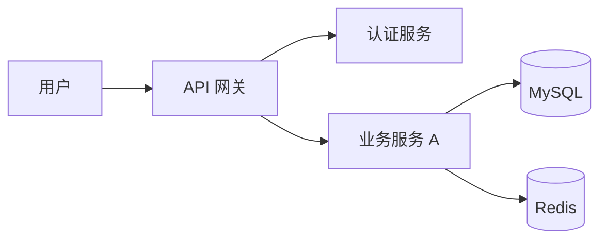
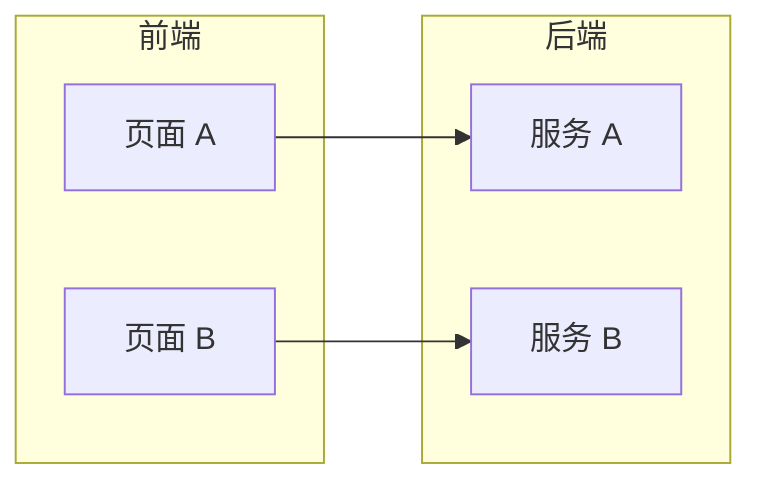
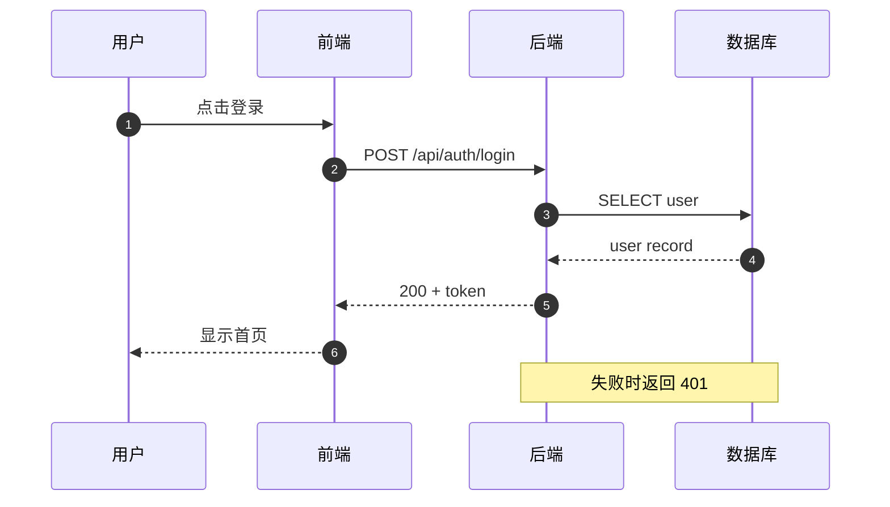
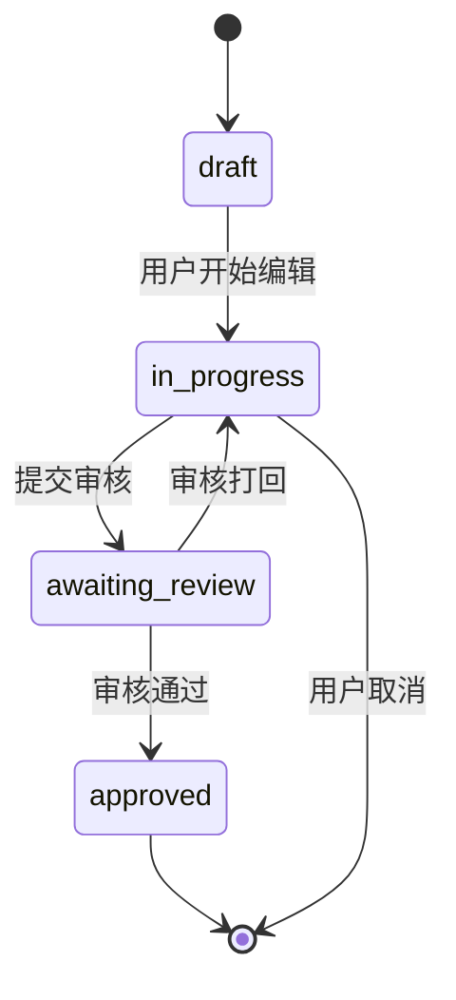
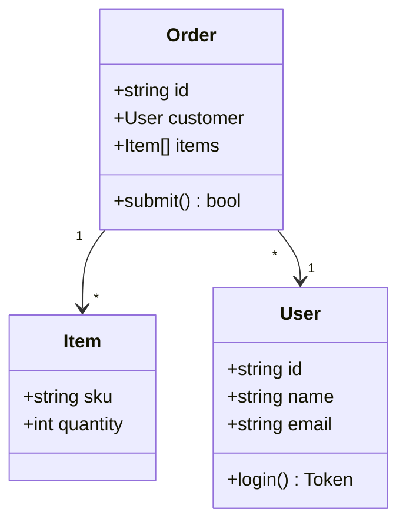
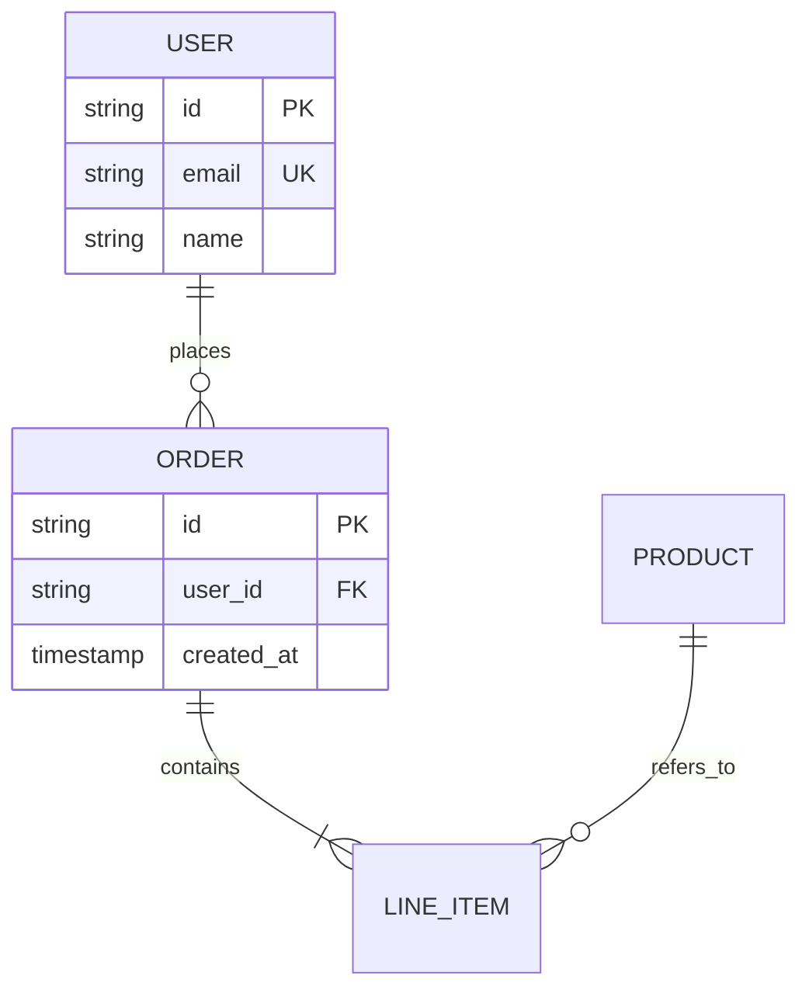
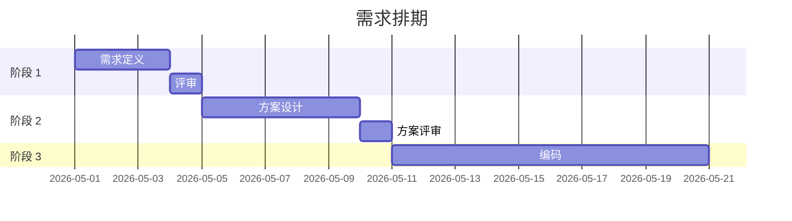

# Mermaid 模板库

> 6 类常用图的可复用模板。`visual-doc-generator` Skill 按 nodes / edges 填充。

## 1. flowchart（流程图 / 模块图）

变体方向：`LR`（左右）/ `TD`（上下）/ `BT`（下上）

子图分组：

## 2. sequence（时序图 / 调用顺序）

要点：
- 用 `participant ... as ...` 给参与者起短名
- `->>` 实线（同步），`-->>` 虚线（响应/异步）
- `Note over A,B: 内容` 加注释

## 3. state（状态机）

## 4. class（类/接口关系）

## 5. er（数据库关系）

关系符号：
- `||--||` 一对一
- `||--o{` 一对多（必/可）
- `}o--o{` 多对多（可/可）

## 6. gantt（时间排期）

## 通用约定

| 约定 | 说明 |
|---|---|
| 节点 ID | 全 ASCII，下划线分隔（`user_login` 而非 `用户登录`） |
| 节点 label | 用引号包裹中文：`["用户登录"]` |
| 注释 | 加在图外（mermaid 代码块前后用 markdown 段落） |
| 颜色 | 默认主题，不要 hardcode 颜色（影响主题切换） |
| 复杂图 | 拆成多个子图，分别附说明 |

## 反模式

- ❌ 在 flowchart 里画时序（用 sequence 即可）
- ❌ 在 sequence 里画很多 `if/else`（改用 `alt/else/end`）
- ❌ ER 图把所有字段都列上（用 table 更清晰）
- ❌ 一张图超过 15 个节点（应拆分）
