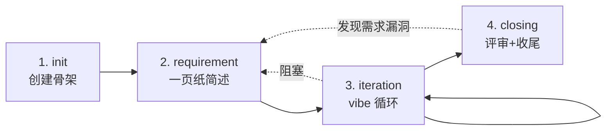

---
name: agile-vibe
version: 0.2.0
description: 默认 SOP。轻量四阶段：初始化 → 需求定义 → 迭代开发 → 收尾沉淀。适合功能探索、快速原型、bugfix、技术改进、单人或小组 vibecoding。
version: 0.2.1
phase_count: 4
phase_field_format: "<id>.<name>"   # meta.yaml 的 phase 字段必须 = phases[i].id + "." + phases[i].name，例 1.init / 2.requirement

tags:
  - default
  - lightweight
  - vibecoding

phases:
  - id: 1
    name: init
    short: 创建需求骨架
    primary_agent: (script-only)
  - id: 2
    name: requirement
    short: 一页纸需求简述
    primary_agent: product-manager
  - id: 3
    name: iteration
    short: 主会话与用户直接迭代，每轮可视反馈
    primary_agent: (主会话)
  - id: 4
    name: closing
    short: 评审 + 收尾 + 知识沉淀
    primary_agent: code-reviewer → closer → knowledge-maintainer
---

# agile-vibe SOP

> **核心理念**：在能搞定的需求上**不要**走重型评审流程。让用户和主会话直接迭代，每 30 分钟拿到可见反馈，最后做一次简短的质量收口。
>
> 重要的事永远在 vibecoding 协议（规则 `10-vibecoding-protocol.mdc`）：小步快跑 / 可视反馈 / 状态先写 / 3-Time Rule / 拿不准就停。

## 适用场景

- ✅ 单人或 2-3 人小组开发
- ✅ 功能探索、原型、bugfix、技术债清理
- ✅ 需求边界清晰，不需要正式架构评审
- ✅ 用户希望「先做起来再说」
- ❌ 跨团队大需求 / 强合规要求 / 需要正式设计文档作为合同 → 用 `deep-vibe`

## 阶段总览



## 阶段详解

### 阶段 1：init（初始化）

- **触发**: `/pm-new` 命令
- **主要执行**: 脚本 `.codebuddy/scripts/new-requirement.ps1`（不需要 agent）
- **目标**: 建立需求目录骨架与索引登记
- **入参**:
  - `req-id`（kebab-case）
  - `title`
  - `sop: agile-vibe`（默认）
  - 代码工程位置（可空）
- **产出**:
  - `requirements/<req-id>/meta.yaml`（含元数据 + 阶段=1.init）
  - `requirements/<req-id>/process.txt`（首行：`[time] init`）
  - `requirements/<req-id>/plan.md`（骨架）
  - `requirements/<req-id>/notes.md`（空）
  - `requirements/INDEX.md` 追加一行
- **完成标准**:
  - [ ] 目录骨架就位
  - [ ] meta.yaml 字段齐全
  - [ ] INDEX 已同步
- **下一步**: 自动进入阶段 2，委派 `product-manager`
- **回退条件**: 无

---

### 阶段 2：requirement（需求定义）

- **触发**: 阶段 1 完成后自动 / 用户后续追加补充时
- **主要 agent**: `product-manager`
- **目标**: 把模糊想法收敛成「一页纸需求简述」
- **入参**: 用户提供的素材 + meta.yaml
- **产出**:
  - `spec/需求简述.md`（轻量：背景、目标、范围、验收标准；目标 ≤ 2 页）
  - `spec/context/来源归档.md`（如有外部素材）
- **完成标准**:
  - [ ] 每个功能点有可验证的验收标准
  - [ ] 已确认点引用来源编号（S1, S2…）
  - [ ] 待确认项明确标注
- **子步骤**: 见 `product-manager` agent 工作流

> **不进入阶段 3 的判断**: 如有"待确认项"未关闭，必须先和用户对齐再进 3。（与 `deep-vibe.md:92` 阶段 1→2 硬约束同构）

- **下一步**: 阶段 3
- **回退条件**:
  - 用户在阶段 3 发现需求歧义 → 退回阶段 2，重新委派 `product-manager`
  - 用户在阶段 4 评审时发现漏项 → 退回阶段 2

---

### 阶段 3：iteration（迭代开发）

- **触发**: 阶段 2 完成后 / `/vibe-loop` 命令
- **主要执行**: **主会话与用户直接协作**（不强制委派 agent）
- **目标**: 按 vibecoding 协议持续迭代，每轮可见反馈
- **入参**:
  - `spec/需求简述.md`
  - 用户每轮的「本轮目标」
- **产出**:
  - 代码改动（提交到 `d:\WePop_trunk`）
  - 每轮在 `process.txt` 追加：目标 / 改动 / 验证 / commit / 下一步
  - 踩坑沉淀到 `notes.md`
- **完成标准**: 用户主动判定「功能基本完成」
**本阶段强制约束**（来自 vibecoding 协议）:
  1. **Mini-Plan 预检**（首轮必做）：开始编码前先输出 3-5 行"我打算这么做"（涉及哪些文件/策略/步骤），让用户看一眼再动手。避免方向做错后大量返工
  2. **Mini-Task 列表**（可选但推荐）：如功能点 > 3 个，先列 3-7 个 mini-task 再逐个执行。类似 Cursor Agent 的 step-by-step plan
  3. 每轮目标 ≤ 30 分钟可见反馈
  4. 每改一个点立即跑预览/截图/单测
  5. 改之前先在 process.txt 写打算做什么
  6. 单次提交对应单一改动
  7. 同类操作做了 3 次 → 触发 `/skill-new` 封装
  8. **结构变更评审门禁**（Phase 3 新增）：当本轮改动涉及以下任一情况时，**必须**在 commit 前运行结构指纹比对：
     - 新增/删除/重命名 ≥ 3 个文件
     - 涉及模块间依赖关系变更（import/require 路径变化）
     - 涉及 API 接口/数据结构变更
     - 涉及配置文件/构建脚本变更
     ```bash
     # 生成当前快照
     bash .workflow/scripts/fingerprint-gen.sh <project-path> .workflow/fingerprints/snapshots/<req-id>-pre-<N>.json
     # 与上次快照比对
     bash .workflow/scripts/fingerprint-diff.sh .workflow/fingerprints/snapshots/<req-id>-pre-<N-1>.json .workflow/fingerprints/snapshots/<req-id>-pre-<N>.json
     ```
     比对结果如有 **breaking change**（模块删除/接口签名变化/依赖环出现），必须在 process.txt 记录并告知用户；用户确认后方可继续
  9. **AI 自主功能测试（Feature Verification）**（Phase 3 收尾前必做）：功能"看起来完成"到"标记完成"之间，必须以**用户视角**逐 AC 验证一遍，产出落到 `requirements/<req-id>/test-report/`：

     **9.1 · 功能测试（核心 · 每个 AC 必做）**
     - AI 必须**真实运行**目标产物（`flutter run -d windows` / 命令行工具跑一遍 / 打开页面点一遍）
     - 逐 AC 按用户操作路径执行：**每 AC ≥ 1 步操作 + 1 张对应步骤截图**（不是最终态大合影）
     - 每 AC 在 `test-report/ac-verification.md` 记录：操作步骤 / 预期 / 实际（引用截图文件名）/ 结论（✅ / ⚠️ / ❌）
     - 未真实操作过的 AC → 显式写 `未验证 / 理由: <说明>`，**禁止**基于源码推理填 ✅

     **9.2 · 代码测试（地基 · 有单测项目才做）**
     - 若项目有 `test/` 目录且当前语言有单测框架 → 跑 `flutter test` 等对应命令，输出到 `test-report/code-test.log`
     - 无单测项目（如纯 demo / 工具脚本）→ 在 `ac-verification.md` 顶部注明"本项目无单测，仅功能测试"

     **9.3 · 视觉回归（UI 改动才做）**
     - 触发条件：改动涉及 `lib/**/screens/` `lib/**/view/` `lib/common/widgets/`
     - 3 视口截图对齐 `80-phet-sim-checklist.mdc §七 M1`（375×667 / 1024×768 / 1920×1080），存 `requirements/<req-id>/screenshots/<sim>-{mobile-portrait,tablet-landscape,desktop}.png`
     - 视觉回归证明"没溢出没崩"，**不代替**功能测试

     **9.4 · 诚实声明（对齐 `60-citation-and-honesty.mdc`）**
     - `test-report/ac-verification.md` 末尾必须勾选 3 条：
       - [ ] 每个 ✅ 的 AC 都由本会话真实操作产物完成，非源码推理
       - [ ] 所有截图均由本次运行产出（mtime 在 phase 3 期间），非历史缓存
       - [ ] 未验证 / 部分失败的 AC 已在报告中显式标注
     - 违反 9.4 任一项 → code-reviewer 阶段判定 Blocker 退回

     **9.5 · 豁免路径**
     - 纯文档 / 纯回溯 / 零代码改动 → 在 `meta.yaml` 加 `test_exempt: true` + `test_exempt_reason: <非空理由>`，跳过 9.1-9.4
- **下一步**: 阶段 4
- **回退条件**:
  - 发现需求歧义 → 阶段 2
  - 发现技术方案完全不可行 → 用户决定是否切换到 `deep-vibe`

> **何时该用专业 agent**（而非主会话直撸）:
> - 跨端协议需要确认 → 临时委派 `tech-leader`
> - 需要深入某领域决策 → 委派对应 `frontend-leader` / `backend-leader`
> - 测试套较复杂 → 委派 `test-runner`

#### 特殊场景：跳阶段（事实清晰时）

部分需求事实极清晰（如：reviewer 已在上一需求完整诊断、spec 已由主会话 review 报告产出、回溯型需求），主会话可判断跳过某个中间阶段（如跳 2.requirement 直接进 3.iteration，或跳 3.iteration 直接进 4.closing）。**允许跳，但必须留底**：

- **必须在 `meta.yaml.phase_overrides[]` 追加一条记录**，结构如下：
  ```yaml
  phase_overrides:
    - from: "1.init"
      to: "3.iteration"       # 跳过了 2.requirement
      at: "2026-05-07 09:09"  # 主会话观察时间
      reason: "reviewer 已在上一需求完整诊断，本需求纯实施"
      by: "主会话"             # 或 agent-name
  ```
- `process.txt` 同步写"跳阶段"日志，含依据（引用来源需求 / commit sha / review 报告位置）
- **不允许"静默跳过"**——meta.phase 改了但 phase_overrides 不写 = 纪律违规。doctor 下游 check（待独立需求 E2 立项：`meta.phase` 变化但 `phase_overrides` 未更新 → 报警）

实证来源：`req-cleanup-dev-agents-minors/process.txt:2`（历史样本，博物馆保留，不回溯补记）。

#### 特殊场景：回溯需求（零迭代）

部分需求是**回溯型**——所有代码改动已在历史 commit 中，本次需求只为**补 AC 映射**与文档（典型如：SOP 体检后整理 P0/P1/P2 修复历史）。此时阶段 3 没有"真代码改动"，按以下分支处理：

- **触发判定**：spec 已确认"代码改动早于本需求 commit↔AC 自检约束"或"零代码改动，仅整理映射"
- **阶段 3 最小产出**：
  - `spec/commit-AC-map.md`（反向映射表：`AC-N ↔ commit sha + 一句话描述`）
  - `process.txt` 仍按时间追加，但"改动"段写"零迭代回溯，整理历史 commit 与 AC 映射"
- **commit↔AC 自检豁免**：见 `40-agent-self-evolution.mdc` 的"回溯需求豁免"专项段（A3）
- **下一步**：阶段 4 closing 按常规走（reviewer 评审映射准确性，closer 做最终归档）

实证来源：`requirements/req-sop-checkup-2026-05-04` 的 dogfood 发现 #4/#5（`notes.md:88-89`）。

---

### 阶段 4：closing（收尾沉淀）

- **触发**: 用户判定「功能基本完成」 / `/code-review` 命令
- **主要 agents**（串联）:
  1. `code-reviewer` —— 代码评审（三视角）
  2. `closer` —— 最终需求文档 + 状态收尾
  3. `knowledge-maintainer` —— 项目级发现回写（**可选**，见下方轻量模式）
  4. `self-improving-agent`（由 `/improve` 命令或主会话触发） —— 检测本需求及近期历史中的重复踩坑、效率瓶颈、经验盲区，生成演进提案
- **目标**: 让需求"可被未来读懂"，把通用经验沉淀到知识库
- **入参**:
  - 全部代码改动（svn diff）
  - `spec/需求简述.md` 与 `notes.md`
- **产出**:
  - `design/代码评审.md`（code-reviewer）
  - `spec/最终需求.md`（closer）
  - `notes.md` 追加沉淀（closer + knowledge-maintainer）
  - `context/project/<project>/` 下的 INDEX 与文档更新（knowledge-maintainer）
  - `.vibe/cache/self-improving-scan-<date>.md`（self-improving-agent，如触发）
  - `context/shared/experiences/` 下的新增经验条目（knowledge-maintainer 步骤 6 或 `/improve` 触发）
  - `meta.yaml` status 改为 `done`
  - `requirements/INDEX.md` 同步
- **完成标准**:
  - [ ] 代码评审无 Blocker
  - [ ] AC 覆盖记录已嵌入 `spec/最终需求.md` 的"最终实现"段（轻量版：M/N + 漏覆盖说明，不另起文件）
  - [ ] `spec/最终需求.md` 含变更时间线骨架
  - [ ] notes.md 已沉淀本需求关键经验
  - [ ] **已完成经验质量门禁检查（doctor / knowledge-maintainer 步骤 6.5）**：
    - `context/shared/experiences/` 中新增条目通过质量门禁（完整性/重复性/上限控制）
    - auto-extracted 条目需人工审核的，已在 `process.txt` 标注
  - [ ] **已检查是否需要触发 `/improve`**（knowledge-maintainer 步骤 6 或主会话主动调用）
  - [ ] **test-report/ac-verification.md 存在**（Phase 3 自主功能测试产出，诚实声明 3 项已勾选）
  - [ ] **每个 AC 有对应操作截图或"未验证"标注**（禁止无证据 ✅；豁免路径需 `meta.yaml.test_exempt=true` 且 reason 非空）
  - [ ] `check-before-done.sh` 门禁通过（exit 0）
- **回退条件**:
  - 评审有 Blocker → 退回阶段 3
  - 发现需求漏项 → 退回阶段 2

#### 轻量 closing 模式（小需求适用）

当需求满足**全部**以下条件时，可选轻量 closing（跳过 knowledge-maintainer）：

- 改动 ≤ 3 个文件
- 无架构/协议变更
- 无跨需求影响
- 用户确认"无需沉淀"

**轻量 closing 流程**：
1. code-reviewer 评审（可由主会话简化版代替，结论嵌入 process.txt；**不要求**产出独立的 `design/代码评审.md`）
2. closer 跑完（产出 `spec/最终需求.md` + 填 `completed_at`）
3. 跳过 knowledge-maintainer（**但**如检测到重复踩坑，仍建议运行 `/improve`）
4. **自动失败提取**：运行 `auto-extract-failures.sh <req-id>` 提取本需求 process.txt 中的失败模式到 `context/shared/experiences/auto-extracted/`
5. **经验质量门禁**（轻量版）：
   - 检查 auto-extracted 目录下的新生成条目是否合规
   - 如有未审核条目，在 `process.txt` 标注 `⚠️ auto-extracted experiences need review`
6. `check-before-done.sh` 通过即可标 done

> **何时不能用轻量模式**: 涉及 SOP/agent/规则改动、跨需求协议变更、引入新架构模式——这些**必须**走完整 closing（含 knowledge-maintainer + self-improving-agent 扫描）。

#### closing 完成后的跨分支同步

需求完成后（closer + knowledge-maintainer 都跑完，`status: done`），主会话**必须**询问用户是否将代码改动同步到同 variant 的其他分支。

**触发条件**：当前需求的 `meta.yaml.repo_key` 不为空。

**选项**（用 `AskUserQuestion` 一次问完）：

| 选项 | 含义 |
|---|---|
| 不同步 | 仅在当前分支完成，不做任何同步 |
| 同步到 `<branch-1>` | 将代码改动同步到同 variant 的另一个分支 |
| 同步到 `<branch-2>` | 将代码改动同步到同 variant 的另一个分支 |
| 同步到 `<branch-1>` 和 `<branch-2>` | 将代码改动同步到同 variant 的两个分支 |

其中 `<branch-1>` 和 `<branch-2>` 根据 `variant` 动态替换：

- **variant = Wepop** 时：另外两个分支为 `trunk` / `Wepop_release_YJ`（排除当前 repo_key）
- **variant = KartRider** 时：另外两个分支为 `KartRider_International_Release` / `KartRider_International_Release_YJ`（排除当前 repo_key）

**同步方式**：精准替换——只复制与本次需求相关的代码改动到目标分支的代码目录，不覆盖无关文件。具体操作由主会话执行，参照 `spec/最终需求.md` 中"最终实现"段列出的涉及文件清单。

**同步完成后**：
- 在 `process.txt` 追加同步日志：`[time] 代码同步: <repo_key> → <target-key-1>, <target-key-2>（用户选择）`
- 如目标分支代码与源分支有差异（非本次需求的部分不同），需告知用户差异点，由用户决定是否覆盖

## 状态机

| `phase` 取值 | `status` 取值 | 含义 |
|---|---|---|
| `1.init` | `draft` → `done` | 骨架创建 |
| `2.requirement` | `in_progress` / `awaiting_user_input` / `done` | 需求定义中 |
| `3.iteration` | `in_progress` / `paused` | 迭代中（可中途暂停） |
| `4.closing` | `in_progress` / `blocked` / `done` | 收尾 |

阶段切换严格按规则 `45-state-sync-protocol.mdc`：先写 meta.yaml + process.txt，后做实际操作。

## 与 deep-vibe 的差异

| 维度 | agile-vibe | deep-vibe |
|---|---|---|
| 阶段数 | 4 | 5 |
| 需求文档 | 一页纸简述 | 完整需求文档 |
| 方案阶段 | 无独立方案阶段 | 独立的方案 + 评审阶段 |
| 测试阶段 | 集成在迭代中 | 独立测试阶段（test-runner） |
| 评审 | 仅最终代码评审 | 方案评审 + 代码评审 |
| 适用规模 | 小 | 中-大 |

## 何时切换到 deep-vibe

在阶段 2 或阶段 3 发现以下情况，应停下来与用户确认是否切到 `deep-vibe`：

- 涉及端 ≥ 3 / 跨团队
- 出现需要架构变更的判断
- 用户提出"需要正式评审" / "要给 XX 看方案"
- 数据 schema 重构 / 不可回滚操作

切换方式：修改需求 `meta.yaml` 中 `sop: deep-vibe`，并在 `process.txt` 写明切换原因。

## 自定义建议

- 阶段 4 内的 agent 顺序可调整（如不需要 knowledge-maintainer 就只跑前两个）
- 不要随意删阶段——这会破坏主会话的 PM 路由判断
- 想加阶段或合并阶段 → 用 `/sop-edit` 创建你自己的 SOP（如 `team-vibe`），不要改本文件

## 变更历史

> 2026-05-04 by code-reviewer (req-sop-checkup-2026-05-04 Phase 4) [version: 0.1.1]：回填两次创世期改动后的 version 与变更历史段。理由：满足 `35-sop-self-evolution.mdc` 协议自洽性，详见 `.codebuddy/docs/SOP-CHECKUP-2026-05-04.md` 附录 B 与本需求 `design/代码评审.md` P1-A。
>
> - `7fa1bca` (P0 Fix-1)：frontmatter 加 `phase_field_format: "<id>.<name>"`，强校验 `meta.yaml.phase` 字段
> - `6d9b294` (P1 Fix-5)：阶段 4 完成标准追加"AC 覆盖记录嵌入 spec/最终需求.md（agile-vibe 轻量路径）"门禁
> - 35 协议合入时序在两次改动之后（`bbd7500`），故为创世期回填，非追溯违规

> 2026-05-06 by req-sop-protocol-gaps-batch Phase 3 [version: 0.1.2]：补 dogfood #3 + #5 两条 SOP 缺口。
> - **A1**：阶段 2 完成标准后追加 blockquote 硬约束 `> 不进入阶段 3 的判断: 如有"待确认项"未关闭，必须先和用户对齐再进 3。`（与 `deep-vibe.md:92` 阶段 1→2 同构）
> - **A2**：阶段 3 末尾追加"特殊场景：回溯需求（零迭代）"小节，说明 spec/commit-AC-map.md 反向映射产出 + 引用 40 协议豁免规则
> - 触发原因：`requirements/req-sop-checkup-2026-05-04/notes.md:87-89` dogfood 发现 #3/#5 + `context/project/AIVibeCodingProj/sop-known-issues.md:13-25`
> - 协议族变更历史段格式与 30/40 同构（blockquote + 多 bullet + version 标在首行）

> 2026-05-07 by req-sop-process-discipline Phase 3 [version: 0.1.3]：补 m-2 过程留底纪律缺口。
> - 阶段 3 "特殊场景：回溯需求（零迭代）" 子段**之前**插入 "特殊场景：跳阶段（事实清晰时）" 子段，定义 `meta.yaml.phase_overrides[]` 强制写入结构 + 硬约束"静默跳过违规"
> - 触发原因：`requirements/req-cleanup-dev-agents-minors/process.txt:2` 跳阶段 `meta.yaml:19-20` phase_overrides 空；2026-05-07 本会话 review 报告识别为 m-2
> - 兼容性：仅对新跳阶段生效；历史需求 `phase_overrides: []` 保留（博物馆样本）
> - 配套：`.codebuddy/rules/45-state-sync-protocol.mdc` 追加"closing 阶段多 agent 日志格式"（本需求同批 Diff-B；修 m-5）
> - 下游建议：doctor 5.4 check（meta.phase 变但 phase_overrides 未改则报警）另立独立需求 E2

> 2026-05-09 by 主会话（用户确认 y）[version: 0.2.0]：
> 参考 Cursor/AI 开发工具设计思想，优化 agile-vibe 实战合理性。
> - 改进 #1：阶段 3 新增"Mini-Plan 预检"强制约束（首轮必做，输出 3-5 行策略让用户确认再动手）
> - 改进 #3：阶段 3 新增"Mini-Task 列表"推荐约束（功能点 > 3 时先列 task 再逐个执行）
> - 改进 #5：阶段 4 新增"轻量 closing 模式"（小需求可跳过 knowledge-maintainer，条件 + 流程明确定义）
> - 阶段 4 完成标准追加 `check-before-done.sh` 门禁通过
> - 触发原因：实战验证（req-game-concept-01-dev/req-score-leaderboard/req-daily-checkin）暴露的 3 类问题

> 2026-07-31 by 主会话（用户确认 全 y · 4 Diff 组合）[version: 0.2.1]：
> 补 "AI 自主功能测试" 强制约束（用户视角逐 AC 验证 · 非纯代码测试）。
> - 阶段 3 强制约束追加第 9 条（9.1 功能测试核心 / 9.2 代码测试地基 / 9.3 视觉回归 UI 触发 / 9.4 诚实声明 / 9.5 豁免路径）
> - 阶段 4 完成标准在 `check-before-done.sh` 前插入 2 条（test-report/ac-verification.md 存在 + 逐 AC 证据）
> - 触发原因：用户澄清"代码测试 ≠ 功能测试"缺口 · 3 层结构以功能测试为核心
> - 联动改动：`.claude/agents/code-reviewer.md` 加步骤 2.5（Diff-B）· `.codebuddy/scripts/check-before-done.{sh,ps1}` 加检查 6（Diff-C）· 新建 `.codebuddy/skills/core/self-testing/` skill（Diff-D）
> - 兼容性：`test_exempt: true` 豁免路径向后兼容纯回溯 / 纯文档需求；已 done 需求不追溯
