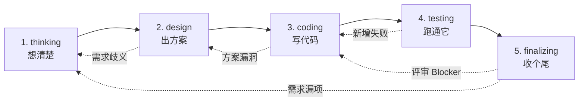

---
name: deep-vibe
version: 0.2.0
description: 重型 SOP。五阶段：想清楚 → 出方案 → 写代码 → 跑通它 → 收个尾。适合跨团队、需要正式评审、架构变更、不可回滚操作的需求。
phase_count: 5
phase_field_format: "<id>.<name>"   # meta.yaml 的 phase 字段必须 = phases[i].id + "." + phases[i].name，例 1.thinking / 4.testing

tags:
  - heavyweight
  - formal-review
  - cross-team

phases:
  - id: 1
    name: thinking          # 想清楚
    short: 完整需求文档 + Socratic 追问
    primary_agent: product-manager
  - id: 2
    name: design            # 出方案
    short: 复杂度判定 + 跨端方案 + 协议 + 评审
    primary_agent: tech-leader (+ frontend-leader / backend-leader / design-reviewer)
  - id: 3
    name: coding            # 写代码
    short: 按方案落代码
    primary_agent: frontend-dev / backend-dev
  - id: 4
    name: testing           # 跑通它
    short: 真跑测试 + 基线对比
    primary_agent: test-runner
  - id: 5
    name: finalizing        # 收个尾
    short: 评审 + 收尾 + 知识沉淀
    primary_agent: code-reviewer → closer → knowledge-maintainer
---

# deep-vibe SOP

> **核心理念**：当需求**确实需要正式协作**时，按"想清楚 → 出方案 → 写代码 → 跑通它 → 收个尾"五步走，每步都有明确的产物与门禁。
>
> 这不是「为了流程而流程」——每个阶段都解决一个具体问题：
> - 阶段 1 解决"做什么没说清"
> - 阶段 2 解决"怎么做没想清"
> - 阶段 3 解决"按方案落实现"
> - 阶段 4 解决"AI 偷懒说自己跑通"（基线对比）
> - 阶段 5 解决"做完没人能继承"

## 适用场景

- ✅ 跨团队大需求
- ✅ 需要正式架构评审
- ✅ 数据 schema 重构 / 不可回滚操作
- ✅ 需求文档需作为合同 / 审计依据
- ✅ 需要为后续审计留下完整证据链
- ❌ 单人探索 / bugfix / 快速原型 → 用 `agile-vibe`

## 阶段总览

## 阶段详解

### 阶段 1：thinking（想清楚）

- **触发**: `/pm-new` 选择 `deep-vibe`
- **主要 agent**: `product-manager`
- **目标**: 把模糊想法收敛成**完整需求文档**（不是一页纸简述）
- **入参**: 用户提供的素材（文本 / 链接 / 截图 / TAPD ID 等）
- **产出**:
  - `spec/需求文档.md` —— 完整版：背景与目标、功能范围、详细功能描述、验收标准、约束与假设、影响面
  - `spec/context/来源归档.md`
- **完成标准**:
  - [ ] 每个功能点配套验收标准
  - [ ] 验收标准编号化（AC-1, AC-2, …）
  - [ ] 已确认点引用来源编号
  - [ ] 待确认项与「技术待确认项」分开列出
- **下一步**: 阶段 2，委派 `tech-leader`
- **回退条件**:
  - 阶段 2 发现需求歧义 / 阶段 5 评审发现漏项 → 回阶段 1

> **不进入阶段 2 的判断**: 如有"待确认项"未关闭，必须先和用户对齐再进 2。

---

### 阶段 2：design（出方案）

四个子阶段串联（`simple` 复杂度可走快速模式，见下方）：

#### 2.1 粗判（tech-leader）

- 提取验收项清单（AC-N）
- 复杂度粗判：`simple` / `medium` / `complex`
- 协作模式选择：`TechLeader only` / `SubAgents` / `AgentTeams`
- **必须用 `AskUserQuestion` 让用户确认协作模式**

#### 快速方案模式（仅 `simple` 复杂度适用）

当 tech-leader 判定 `simple` 且用户确认时，可跳过 2.3 / 2.4，直接产出：
- `design/技术方案.md`（精简版：3-5 行策略 + 涉及文件清单 + 关键决策）
- `tasks/features.json`（直接由 tech-leader 列出）
- **不委派** frontend/backend-leader，**不委派** design-reviewer

> 类似 Cursor Agent 的"plan 模式"——展示要改什么 + 策略，用户确认后直接进 coding。

#### 2.2 框架（tech-leader）

- 写 `design/技术方案-框架.md`：架构骨架、跨端边界、关键决策
- 如涉及多端：写 `design/协议定义.md` 草案

#### 2.3 细化（仅 medium / complex）

并行（或串行）委派：

- `frontend-leader` → `design/前端方案.md` + `tasks/frontend-features.json`
- `backend-leader` → `design/后端方案.md` + `tasks/backend-features.json`

#### 2.4 汇总与评审

- `tech-leader` 回收 leader 产出，写 `design/技术方案.md`（终版）
- 写 `tasks/features.json`（含全部任务，每条对应 AC-N）
- **必委派** `design-reviewer` 评审 → 写 `design/方案评审.md`

- **完成标准**:
  - [ ] 每个 AC-N 在方案中可定位落点
  - [ ] 协议字段、错误码、版本一致
  - [ ] 任务粒度合理（每条可独立执行）
  - [ ] 风险段非空
  - [ ] 评审无 Blocker
- **下一步**: 阶段 3
- **回退条件**:
  - 评审有 Blocker → 退回 tech-leader 或对应 leader
  - 发现需求歧义 → 退回阶段 1

---

### 阶段 3：coding（写代码）

- **触发**: 阶段 2 评审通过
- **主要 agents**: `frontend-dev` / `backend-dev`（按需）
- **目标**: 按方案与任务清单落代码
- **入参**:
  - `design/技术方案.md` + `design/协议定义.md`
  - `tasks/features.json`
  - `spec/需求文档.md`（验收项清单）
- **产出**:
  - 代码改动到 `d:\WePop_trunk`
  - 每完成一个任务追加 `process.txt`
  - 偏离与踩坑写入 `notes.md`
- **完成标准**:
  - [ ] tasks 全部 done
  - [ ] linter / 编译通过
  - [ ] 各 dev agent 自验证（单测 / 预览 / 截图）通过
- **本阶段强制约束**:
  - 不重新设计（疑问 → stop + report）
  - 不改协议（冲突 → stop + report 给 tech-leader）
  - 不擅自改需求
  - 单 commit 单任务
  - 不自动 svn commit（须用户审批）
- **下一步**: 阶段 4
- **回退条件**:
  - 方案有疑问 → 阶段 2（tech-leader / leader）
  - 协议字段不可用 → 阶段 2（tech-leader 协调）
  - 需求漏项 → 阶段 1（product-manager）

---

### 阶段 4：testing（跑通它）

- **触发**: 阶段 3 完成
- **主要 agent**: `test-runner`（完整模式）或 **主会话验证**（轻量模式）
- **目标**: 真实执行测试，识别新增失败
- **入参**: 全部代码改动 + 测试约定

#### 完整模式（有测试套时）

- **产出**:
  - `design/测试报告.md`
  - 完整日志保留在 `.vibe/cache/<req-id>-*.txt`
- **完成标准**:
  - [ ] 单元 / 集成 / E2E 都跑过
  - [ ] 新增失败 = 0
  - [ ] 验收项有对应测试用例覆盖（如有缺测试，列入"建议"）

#### 轻量模式（无测试套 / 前端原型 / 脚本工具类）

当项目无正式测试框架时，可用"code+verify 循环"替代独立 test-runner：

- **触发条件**（满足任一）：
  - 项目无 test 命令（如纯 HTML 游戏、脚本工具）
  - 改动为纯配置/文档
  - 用户确认"不需要独立测试阶段"
- **验证方式**（至少做一种）：
  - 手动 curl 验证 API
  - 浏览器预览确认 UI
  - Node.js 脚本语法验证
  - 离线单元验证（`node -e`）
- **产出**：在 `process.txt` 记录验证结果即可，不要求 `design/测试报告.md`
- **完成标准**：所有 AC 在 process.txt 有"verified"或"curl 通过"等留底

> 类似 Cursor 的做法：Agent 执行后自动跑 lint/build/test，如果没有 test 命令就用 build 结果代替。

- **本阶段强制约束**（两种模式共有）:
  - 必须真实执行，不允许"应该会过"
  - 必须做基线对比（防 AI 用"历史问题"糊弄）
  - 不修测试代码（标记后交 dev）
- **下一步**: 阶段 5
- **回退条件**:
  - 新增失败 > 0 → 退回阶段 3（dev 修复）
  - 缺测试覆盖 → 询问用户是否补测试任务

---

### 阶段 5：finalizing（收个尾）

三 agent 串联：

#### 5.1 code-reviewer

- 三视角评审（实现质量 / 需求一致性 / 方案一致性）
- 写 `design/代码评审.md`

#### 5.2 closer

- 前置：`代码评审.md` 通过 + `测试报告.md` 通过 + 用户确认完成
- 产出：`spec/最终需求.md`（含变更时间线骨架）
- 追加 `notes.md` 沉淀
- 更新 `meta.yaml` status 为 `done`
- 同步 `requirements/INDEX.md`

#### 5.3 knowledge-maintainer

- 把项目级发现回写到 `context/project/<project>/`
- 更新对应 INDEX
- 不回写需求级特殊处理

- **完成标准**:
  - [ ] 代码评审无 Blocker
  - [ ] 最终需求文档已生成
  - [ ] AC 全覆盖矩阵已生成（`spec/AC-coverage.md`），所有 AC-N 状态 ∈ {covered, partial, waived}；不允许 unknown 或 missing
  - [ ] partial 项已在 `design/代码评审.md` 由 code-reviewer 显式 approve_partial 签字
  - [ ] `check-before-done.sh` 门禁通过（exit 0）
  - [ ] waived 项已有用户在 process.txt 显式 `verdict=approve_go / 备注: waive AC-N` 留底
  - [ ] 项目级发现已回写
  - [ ] INDEX 全部同步
- **回退条件**:
  - 评审有 Blocker → 阶段 3
  - 发现需求漏项 → 阶段 1

## 状态机

| `phase` 取值 | `status` 取值 | 含义 |
|---|---|---|
| `1.thinking` | `in_progress` / `awaiting_user_input` / `done` | 需求定义 |
| `2.design` | `in_progress` / `awaiting_user_input` / `awaiting_subagents` / `blocked` / `done` | 方案设计（含子阶段 2.1-2.4） |
| `3.coding` | `in_progress` / `partial` / `blocked` / `done` | 编码 |
| `4.testing` | `in_progress` / `has_new_failures` / `done` | 测试 |
| `5.finalizing` | `in_progress` / `blocked` / `done` | 收尾 |

## 与 agile-vibe 的差异

| 维度 | agile-vibe | deep-vibe |
|---|---|---|
| 阶段数 | 4 | 5 |
| 需求文档 | 一页纸简述 | 完整需求文档 |
| 方案阶段 | 无 | 独立 + 评审 |
| 测试阶段 | 嵌入迭代 | 独立 |
| 评审 | 仅代码评审 | 方案评审 + 代码评审 |
| 强制基线对比 | 否 | ✓ |

## 何时该退化为 agile-vibe

如果在阶段 2 发现复杂度判定为 `simple` 且用户希望"快进"：

- 与用户确认是否切到 `agile-vibe`
- 修改 `meta.yaml` 的 `sop` 字段，在 `process.txt` 记录切换原因
- 注意：已生成的 `spec/需求文档.md` 不需要删，只是后续按 `agile-vibe` 流程走

## 自定义建议

- 各阶段内的子步骤可调整
- 不建议跳过 `design-reviewer` 与 `test-runner`——这是 deep-vibe 的核心价值
- 想做更精细的拆分（如阶段 2 拆成 2 个独立阶段）→ 用 `/sop-edit` 创建你自己的 SOP

## 变更历史

> 2026-05-04 by code-reviewer (req-sop-checkup-2026-05-04 Phase 4)：回填两次创世期改动后的 version 与变更历史段。理由：满足 `35-sop-self-evolution.mdc` 协议自洽性，详见 `.codebuddy/docs/SOP-CHECKUP-2026-05-04.md` 附录 B 与本需求 `design/代码评审.md` P1-A。
>
> - `7fa1bca` (P0 Fix-1)：frontmatter 加 `phase_field_format: "<id>.<name>"`，强校验 `meta.yaml.phase` 字段（例 `4.testing` / `5.finalizing`）
> - `6d9b294` (P1 Fix-5)：阶段 5 完成标准追加 3 项 AC 门禁（覆盖矩阵无 unknown/missing；partial 项有 reviewer 签字；waived 项有用户 verdict 留底）
> - 35 协议合入时序在两次改动之后（`bbd7500`），故为创世期回填，非追溯违规

> 2026-05-09 by 主会话（用户确认 y）[version: 0.2.0]：
> 参考 Cursor/AI 开发工具设计思想，优化 deep-vibe 实战合理性。
> - 改进 #2：阶段 2 新增"快速方案模式"（simple 复杂度可跳过 2.3/2.4，tech-leader 直接产出精简方案 + tasks，不委派 leader/reviewer）
> - 改进 #4：阶段 4 新增"轻量模式"（无测试套时用 code+verify 循环代替独立 test-runner，验证结果记 process.txt 即可）
> - 触发原因：实战验证（req-game-concept-01-dev 的 design 阶段 tech-leader 超时 + testing 阶段主会话自测代替）暴露的 2 类问题
