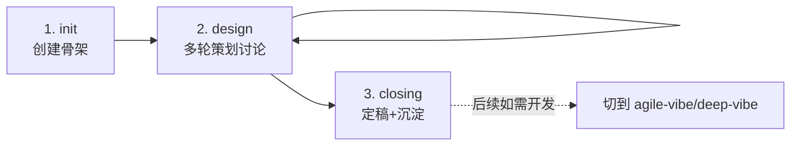

# game-design SOP

> **核心理念**：游戏策划需求**不需要**走开发 SOP 的"需求澄清 → 编码 → 评审"流程。策划的产出是**文档本身**（策划案），不是代码。SOP 聚焦在"把模糊想法变成可执行的详细策划案"。
>
> 与 agile-vibe / deep-vibe 的根本区别：**没有编码阶段**。所有产出都是 spec/ 下的文档。

## 适用场景

- ✅ 游戏核心玩法设计（从一句话 → 完整玩法框架）
- ✅ 关卡设计讨论（目标、难度曲线、奖励机制）
- ✅ 数值系统设计（属性、成长、经济循环）
- ✅ 美术需求细化（风格定调、角色/场景/UI 清单）
- ✅ 叙事/剧情大纲（世界观、角色、主线/支线）
- ✅ 游戏类需求的前期探讨——**不确定要做什么之前**
- ❌ 需要实际编码 → 策划定稿后切 agile-vibe 或 deep-vibe
- ❌ 通用软件需求（非游戏）→ 用 agile-vibe

## 阶段总览



## 阶段详解

### 阶段 1：init（初始化）

**主要 Agent**: `(script-only)` — 脚本生成

**目标**：创建需求骨架，占位文件就位。

**入参**：
- `req-id`（kebab-case / 大小写字母均可）
- `title`（策划案标题）
- 用户的初步想法（一段话即可）

**产出**：
```
requirements/<req-id>/
├── meta.yaml             # sop: game-design, phase: 1.init
├── process.txt
├── notes.md
├── plan.md
├── spec/
│   ├── context/          # 参考资料（类似游戏、灵感来源、用户原话）
│   └── （后续由 game-designer 填充）
└── design/               # 保留但通常不用
```

**完成标准**：
- [ ] 目录骨架创建
- [ ] meta.yaml 填充 sop/phase/status
- [ ] process.txt 记录第一行

**子步骤**：

1. 脚本 `new-requirement.sh -s game-design` 生成骨架
2. 主会话确认初步想法已记录到 `notes.md` 或 `spec/context/原始想法.md`
3. 切换到阶段 2，委派 `game-designer`

---

### 阶段 2：design（策划细化）

**主要 Agent**: `game-designer`

**目标**：通过多轮对话，把模糊的策划想法细化为可执行的详细策划案。

**入参**：
- 用户的初步想法
- 可选：参考游戏、灵感资料（链接/文档）
- 可选：项目已有的约束（平台/受众/时长/团队规模）

**产出**（按需选择，一个需求通常产出 2-4 个）：
```
spec/
├── 核心玩法.md           # 玩法循环、核心动词、乐趣点
├── 关卡设计.md           # 关卡结构、难度曲线、奖励
├── 数值系统.md           # 属性、成长、经济
├── 美术需求.md           # 风格、角色/场景/UI 清单、参考图
├── 叙事大纲.md           # 世界观、角色、主线
└── context/
    └── 参考资料.md       # 对标游戏、灵感来源
```

**完成标准**：
- [ ] 至少产出"核心玩法.md"
- [ ] 所有关键决策（选 A 不选 B）记录到 notes.md 的"决策记录"段
- [ ] 玩法可"讲得通"——读完文档能描述完整的游戏循环
- [ ] 美术需求有明确风格定调（不是"好看"这种空话）
- [ ] 数值/关卡（如涉及）有具体示例，不是抽象规则

**子步骤**：

1. game-designer 读 `spec/context/` 和用户原话
2. 按"核心玩法 → 数值 → 关卡 → 美术 → 叙事"顺序逐层展开
3. 每层用 Socratic 提问帮用户想清楚：
   - "核心动词是什么？玩家每秒在做什么？"
   - "这个数值为什么是 10 不是 5？"
   - "这个美术风格参考哪款游戏？色调关键词是什么？"
4. 有不确定的，记录到 `notes.md` 的"待确认"段
5. 每完成一块主要内容就让用户看一眼确认方向

**迭代性**：阶段 2 可以多轮——一个完整策划案通常需要 3-10 轮对话。每轮结束在 process.txt 追加"第 N 轮：讨论了 X"。

> ⚠️ 每轮用户做出选择后，process.txt 应追加简短 verdict 记录（如"verdict=approve_go / 备注: 用户确认 Layer 1-2 方向"），便于后续追溯决策链。

**回退条件**：
- 用户发现根本方向错了 → 回阶段 1 重新想
- 产出与用户预期不符 → 本阶段内重做

---

### 阶段 3：closing（定稿）

**主要 Agent**: `closer` → `knowledge-maintainer`

**目标**：把阶段 2 的草稿定稿为最终策划案，沉淀项目级决策到 `context/project/`。

**入参**：
- spec/ 下所有文档（草稿态）
- notes.md 中的决策记录与待确认

**产出**：
```
spec/
├── 最终策划案.md         # 汇总所有 spec/*.md + 变更时间线
└── （其他 spec/*.md 保留作为附件）
context/project/<project>/
└── design-decisions/
    └── <topic>.md        # 项目级策划决策（如"核心玩法选回合制的理由"）
meta.yaml:
  status: done
  completed_at: <time>
  final_summary_path: "spec/最终策划案.md"
```

**完成标准**：
- [ ] `spec/最终策划案.md` 存在且可读
- [ ] 所有 [基于假设] 标注已与用户确认或升级为明确决策
- [ ] 项目级发现候选已回写到 `context/project/`
- [ ] meta.yaml status=done

**子步骤**：

1. closer 汇总 spec/*.md 为最终策划案
2. closer 在最终策划案顶部加"变更时间线"，记录从阶段 2 多轮讨论的关键节点
3. knowledge-maintainer 识别哪些决策属于"项目级"（不止本需求复用），写到 `context/project/<name>/design-decisions/`
4. meta.yaml 状态切换到 done

> 💡 **上下文精简提示**：如果阶段 2 产出了 4+ 个 spec 文档（> 5000 字），closer 委派时只传"最终策划案.md 的骨架要求 + notes.md 的决策列表"，不要把所有 spec 全文塞进 prompt——让 closer 自己按需 read_file。

**回退条件**：
- closer 发现 spec 有重大矛盾 → 回阶段 2 补讨论
- 用户发现结论与预期不符 → 回阶段 2 修订

---

## 状态机

每个需求在本 SOP 下的状态通过 meta.yaml 的两个字段表达：

| 字段 | 含义 | 取值 |
|---|---|---|
| `phase` | 当前阶段 | `1.init` / `2.design` / `3.closing` |
| `status` | 阶段内状态 | `draft` / `in_progress` / `awaiting_user_input` / `blocked` / `done` |

阶段切换时**必须**按规则 `45-state-sync-protocol.mdc` 的"先写状态后做事"顺序：

1. 改 `meta.yaml`（phase / status / updated_at）
2. 追加 `process.txt`
3. 跑 `bash .codebuddy/scripts/rebuild-index.sh`
4. 调用下游 agent

## 与其他 SOP 的关系

- **与 agile-vibe / deep-vibe 的根本区别**：没有编码阶段，不涉及 tasks/features.json
- **衔接路径**：策划案定稿后如需开发，新建一个 agile-vibe 或 deep-vibe 需求，在 spec 里引用本需求的最终策划案
- **与 AI 出图能力配合**：阶段 2 讨论美术需求时，game-designer 可使用 `image_gen` 工具生成概念图（如有）

## 与美术出图的关系

- game-designer agent 在讨论"美术需求"时，如需生成参考图，可调用 AI 图像生成工具（如 `image_gen`）
- 生成图保存到 `spec/context/images/` 下
- 不要依赖 AI 出终稿图——只用作**风格定调的参考**和**与美术团队沟通的起点**
- 如果 subagent 无法直接调用 image_gen，写 prompt 到 `spec/context/images/<name>-prompt.md`，由主会话执行生成

## 不使用的文件

- **plan.md**：game-design SOP 不使用 plan.md（它是开发 SOP 的迭代目标追踪，策划流程用 process.txt 就够了）
- **design/**：game-design SOP 不使用 design/ 目录（策划文档全在 spec/ 下）
- **tasks/features.json**：game-design SOP 不产出任务清单（无编码阶段）

## 自定义建议

- 如果你的策划项目有专门的模板（如"SLG 策划案模板""卡牌游戏策划案模板"），可在 `.codebuddy/skills/project/` 中定义对应 Skill，阶段 2 会读取
- 如果团队有策划评审流程，可在阶段 2 和 3 之间插入"评审阶段"（类似 deep-vibe 的 design-reviewer），自定义新 SOP
