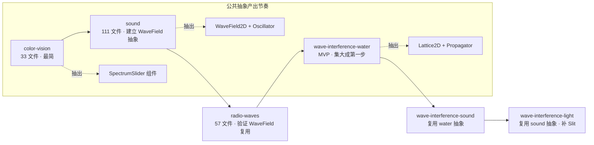

# 4 Sim 轻量 EDD 索引（Lightweight EDD Index · 全景对照）

> **产出触发**：主对话 2026-07-24 用户选 C · A+B 混合方案的 B 部分
> **目的**：为 4 个新模块建立横向对照全景 · 为下一步深化 color-vision 完整 EDD 提供模板锚点
> **数据源**：`c:\workspace\kartosTrunk\kartosTrunk\simulations-java\simulations\<sim>\src\edu\colorado\kartos\<pkg>\` 实测扫描
> **约束遵循**：memory 2q03lm2g §4.6 十问检索门禁；本轮为轻量索引，Q7/Q8/Q9/Q10 留到各 sim 完整 EDD 深挖
> **完整 EDD 模板**：所有完整 EDD 必须遵循 [`edd-template.md`](edd-template.md) v2.0（12 章 · 原 8 章 + §9 可配置化 + §10 AI 可生成化 + §11 通用化组件清单 + §12 质量属性声明）
> **已完成实例**：[`edd/color-vision-EDD.md`](edd/color-vision-EDD.md)（首个 v2.0 完整 EDD · §1-§10 已覆盖 · §11/§12 待 retro 补）

---

## 全景对照总表

| 维度 | color-vision | sound | radio-waves | wave-interference |
|---|---|---|---|---|
| **Java 文件数** | 33 | 111 (含 jass 音频引擎) | 57 | 196 (含 tests/) |
| **业务代码规模** | 33 | ~50（含 model/view/coreadditions） | ~40（不算 common_1200 内嵌） | ~120（不算 tests/ 与 kartoscommon） |
| **子屏数量（Module）** | 2 | 5 | 1 | 3 |
| **核心 Model 类数** | 6 | 10 | 8 | 16 |
| **核心 View 类数** | 10 | 17 | 8+ | 60+ |
| **物理域** | 光学·色觉 | 声波 | 电磁波 | 通用波动（水/声/光） |
| **数学核心** | RGB 合成 · 光谱 | Wavefront 平面/球面 | 电子振荡 + 场传播 | Lattice2D + ClassicalWavePropagator |
| **优先级建议** | 🟢 首个复刻 · 最简 | 🟡 第 2 · 中等复杂度 | 🟡 第 3 · 抽象度高 | 🔴 最后 · 集大成 |

---

## Sim 1 · color-vision（33 文件 · 最简）

### 目录结构
```
edu/colorado/kartos/colorvision/
├── ColorVisionApplication.java     (应用入口)
├── RgbBulbsModule.java             (14.5 KB · ★ 子屏 1 · RGB 三色合成)
├── SingleBulbModule.java           (18.7 KB · ★ 子屏 2 · 单光源+滤色片)
├── control/  (6 文件 · ColorIntensitySlider · SpectrumSlider 20 KB · ToggleSwitch ...)
├── event/    (2 文件 · VisibleColorChangeEvent/Listener)
├── help/     (3 文件 · WiggleMe 引导动效)
├── model/    (6 元件 · Filter · Person · Photon · PhotonBeam · SolidBeam · Spotlight)
└── view/     (10 painter · 对应元件 + BellCurve/ThoughtBubble/Pipe/Bounds/Person...)
```

### Q1-Q6 快速回答

| # | 项 | 答 |
|---|---|---|
| **Q1.A 元件清单** | 核心物理元件 | 6 类：Spotlight / Filter / Person / Photon / PhotonBeam / SolidBeam |
| **Q1.B 辅助概念** | 教学表征 | BellCurve（光谱高斯分布可视化）· ThoughtBubbleGraphic（观察者所见颜色气泡）· PipeGraphic（光管道限位） |
| **Q2 元件数量** | 子屏 1 | 3 Spotlight（RGB） + 1 Person + 3 SolidBeam（可切光子 PhotonBeam） |
| | 子屏 2 | 1 Spotlight（可调波长） + 1 Filter + 1 Person + 1 Beam |
| **Q3 元件关联** | 空间关系 | Spotlight → (Filter →) PhotonBeam/SolidBeam → Person 单向光路（左→右） |
| **Q4 元件交互** | 相互作用 | Filter 吸收/透过特定波长；Person 观察合成色；Photon 携带波长属性 |
| **Q5 可调属性** | 学生控件 | 光强 (ColorIntensitySlider) · 波长/颜色 (SpectrumSlider) · 光子/实光切换 (ToggleSwitch) · 滤色片位置 |
| **Q6 实验目标** | 教学目标 | 理解 RGB 加色混合 + 滤色片减色原理 + 波长与颜色对应关系 |

### 复刻价值 · 高（推荐首个复刻）
- Q1 简单（6 元件）· Q2 布局固定 · Q4 计算量小
- `SpectrumSlider`（20 KB）可复用到 `bending-light` 系列
- 已存在的 `lib/optics/` 有 `Ray/Light` 概念可迁移

---

## Sim 2 · sound（111 文件 · 中等）

### 目录结构（业务代码）
```
edu/colorado/kartos/sound/
├── SoundApplication.java             (应用入口 · 5 子屏注册)
├── SoundModule.java                  (7.3 KB · 基类)
├── SingleSourceModule.java           (子屏基类)
├── SingleSourceListenModule.java     (★ 子屏 1 · 单源+聆听者)
├── SingleSourceMeasureModule.java    (★ 子屏 2 · 单源+测量仪表)
├── SingleSourceWithBoxModule.java    (14.5 KB · ★ 子屏 3 · 真空盒/介质对比)
├── TwoSpeakerInterferenceModule.java (8.3 KB · ★ 子屏 4 · 双源干涉)
├── WallInterferenceModule.java       (13.5 KB · ★ 子屏 5 · 反射墙干涉)
├── SoundConfig.java                  (常量配置 4 KB)
├── model/   (10 类 · SoundModel · Wavefront ★ 7 KB · WaveMedium · SoundListener · PlaneWavefront · SphericalWavefront · SineWaveFunction · AttenuationFunction ...)
├── view/    (17 类 · WaveMediumGraphic 11 KB · BufferedWaveMediumGraphic 10 KB · SpeakerGraphic · ListenerGraphic · DialGauge · MeterStick ...)
└── coreadditions/  (3 · ScalarObservable/Observer 观察者模式)

# jass/ + javasound/ = Java 原生音频引擎（Flutter 复刻不移植，用 flutter_audio）
```

### Q1-Q6 快速回答

| # | 项 | 答 |
|---|---|---|
| **Q1.A 元件清单** | 核心物理元件 | Speaker（扬声器）· WaveMedium（传播介质·空气/真空）· Wavefront（波前 · 平面/球面）· Listener（听者·带耳朵）· ReflectingWall（反射墙）· MeterStick（尺子）· DialGauge（气压计） |
| **Q1.B 辅助概念** | 教学表征 | 波前圆圈/平面/挤压带 · 音频波形叠加渲染（BufferedWaveMediumGraphic） |
| **Q2 元件数量** | 5 子屏分别 | Listen: 1 Speaker+1 Listener · Measure: 1 Speaker+1 尺+1 计 · Box: 1 Speaker+ 1 空气/真空盒切换 · TwoSpeaker: 2 Speaker+1 Listener · Wall: 1 Speaker+1 Wall+1 Listener |
| **Q3 元件关联** | 空间关系 | Speaker（源） → WaveMedium（场）→ Wavefront 扩散 → Listener/Wall（终点/反射） |
| **Q4 元件交互** | 相互作用 | Wavefront 按 SineWaveFunction 生成 · AttenuationFunction 衰减 · WallInterference 双向叠加 · TwoSpeaker 相位叠加 |
| **Q5 可调属性** | 学生控件 | 频率 (SoundControlPanel Freq)· 振幅 (Amp)· 声音开关 (AudioControlPanel)· 传播介质 (真空/空气切换) · Listener 位置拖拽 |
| **Q6 实验目标** | 教学目标 | 理解声波传播（需要介质）· 波前扩散 · 双源干涉 · 反射与叠加 · 频率/振幅感官对应 |

### 复刻风险预警
- 🚨 **`Wavefront.java` (7 KB) 是核心**：Flutter 复刻必须先设计 WaveField 抽象（后 radio-waves 与 wave-interference 都用类似概念）
- 🚨 **音频渲染**：`AudioControlPanel` + jass 引擎 → 用 Flutter `just_audio` 替代
- ⚠️ **BufferedWaveMediumGraphic** 双缓冲绘制 → Flutter CustomPainter + RepaintBoundary

### 与 memory 2q03lm2g §4.5.5 EGPSpace 关系
Sound 涉及 Wavefront 位置传播（波前圆圈扩散），必须遵守 **描述/渲染分离**：Wavefront 数据在 Model 层，绘制在 CustomPainter 层。

---

## Sim 3 · radio-waves（57 文件 · 抽象度高）

### 目录结构
```
edu/colorado/kartos/radiowaves/
├── RadioWavesApplication.java       (应用入口)
├── EmfModule.java                   (19.3 KB · ★ 唯一子屏 · 电子振荡 + EM 场)
├── EmfConfig.java                   (常量)
├── command/  (7 · 命令模式 · AddElectron/SetFreq/SetAmp/SetMovement...)
├── coreadditions/  (5 · LookAndFeel)
├── common_1200/graphics/  (17 · 内嵌 kartos-common · 复刻时用 Flutter 原生 widget)
├── model/    (8 · Electron 12.9 KB ★ · Antenna 3.3 KB · EmfModel · EmfSensingElectron · PositionConstrainedElectron · EMFSineFunction · EMFPeriodicFunction · movement/{Sinusoidal,Manual})
├── util/     (1 · StripChart 5.4 KB · 实时波形图)
└── view/     (8 · FieldLatticeView 22.2 KB ★ · ElectronGraphic · TransmitterElectronGraphic · ReceivingElectronGraphic · WaveMediumGraphic 7 KB · EmfControlPanel 16.9 KB · EmfPanel · StripChartDelegate + splines/)
```

### Q1-Q6 快速回答

| # | 项 | 答 |
|---|---|---|
| **Q1.A 元件清单** | 核心物理元件 | Antenna（天线·发射端）· Electron（振荡电子·产生场）· ReceivingElectron（接收电子·被场驱动）· EmField（电磁场 · Lattice 表示） |
| **Q1.B 辅助概念** | 教学表征 | FieldLatticeView（22 KB · 场箭头矩阵）· WaveMediumGraphic（波扩散图）· StripChart（振幅时间曲线） |
| **Q2 元件数量** | 单子屏 | 1 发射 Antenna + 1 TransmitterElectron + 1 ReceivingElectron + 1 FieldLattice(N×M 箭头) + 1 StripChart |
| **Q3 元件关联** | 空间关系 | Transmitter Electron 振荡 → EM 场按距离/时间辐射 → Receiver Electron 感应振荡 · 场用 Lattice 矩阵表示 |
| **Q4 元件交互** | 相互作用 | Electron 按 SinusoidalMovement/ManualMovement 运动 · EmfSensingElectron 根据本地场强响应 · FieldLatticeView 采样场值渲染箭头 |
| **Q5 可调属性** | 学生控件 | 频率 · 振幅 · 手动/自动振荡切换 (SetMovementCmd) · 场/波两种视图切换 (DynamicField/StaticField Cmd) · Receiver 位置 |
| **Q6 实验目标** | 教学目标 | 理解电磁波产生（加速电荷辐射）· 场概念 · 传播延迟 · 远近场衰减 · 波长 |

### 复刻风险预警
- 🚨 **FieldLatticeView (22 KB)**：矩阵采样场 + 箭头渲染 → 与 sound 的 WaveMedium 是**同一类抽象**（都是 2D 标量/矢量场随时间演化）
- 🚨 **命令模式**（`command/` 7 个 Cmd 类）：Flutter 版可能不需要，直接 setState/Provider
- ⚠️ **common_1200/graphics/** 是 kartos 早期公共库快照，Flutter 版用原生 widget 全部替代

### 与 sound 的抽象共性
- `EmField Lattice` ≈ `WaveMedium` → 可抽为通用 **`WaveField2D`** 组件（memory 2q03lm2g §4.6.7 EDD §3 参数联动）
- `Electron 振荡` ≈ `Speaker` → 可抽为通用 **`Oscillator` 源**（wave-interference 已经这么做了！）

---

## Sim 4 · wave-interference（196 文件 · 集大成）

### 目录结构（核心业务代码）
```
edu/colorado/kartos/waveinterference/
├── WaveInterferenceApplication.java    (应用入口 · 3 子屏)
├── WaveInterferenceModule.java         (基类)
├── WaterModule.java + WaterSimulationPanel.java + WaterControlPanel.java    (★ 子屏 1 · 水波 · 水滴/水龙头)
├── SoundModule.java + SoundSimulationPanel.java (12 KB) + SoundControlPanel.java  (★ 子屏 2 · 声波 · Speaker · 3D 侧视图)
├── LightModule.java + LightSimulationPanel.java (12.8 KB) + LightControlPanel.java  (★ 子屏 3 · 光波 · Laser · 波长滑条)
├── WaveInterferenceModel.java          (5 KB · 通用波模型)
├── model/  (16 · WaveModel ★ · Lattice2D ★ · ClassicalWavePropagator ★ · DampedClassicalWavePropagator · Oscillator · SlitPotential · HorizontalDoubleSlit · VerticalDoubleSlit · VerticalSingleSlit · VerticalBarrier · BarrierPotential · CompositePotential · ConstantPotential · Potential · PrecomputedPotential · SubLattice2D)
├── view/   (60+ · ColorGrid 4.7 KB · WaveModelGraphic · CrossSectionGraphic · SlitPotentialGraphic · IntensityReader 10 KB · WaveChartGraphic · FaucetGraphic 12 KB · ScreenChartGraphic · MultiOscillator · SRRWavelengthSlider 8.7 KB · PressureWaveGraphic 20 KB ★ ...)
├── kartoscommon/  (4 · 内嵌 · Flutter 原生替代)
├── sound/    (3 · FourierOscillator 12 KB · FourierSoundPlayer 10 KB · 音频引擎)
├── util/     (2 · 工具)
└── tests/    (23 · 测试/示例代码 · 复刻时不移植)
```

### Q1-Q6 快速回答

| # | 项 | 答 |
|---|---|---|
| **Q1.A 元件清单** | 核心物理元件 | Oscillator（波源·统一抽象·水/声/光复用）· Faucet（水龙头·Water 特有）· Speaker（Sound 特有）· Laser（Light 特有）· Barrier（挡板·带缝隙）· SingleSlit/DoubleSlit（单/双缝）· Screen（光屏）· IntensityReader（强度读数）· MeasuringTape（尺）· Stopwatch（秒表）· CrossSectionGraphic（截面波形） |
| **Q1.B 辅助概念** | 教学表征 | Lattice2D 网格 · ColorGrid（伪彩色可视化）· 3D 侧视图旋转（RotationGlyph）· 双源模式 (MultiOscillator) · 光的粒子模式 (PhotonEmissionColorMap) |
| **Q2 元件数量** | 3 子屏 | Water: 1-2 Faucet + Barrier + Slit + Lattice · Sound: 1-2 Speaker + Barrier + Slit + Lattice · Light: 1 Laser + Slit + Screen + Lattice |
| **Q3 元件关联** | 空间关系 | Oscillator → Lattice2D（波场·2D 数组）→ 遇 Potential/Barrier 反射/衍射 → Screen 采样成强度图 |
| **Q4 元件交互** | 相互作用 | `ClassicalWavePropagator` 每 tick 更新 Lattice 波值 · `DampedClassicalWavePropagator` 加边界衰减 · SlitPotential 阻挡波传播产生衍射 · `IntensityReader` 时间平均求强度 |
| **Q5 可调属性** | 学生控件 | 频率 (FrequencyControl) · 振幅 (AmplitudeControl) · 波长/颜色 (SRRWavelengthSlider 光波用) · 缝隙宽度/间距 (SlitControlPanel 7 KB) · 双源开关 · 光屏开关 · 3D 侧视图切换 · 测量工具（尺/秒表/强度探针） |
| **Q6 实验目标** | 教学目标 | 通用波动概念（振幅/频率/波长/相位）· 单缝衍射 · 双缝干涉（杨氏实验）· 反射 · 三种波介质对比（水/声/光的相似性） |

### 复刻风险预警（🔴 最高）
- 🔴 **196 文件 · MVP 拆分必要**：不能一次做完 · 建议拆 3 个子需求：
  1. `req-port-wi-water`（子屏 1 · 水波 · MVP）
  2. `req-port-wi-sound`（子屏 2 · 声波 · 复用 water 抽象）
  3. `req-port-wi-light`（子屏 3 · 光波 · 复用 sound 抽象）
- 🔴 **`WaveModel + Lattice2D + ClassicalWavePropagator`** = 项目最重的物理仿真 · 需要单独设计 EDD
- 🔴 **`PressureWaveGraphic` (20 KB)** · `IntensityReader` (10 KB) · `FaucetGraphic` (12 KB) · 都是重型 view
- ⚠️ **`SlitPotential` 双缝势** · 波动力学抽象 · 与 photoelectric / discharge-lamps 未来复刻共享概念

### 与前 3 sim 的复用关系
| 抽象 | color-vision | sound | radio-waves | wave-interference |
|---|---|---|---|---|
| **Wavelength Slider** | SpectrumSlider (20K) | ❌ | ❌ | SRRWavelengthSlider (8.7K) |
| **Oscillator 源** | Spotlight | Speaker | Electron | Oscillator 通用（含 MultiOscillator） |
| **Wave Field 2D** | ❌（几何光学） | WaveMedium | FieldLattice | Lattice2D + ClassicalWavePropagator |
| **Intensity Reader** | Photon 计数 | DialGauge (声压) | StripChart | IntensityReader（时间平均） |
| **Barrier/Slit** | Filter (透过率) | ReflectingWall | ❌ | SlitPotential/DoubleSlit/SingleSlit |

**核心洞见**：4 个 sim 中 `Oscillator` + `WaveField2D` + `IntensitySampler` 是通用抽象 —— 应该在 `lib/common/wave/` 建立公共层（memory 2q03lm2g §4.6.7 与 shared-abstraction-plan.md 联动）。

---

## 复刻顺序与依赖关系图



---

## 下一步（下一个 vibe-loop 目标）

按用户 C 方案的 A 部分：**深化 color-vision 完整 EDD**

- 读全 33 个 Java 文件
- 填 memory 2q03lm2g §4.6.7 EDD 8 章节全量模板
- 产物：`docs/knowledge/kkartoss-java-simulations/edd/color-vision-EDD.md`（预计 400-600 行）
- 时间：预计 60-90 分钟（单次 vibe-loop 满载）
- 作为后续 sound / radio-waves / wave-interference 的 EDD 模板锚点

## 变更历史

> 2026-07-24 by 主对话（用户选 C 混合方案 · B 部分）：
> 首次产出 4 sim 轻量 EDD 索引 · 全景对照。
> - 数据源：实测 `c:\workspace\kartosTrunk\kartosTrunk\simulations-java\simulations\<sim>\src\` 4 目录
> - 覆盖 Q1-Q6 + 目录结构 + 关键类清单 + 复刻风险预警 + 4 sim 抽象复用矩阵
> - Q7/Q8/Q9/Q10 留到各 sim 完整 EDD 深挖
> - 触发下一步：color-vision 完整 EDD（本 loop A 部分）
