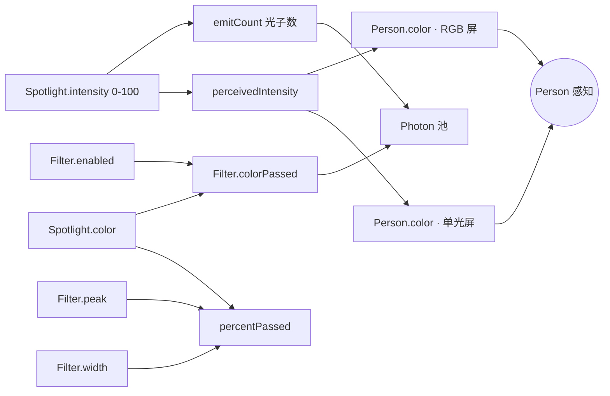
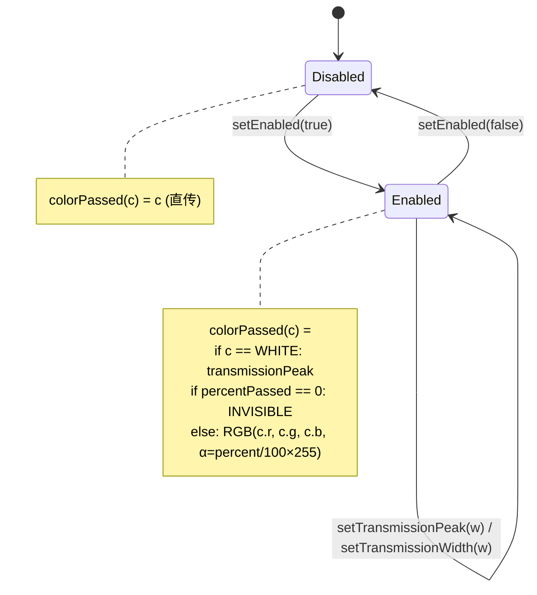

# Color-Vision · Experiment Design Document (EDD)

> **需求 ID**：req-port-color-vision
> **蓝本**：`c:\workspace\kartosTrunk\kartosTrunk\simulations-java\simulations\color-vision\` · 33 Java 文件
> **产出触发**：主对话 2026-07-24 C 混合方案 A 部分 · 首个完整 EDD 模板
> **约束依据**：memory 2q03lm2g §4.6.7 EDD 与闸门映射 · 8 章节结构
> **信心度**：92%（8 model + 2 module 已读全 · view/control 层通过 module 引用间接理解）
> **数据源**：`c:\workspace\kartosTrunk\kartosTrunk\simulations-java\simulations\color-vision\src\edu\colorado\kartos\colorvision\**\*.java`

---

## §1 · 实验概览（Experiment Overview）

### 1.1 学科与知识点定位

| 项 | 值 |
|---|---|
| **学科** | 物理 · 光学 · 色觉 |
| **主题** | 颜色的产生与感知 · RGB 加色合成 · 光的滤波 |
| **课标关联** | 义务教育《物理课程标准》"光现象"主题 → 三原色、光的合成、光的过滤（选择性透射）· 高中物理选修"光学"扩展 |
| **典型学段** | 初中 8 年级 - 高中 · 也可作科普通识 |
| **学习时长（单次）** | 15-25 分钟 |

### 1.2 双子屏结构（对应蓝本 2 Module）

| 子屏 | 蓝本类 | 教学重点 | 元件数量 |
|---|---|---|---|
| **子屏 1 · RGB 三色合成** | `RgbBulbsModule.java` (14.5 KB) | 加色混合（Additive Color Mixing）· 三原色叠加成任意色 · 白光 = R+G+B | 3 Spotlight + 3 PhotonBeam + 1 Person |
| **子屏 2 · 单光源 + 滤光片** | `SingleBulbModule.java` (18.7 KB) | 滤光片的选择透射 · 白光 vs 单色光 · 光子颗粒 vs 光束两种表征 | 1 Spotlight + 1 Filter + 1 PhotonBeam + 2 SolidBeam + 1 Person |

### 1.3 教学目标（Bloom 认知层次映射）

| 层次 | 目标 |
|---|---|
| **记忆** | 光的三原色（RGB）· 可见光波长范围 380-780 nm |
| **理解** | 加色合成原理 · 滤光片透过 vs 反射（吸收）机制 |
| **应用** | 预测：R+G=? · 蓝色光通过红色滤光片会呈现什么？ |
| **分析** | 白光 = 全光谱叠加；白光通过窄带滤光片后颜色 = 滤光片色 |
| **评价** | 对比"光子模型"与"光束模型"哪个更接近真实物理（光子模型正确但抽象） |

---

## §2 · 元件清单（Component Inventory · Q1.A + Q1.B）

### 2.1 核心物理元件（Q1.A）· 6 类

> 来源：`model/` 6 Java 类

| # | 元件 | 蓝本类 | 职责 | 物理对应物 |
|---|---|---|---|---|
| C1 | **Spotlight**（聚光光源） | `Spotlight.java` (6.5K) | 发光源 · 有颜色/强度/方向/发散角 | 手电筒、聚光灯、单色 LED |
| C2 | **Filter**（滤光片） | `Filter.java` (6.6K) | 选择性透射一个波长带 · 有 peak+width | 二向色滤光片、滤色玻璃 |
| C3 | **Person**（观察者） | `Person.java` (2.7K) | 感知到的颜色 · 有位置 · 无主动行为 | 学生自己（第一人称视角） |
| C4 | **Photon**（光子） | `Photon.java` (6.7K) | 单个光子 · 携带颜色+强度+方向 · 有位置更新 | 真实光子（量子表征） |
| C5 | **PhotonBeam**（光子束） | `PhotonBeam.java` (22.3K ★) | 批量管理 Photon · 池化复用 · 计算感知色 | 大量光子的统计集合 |
| C6 | **SolidBeam**（连续光束） | `SolidBeam.java` (6.8K) | 单个矩形光束 · 直接从光源色 → Filter → 感知色 | 经典波动光学近似 |

### 2.2 辅助表征概念元件（Q1.B）· 教学可视化组件

> 这些不是"物理实体"，是让学生看懂物理的**表征桥梁**

| # | 概念 | 蓝本类 | 说明 |
|---|---|---|---|
| A1 | **BellCurve**（钟形光谱曲线） | `view/BellCurveGraphic.java` | Filter 透射曲线的高斯可视化 · 让学生看到"半峰宽 transmissionWidth" |
| A2 | **ThoughtBubbleGraphic**（气泡） | `view/ThoughtBubbleGraphic.java` | Person 眼中所见颜色的思维气泡 · 建立"感知色 ↔ 意识"的教学隐喻 |
| A3 | **PipeGraphic**（管道） | `view/PipeGraphic.java` | 从滑条到光源/滤光片的物理连接线 · 表征"这个滑条控制的是谁" |
| A4 | **SpectrumSlider**（光谱滑条） | `control/SpectrumSlider.java` (20K ★) | 可视化的波长选择器 · 380nm 紫 → 780nm 红 |
| A5 | **ColorIntensitySlider**（强度滑条） | `control/ColorIntensitySlider.java` | 单一颜色的 0-100% 强度控件 |
| A6 | **ToggleSwitch**（开关） | `control/ToggleSwitch.java` | 滤光片启用/禁用 · 图形化开关 |
| A7 | **WiggleMe**（引导抖动） | `help/WiggleMe.java` | 首次进入时的动效指引 · 教学引导 |

### 2.3 复用与省略清单

| 类 | Flutter 复刻策略 |
|---|---|
| Photon 池化机制 | ✅ 保留 · 大量粒子必须池化（Flutter CustomPainter 渲染 60 帧才不掉帧） |
| Java Swing `ChangeEvent`/`SimpleObservable` | ❌ 用 Flutter `ChangeNotifier` / `ValueNotifier` 替代 |
| `EventListenerList` 反射式监听 | ❌ 用 Dart callback + Stream |
| PhetGraphicsModule + ApparatusPanel3 | ❌ 用 Flutter Scaffold + Stack + Positioned |
| `VisibleColor` 类 | 🟡 部分复用 · 波长 → RGB 的转换算法必须保留（`lib/common/optics/visible_color.dart` 可能已存在） |

---

## §3 · 参数联动声明（Parameter Coupling · Q5 + Intrinsic/Derived 分类）

> 依据 memory 2q03lm2g §3.5 参数分类判定法：Intrinsic = 独立可调；Derived = 由 Intrinsic 计算得出

### 3.1 Intrinsic 参数（学生可直接调）

| # | 元件 | 参数 | 类型 | 单位/范围 | 默认值 | 控件 |
|---|---|---|---|---|---|---|
| P1 | Spotlight | `intensity` | Intrinsic | 0-100% | RGB 屏：0；单光屏：100 | ColorIntensitySlider / 隐式 |
| P2 | Spotlight | `color` | Intrinsic | VisibleColor (含 wavelength) | RGB 屏：RED/GREEN/BLUE；单光屏：WHITE | SpectrumSlider（单光屏 mono 模式） |
| P3 | Spotlight | `direction` | Intrinsic | -180°~180° | RGB 屏：27°/0°/-27°；单光屏：0° | 布局固定（不允许学生改） |
| P4 | Spotlight | `cutOffAngle` | Intrinsic | 0°-180° | 15°（DEFAULT） | 布局固定 |
| P5 | Filter | `transmissionPeak` | Intrinsic | wavelength (380-780 nm) | 中值 580 nm | SpectrumSlider（filter） |
| P6 | Filter | `transmissionWidth` | Intrinsic | nm | 50 nm（半峰宽） | 布局固定（可选未来暴露） |
| P7 | Filter | `enabled` | Intrinsic | bool | true | ToggleSwitch |
| P8 | 表征模式 | `beamType` | Intrinsic | {PHOTON_BEAM, SOLID_BEAM} | PHOTON_BEAM | RadioButton |
| P9 | 表征模式 | `bulbType` | Intrinsic | {WHITE_BULB, MONOCHROMATIC_BULB} | WHITE_BULB | RadioButton |

### 3.2 Derived 参数（由 Intrinsic 计算得出 · 严禁作为独立字段存储）

| # | 派生量 | 由何计算 | 公式 |
|---|---|---|---|
| D1 | Photon.deltaX/deltaY | Spotlight.direction | `PHOTON_DS × cos/sin(radians)`（Photon.java: 149-151） |
| D2 | PhotonBeam.emitCount | Spotlight.intensity + PhotonBeam.maxPhotons | `(intensity/100) × maxPhotons`（PhotonBeam.java: 262-268） |
| D3 | Filter.percentPassed | color.wavelength + Filter.peak + Filter.width | 若 abs(peak-w) > width/2 → 0；否则 `100 - (abs(peak-w)/halfWidth × 100)`（Filter.java: 196-215） |
| D4 | Filter.colorPassed | color + enabled + peak | 见 §4.2 状态机 |
| D5 | PhotonBeam.perceivedColor | 最后离开 bounds 的 photon 的 color × intensity 折算 alpha | 通过 VisibleColorChangeEvent 通知 Person |
| D6 | Person.color（RGB 屏） | 3 个 PhotonBeam 的 perceivedIntensity | `r = (redBeam.pi/100)×255`（同理 g/b）→ new VisibleColor(r,g,b,255)（RgbBulbsModule.java: 253-260） |
| D7 | Person.color（单光屏） | photonBeamModel 或 postFilterBeamModel 的 VisibleColorChangeEvent.color | 直接 setColor（SingleBulbModule.java: 293） |

### 3.3 参数联动图



**关键洞见**：Person.color 是**完全派生量** —— 学生不能直接调 Person，只能通过 Spotlight+Filter 间接影响。这是 C27（元件唯一性）的正例。

---

## §4 · 元件交互与状态机（Component Interaction · Q3 + Q4）

### 4.1 空间关系（Q3）

**RGB 屏拓扑**（RgbBulbsModule.java: 60-73）：
```
[Red Spotlight]   (120, 105)  ─┐
                     ↓ 27°     │
[Green Spotlight] (120, 325)  ─┤─ 3 PhotonBeam ─→ Person (450, 25)
                     ↓ 0°     │
[Blue Spotlight]  (120, 545)  ─┘
                     ↓ -27°
BEAM_BOUNDS = Rectangle(120, 105, 430, 440)  // 3 光束会聚区
```

**单光屏拓扑**（SingleBulbModule.java: 68-90）：
```
[Spotlight] (120, 325) ─→ [Filter] (337, 250) ─→ [Person] (450, 25)
                              ↑
                    ToggleSwitch (330, 440)
                    SpectrumSlider (100, 515)
```

### 4.2 相互作用规则（Q4）

#### 规则 R1 · 光源发射光子（PhotonBeam.stepInTime L262-283）
```
emitCount = round(spotlight.intensity/100 × maxPhotons)  // maxPhotons=15
特殊：intensity=0 但 perceivedIntensity>0 时，emit 1 zero-intensity photon（用于"关灯回归黑暗"效果）
```

#### 规则 R2 · Filter 与 Photon 相遇（PhotonBeam.stepInTime L303-343）
四种情形：

| 情形 | 条件 | 处理 |
|---|---|---|
| **未启用滤光片** | !hasEnabledFilter | photon 标 filtered=true 直穿 |
| **完全阻断** | percentPassed == 0 | photon.setInUse(false) 标可复用 |
| **部分通过** | 0 < percentPassed < 100 | photon.setIntensity(percentPassed)；位置 +FILTERED_PHOTON_ADVANCE=20；加入 filteredPhotons |
| **白光穿滤光片** | color = WHITE | 保留 15% 数量 · 变为 filter.transmissionPeak 色（PhotonBeam.java: 372-386） |

#### 规则 R3 · Photon 离开 bounds → 更新 perceivedColor（PhotonBeam.java: 297-302）
```
if !bounds.contains(photon):
    photon.inUse = false
    perceivedColor = photon.color
    perceivedIntensity = photon.intensity
    fire VisibleColorChangeEvent → Person
```

#### 规则 R4 · Filter.percentPassed 数学函数（Filter.java: 196-215）
```
percent(wavelength) = {
    100,                                            if wavelength == WHITE (special)
    0,                                              if |peak - w| > width/2
    100 × (1 - |peak - w| / (width/2)),             otherwise (triangular passband)
}
```

**物理近似**：三角带通函数，非真实高斯 · 但视觉上足够表征"半峰宽"。

#### 规则 R5 · RGB 加色合成（RgbBulbsModule.java: 253-260）
```
r = (redBeam.perceivedIntensity/100) × 255
g = (greenBeam.perceivedIntensity/100) × 255
b = (blueBeam.perceivedIntensity/100) × 255
Person.color = RGB(r, g, b, 255)
```

### 4.3 状态机（Filter 视角）



---

## §5 · 实验流程与教学脚本（Experiment Flow · Q6 + Q7）

### 5.1 实验目标（Q6）

**RGB 屏 · 学习问答**：
- Q: 只开红光，Person 看到什么？→ A: 红色
- Q: 红+绿全开，看到什么？→ A: 黄色（学生常预测"红绿色"，反例教学价值高）
- Q: R+G+B 全开满，看到什么？→ A: 白色（关键 AHA moment）
- Q: R=50%, G=100%, B=0%，看到什么？→ A: 偏绿的黄绿色

**单光屏 · 学习问答**：
- Q: 白光通过红色滤光片，看到什么？→ A: 红色（白光含全光谱）
- Q: 蓝色单色光通过红色滤光片，看到什么？→ A: 黑（波长差太大，percentPassed=0）
- Q: 绿色单色光通过绿色滤光片，看到什么？→ A: 绿色（同波长 100% 通过）
- Q: 关闭滤光片，还有颜色变化吗？→ A: 无 · 直传（对照组）

### 5.2 推荐教学脚本（Q7）

| 步骤 | 屏 | 操作 | 观察 | 讲授点 |
|---|---|---|---|---|
| 1 | RGB | 只拉红滑条 100% | 全屏出现红光柱 · Person 变红 | 引入"光源色 → 感知色" |
| 2 | RGB | 加入绿滑条 100% | 两光柱交汇 · Person 变黄 | R+G=Y 反直觉 · 讨论"这不是颜料混合！" |
| 3 | RGB | 加蓝到 100% | 三光柱交汇 · Person 变白 | RGB=W · 白光的本质 |
| 4 | RGB | 各调至 50% | Person 变灰 | 强度决定明暗，比例决定色调 |
| 5 | 切到单光屏 | 白光 + 红滤光片启用 | 光束在滤光片处变红 · Person 红 | 白光含所有波长，滤光片只放行"其中一部分" |
| 6 | 单光屏 | 切换到单色光模式 · 拉紫 400 nm · 滤光片红 | 完全阻断 · 光子撞到滤光片就消失 | 单色光波长与滤光片不匹配 → 全反射/吸收 |
| 7 | 单光屏 | 切"光子颗粒"表征 | 看到离散光子 · 部分被滤 | 建立"光=粒子"量子观 |
| 8 | 单光屏 | 关闭滤光片开关 | 光子直穿 | 对照组 · 无过滤 |

### 5.3 反直觉现象清单（教学高价值）

1. R+G=Y（不是"红绿色"）
2. 三个不同色相加 = 白（学生常预测"混浊/棕色"）
3. 单色蓝光过红滤光片 = 完全黑（不是"变紫变浅"）
4. 白光过绿滤光片 = 纯绿（不是"绿白色"）

---

## §6 · 预期现象声明（Phenomena Declaration · Q8）

> 依据 memory 2q03lm2g §4.6 Q8 必答题要求 · 即使无特殊现象也须声明

### 6.1 视觉现象

| # | 现象 | 触发条件 | 表征 | 蓝本证据 |
|---|---|---|---|---|
| Ph1 | **光柱扩散** | Spotlight 有 intensity + cutOffAngle | 从光源发出的扇形光束 | SolidBeamGraphic 呈梯形；PhotonBeamGraphic 呈散点 |
| Ph2 | **光子颗粒运动** | beamType=PHOTON_BEAM | 离散小点从左向右流动 | Photon.stepInTime L232-235 · deltaX/deltaY 更新 |
| Ph3 | **光子撞到滤光片停止** | Filter enabled + percentPassed=0 | 光子到 filter.x+FILTER_CENTER_OFFSET 位置消失 | PhotonBeam.java L318-321 |
| Ph4 | **光子颜色变化** | 白光 + 滤光片启用 | 光子过滤光片后颜色 = filter.transmissionPeak | PhotonBeam.java L379-385 |
| Ph5 | **Person 颜色变化** | perceivedColor 变化 | Person 面部/思维气泡颜色变 | PersonGraphic 监听 Person model |
| Ph6 | **数量减少** | Filter 部分通过（percentPassed<100） | 通过 filter 的光子数变稀疏 | PhotonBeam.java L349-368 · culling 逻辑 |
| Ph7 | **RGB 光束交汇区变色** | 3 光束在 Person 处叠加 | 光束视觉相交 · Person 显示合成色 | RgbBulbsModule.java Rectangle BEAM_BOUNDS |

### 6.2 无声/无温度/无力学现象

- ❌ 无声音效
- ❌ 无温度变化
- ❌ 无力（光压不建模）
- ❌ 无 Person 反射光（Person 只吸收，不再发光）
- ❌ 无镜面反射 / 无折射（几何光学此处不涉及 · 蓝本简化）

### 6.3 特殊边界现象

- **intensity=0 但仍有感知色残留**：PhotonBeam 会 emit 1 zero-intensity photon 强制清零感知（PhotonBeam.java L246-249）· **视觉上表现为"关灯后 Person 立即变黑"，无残影**
- **滤光片刚启用瞬间**：正在传播中的光子不会被"追溯滤过"，只有到 filter 位置的新光子才被过滤（isFiltered 标记单向）

---

## §7 · 学生交互操作（Student Interactions · Q9）

> 依据 memory 2q03lm2g §4.6 Q9 必答题

### 7.1 RGB 屏 · 交互清单

| # | 交互 | 触发 UI | 后端反应 | 教学价值 |
|---|---|---|---|---|
| I1 | 拖动红强度滑条 | ColorIntensitySlider (RED) | Spotlight[red].intensity 改变 → PhotonBeam 发射数量变 → Person.color 红分量变 | 感知"强度 vs 色相"分离 |
| I2 | 拖动绿强度滑条 | ColorIntensitySlider (GREEN) | 同上（绿分量） | 单一变量控制 |
| I3 | 拖动蓝强度滑条 | ColorIntensitySlider (BLUE) | 同上（蓝分量） | 单一变量控制 |
| I4 | 三滑条组合调节 | 3 滑条同时 | 3 PhotonBeam 并行 emit → 感知色实时合成 | 关键教学互动 |

### 7.2 单光屏 · 交互清单

| # | 交互 | 触发 UI | 后端反应 |
|---|---|---|---|
| I5 | 切换白光/单色光 | RadioButton (WHITE_BULB / MONOCHROMATIC_BULB) | Spotlight.color 切换 · bulbSlider 显隐 |
| I6 | 单色光模式下拖动波长滑条 | SpectrumSlider (bulb) | Spotlight.color = new VisibleColor(wavelength) |
| I7 | 拖动滤光片颜色滑条 | SpectrumSlider (filter) | Filter.transmissionPeak 改变 |
| I8 | 切换滤光片开关 | ToggleSwitch | Filter.enabled = true/false |
| I9 | 切换光子/光束表征 | RadioButton (PHOTON_BEAM / SOLID_BEAM) | PhotonBeam/SolidBeam.enabled 互斥切换 |

### 7.3 无操作场景

- ❌ 不允许拖动 Person 位置（Person.setLocation 存在但 UI 不暴露）
- ❌ 不允许拖动 Spotlight 位置或方向（布局固定）
- ❌ 不允许调整 cutOffAngle 或 transmissionWidth（隐藏进阶参数）

### 7.4 交互引导（首次进入）

- RGB 屏：WiggleMe 抖动指向红滑条区域（IntensitySliderWiggleMe · 位置 (90, 195)）
- 单光屏：WiggleMe 抖动指向滤光片滑条（FilterSliderWiggleMe · 位置 (215, 560)）
- 学生第一次操作滑条时 WiggleMe 停止

---

## §8 · 实验改造与扩展（Adaptation & Organization · Q10）

### 8.1 学科正确性矩阵（Scientific Correctness · memory 2q03lm2g §4.5.4）

| 维度 | 正确性 | 说明 |
|---|---|---|
| **加色合成** | ✅ 正确 | RGB→CIE 色空间的近似 · 显示器工作原理 |
| **光子颗粒** | 🟡 教学近似 | 真实光子无"颜色"属性（颜色是波长的感官投射）· 但作为初中/高中入门表征可接受 |
| **白光模型** | 🚨 简化 | 蓝本用"白光光子"（PhotonBeam.java 注释 L172-178 明确承认这是 HACK）· 真实白光应是全光谱统计 · Flutter 复刻可选：保留 HACK（保持一致）或改进为"随机波长采样" |
| **Filter 三角带通** | 🟡 近似 | 真实滤光片透射曲线是高斯或洛伦兹 · 三角函数视觉上"半峰宽"概念足够 |
| **加法混合数学** | ✅ 正确 | (r/100)×255 三通道叠加 · RGB 空间标准算法 |
| **强度 = 光子数量** | ✅ 正确 | 经典光学的能量-粒子对应 |
| **强度=0 但仍显示轨迹** | ❌ 不符 · 但教学必要 | 蓝本 emit 1 zero-intensity photon 只为清空缓冲 · 视觉上无残留 · Flutter 复刻保留即可 |

### 8.2 复刻改进机会（Flutter 版可优化）

| # | 改进点 | 原因 | 复杂度 |
|---|---|---|---|
| M1 | 拖动 Person 位置 | 让学生探索"距离衰减"（虽然此蓝本不建模） | 低（已有 setLocation） |
| M2 | 显示 Filter 透射曲线 BellCurve | 蓝本有 BellCurveGraphic 但未启用 · 让学生看到"peak+width" | 低 |
| M3 | 光子命中率统计 | 显示"1000 光子中通过 X 个"→ 定量理解 | 中 |
| M4 | 引入减色合成第 3 屏（可选） | CMY 颜料合成 · 与 RGB 加色对照 | 高（超出蓝本） |
| M5 | 光子颜色动态显示波长（nm 数值） | 让学生知道具体波长 | 低 |

### 8.3 与其他 sim 的组织关系

| 相邻 sim | 关系 |
|---|---|
| **bending-light** | 都用 VisibleColor 概念 · 都是几何光学 · SpectrumSlider 可直接复用 |
| **wave-interference (light 屏)** | 都用波长滑条 · 但 wave-interference 是波动光学（Lattice），color-vision 是粒子光学（Photon 池），教学互补 |
| **photoelectric** | 都用光子模型 · 但 photoelectric 强调"能量=hν"，color-vision 强调"颜色感知" |
| **molecules-and-light** | 光子被分子吸收 · 与 color-vision 的滤光片吸收类比 |

**建议纵向组织**：`color-vision → bending-light → wave-interference (light) → photoelectric` = 完整光学教学链

### 8.4 EGPSpace 合规性声明（memory 2q03lm2g §4.5.5）

**结论**：⚠️ **本 sim 涉及实体位移，必须遵守 EGPSpace 描述/渲染分离**

- Photon.stepInTime 更新的是 `_x/_y` 数值（Model 层描述）
- PhotonBeamGraphic 消费 Photon 的 x/y 绘制小点（Render 层）
- Flutter 版必须严格：`PhotonModel { x, y, color }` in `lib/optics/color_vision/model/` · `CustomPainter` in `lib/optics/color_vision/painter/` · 二者只通过接口通信 · Painter 不允许改 x/y

### 8.5 元件化绘制合规性声明（memory 2q03lm2g §4.5.4.4）

**结论**：✅ 蓝本 view 层已按元件化绘制组织（SpotlightGraphic / PhotonBeamGraphic / SolidBeamGraphic / FilterGraphic / PersonGraphic 各司其职）· Flutter 复刻可直接一一对应到独立 CustomPainter

**Flutter 建议架构**：
```
lib/optics/color_vision/
├── model/
│   ├── spotlight.dart          (extends ChangeNotifier)
│   ├── filter.dart
│   ├── photon.dart             (pure data · 支持池化)
│   ├── photon_beam.dart        (核心逻辑 · stepInTime tick)
│   ├── solid_beam.dart
│   └── person.dart
├── view/
│   ├── screens/
│   │   ├── rgb_bulbs_screen.dart
│   │   └── single_bulb_screen.dart
│   ├── painters/
│   │   ├── spotlight_painter.dart
│   │   ├── photon_beam_painter.dart
│   │   ├── solid_beam_painter.dart
│   │   ├── filter_painter.dart
│   │   └── person_painter.dart
│   └── widgets/
│       ├── color_intensity_slider.dart
│       └── (SpectrumSlider 应提到 lib/common/controls/)
└── controller/
    └── color_vision_controller.dart (整合 model tick + notify)
```

---

## §9 · 可配置化声明（Configuration-Driven · 项目四原则之四）

> **依据**：`docs/knowledge/kkartoss-java-simulations/overview.md:144-150` 明确要求"复刻某个 sim 时，第一步照搬 Java 逻辑，**第二步必须补一层"提取硬编码到 JSON scenario"**"
> **参照现有**：`c:\workspace\kratos\assets\scenarios\{circuit,forces}\` · `docs/prompts/{circuit,forces,optics}_scenario.md` · `schemas/*_scenario.schema.json`
> **本原则**：所有教学变量必须从 JSON 场景读取 · 不允许在 Dart 代码里硬编码"红光初始强度=0"这类可教学参数

### 9.1 配置化边界（What goes to JSON, what stays in code）

| 类别 | 归属 | 例 |
|---|---|---|
| **物理常数** | 🔒 代码硬编码（不可教学调） | `PHOTON_DS`（光子步长）、光速、`WHITE_WAVELENGTH=-1` 哨兵值 |
| **元件初始状态** | ✅ JSON 配置 | 各 Spotlight 的 intensity/color/direction/位置 |
| **元件可调范围** | ✅ JSON 配置 | intensity 0-100 · wavelength 380-780 · transmissionWidth |
| **场景布局** | ✅ JSON 配置 | 3 光源坐标 · Filter 坐标 · Person 坐标 · BEAM_BOUNDS |
| **教学目标** | ✅ JSON 配置 | successCriteria（如"Person 变白" / "Person 变红"） |
| **提示语** | ✅ JSON 配置 | hints（如"两色相加会怎样？"） |
| **元件类型清单** | ✅ JSON 配置 | 该场景启用哪些元件（RGB 屏 3 Spotlight vs 单光屏 1 Spotlight + 1 Filter） |
| **模式切换** | ✅ JSON 配置 | beamType (PHOTON_BEAM/SOLID_BEAM) · bulbType (WHITE/MONOCHROMATIC) 的初始值与可切换性 |
| **Photon 池大小** | 🟡 代码常量 + JSON 覆盖 | 默认 maxPhotons=15 · JSON 可覆盖（性能调优空间） |
| **算法流程** | 🔒 代码硬编码 | stepInTime tick 逻辑 · RGB 合成公式 · Filter 三角带通函数 |

**原则**：如果学生调这个值能获得教学价值 → JSON · 如果只是引擎实现细节 → 代码

### 9.2 提议的 scenario 目录结构

```
c:\workspace\kratos\assets\scenarios\color_vision\
├── manifest.json                    # 场景池索引（参考 forces/manifest.json 格式）
├── default.json                     # 默认（RGB 三光源 · 全灭 · 学生自由探索）
├── rgb-all-on.json                  # RGB 全开 = 白光教学
├── rgb-yellow-mystery.json          # R+G 挑战："预测这是什么颜色"
├── rgb-gray-mystery.json            # R=G=B=50% 挑战
├── single-white-red-filter.json     # 白光 + 红滤光片
├── single-blue-red-filter.json      # 蓝光 + 红滤光片（黑色反例）
├── single-photon-mode.json          # 光子颗粒表征演示
└── single-filter-toggle-demo.json   # 开关滤光片对照

c:\workspace\kratos\docs\prompts\
└── color_vision_scenario.md         # AI 生成提示词（本 EDD 附赠骨架 · 见 §10）

c:\workspace\kratos\schemas\
└── color_vision_scenario.schema.json  # JSON Schema 验证器
```

### 9.3 scenario JSON 契约（骨架 · 待正式实现时细化）

参照 `forces_scenario.schema.json` 的组织风格，color_vision 的 schema 关键字段：

```jsonc
{
  "scenarioId": "single-white-red-filter",
  "name": "白光通过红滤光片",
  "description": "白光含全光谱 · 红滤光片只放行红光波段 · Person 应看到红色",
  "version": "1.0",
  "screen": "singleBulb",              // "rgbBulbs" | "singleBulb"

  // Intrinsic 参数初值（对齐 EDD §3.1 P1-P9）
  "initialParams": {
    "beamType": "PHOTON_BEAM",         // 或 SOLID_BEAM
    "bulbType": "WHITE_BULB",          // 或 MONOCHROMATIC_BULB · 仅 singleBulb 屏
    "spotlights": [                    // rgbBulbs 屏 3 项 · singleBulb 屏 1 项
      {
        "id": "single-white",
        "intensity": 100,              // 0-100
        "wavelength": -1,              // -1 = WHITE · 或 380-780 nm
        "position": {"x": 120, "y": 325},
        "direction": 0,                // 度
        "cutOffAngle": 15
      }
    ],
    "filter": {                        // singleBulb 屏专用 · rgbBulbs 屏省略
      "enabled": true,
      "transmissionPeak": 680,         // nm · 红光峰值
      "transmissionWidth": 50,
      "position": {"x": 337, "y": 250}
    },
    "person": {"position": {"x": 450, "y": 25}}
  },

  // 元件可调范围（覆盖 §3.1 硬编码默认）
  "paramRanges": {
    "wavelength": {"min": 380, "max": 780, "step": 5, "unit": "nm"},
    "intensity":  {"min": 0,   "max": 100, "step": 1, "unit": "%"},
    "transmissionPeak": {"min": 380, "max": 780, "step": 5, "unit": "nm"}
  },

  // Q6 教学目标 → 可判定的 successCriteria
  "successCriteria": [
    {
      "id": "sc-1",
      "type": "personColorReached",
      "description": "让 Person 感知到红色",
      "params": {"targetHue": 0, "hueTolerance": 15, "minSaturation": 0.5}
    }
  ],

  // Q4/R2 交互规则可参数化（覆盖蓝本硬编码）
  "constraints": [
    {"id": "co-1", "type": "filterPassThrough",
     "description": "白光通过滤光片会变为滤光片峰值色",
     "params": {"whiteRetentionRate": 0.15}}
  ],

  // 教学提示语（Q7 教学脚本自动化）
  "hints": [
    {"trigger": "filter.enabled == false", "message": "先启用滤光片开关"},
    {"trigger": "person.perceivedIntensity < 10", "message": "试试增加白光强度"},
    {"trigger": "always", "message": "白光含所有波长 · 滤光片只放行其中一小段"}
  ]
}
```

**关键设计**：
1. **`screen` 字段**决定加载 RgbBulbsScreen 还是 SingleBulbScreen（对齐蓝本 2 Module）
2. **`spotlights` 数组**统一 RGB 屏 3 项与单光屏 1 项 · 元件唯一性（memory 2q03lm2g §C27）
3. **`initialParams` vs `paramRanges` 分离** · 前者是 §3.1 的 Intrinsic 初值 · 后者是 UI 滑条约束 · 对应 `w0-3-property-control-draft.md:174-238` 的 `PropertyControlPanel.fromScenarioParams` 工厂
4. **Derived 参数不出现在 JSON**（如 Person.color / percentPassed）· 严格遵守 EDD §3.2 派生量代码计算原则
5. **successCriteria.type = "personColorReached"** 是 color-vision 特有类型 · 需在 Dart 侧新增 checker · 参照 forces 的 `speedReached`

### 9.4 与 ScenarioManagerBase 的对接（依赖 P2 债务）

- 本模块直接使用 P2 抽出的 `ScenarioManagerBase<ColorVisionScenario>`
- 需先完成 `req-refactor-scenario-manager-common` · 见 `shared-abstraction-plan.md:73-74`
- Dart 模型类：`lib/optics/color_vision/config/color_vision_scenario.dart`
- 加载器：`lib/optics/color_vision/config/color_vision_scenario_manager.dart` (继承 base)

### 9.5 配置化验收（Definition of Done · 配置化维度）

- [ ] `assets/scenarios/color_vision/manifest.json` 存在 · 至少 3 个 scenario
- [ ] `schemas/color_vision_scenario.schema.json` 存在 · CI 校验所有场景 JSON 通过 schema
- [ ] `lib/optics/color_vision/config/color_vision_scenario.dart` fromJson/toJson 单测覆盖
- [ ] UI 右侧参数面板通过 `PropertyControlPanel.fromScenarioParams` 生成 · 不硬编码控件
- [ ] 场景切换后 · 元件位置/初值/可调范围全部按 JSON 生效
- [ ] 加载失败的场景 · 降级为 default 场景（不 crash）

---

## §10 · AI 可生成化声明（AI-Generatable · 项目四原则加成）

> **依据**：项目 overview.md 明确"AI 可生成"是 scenario 系统的核心价值 · 现有 `docs/prompts/{circuit,forces,optics}_scenario.md` 已是成熟范式
> **原则**：任何具备 §9 完整 schema 的 sim · 必须同步产出可让 LLM 直接读来生成新场景的 prompt 文档
> **产物**：`c:\workspace\kratos\docs\prompts\color_vision_scenario.md`

### 10.1 为什么 color-vision 天然适合 AI 生成

| 特性 | AI 生成友好度 | 说明 |
|---|:---:|---|
| **元件类型少** | ⭐⭐⭐⭐⭐ | 只有 3 类（Spotlight/Filter/Person）· AI 组合空间收敛 |
| **参数值离散** | ⭐⭐⭐⭐ | 强度 0-100 整数 · 波长 380-780 步进 5nm · 无连续数学 |
| **教学目标可枚举** | ⭐⭐⭐⭐⭐ | 单一维度（Person 感知到什么颜色）· AI 易验证 |
| **反直觉现象丰富** | ⭐⭐⭐⭐⭐ | R+G=Y 等经典陷阱可批量生成"预测挑战"场景 |
| **无时序编排** | ⭐⭐⭐⭐⭐ | 场景是静态初值 + 学生调节 · 不像 sound 需要节拍/波形时序 |
| **物理边界明确** | ⭐⭐⭐⭐⭐ | schema.json + successCriteria.type 双约束 · AI 难越界 |

**综合评估**：color-vision 是 4 个待复刻 sim 中 **AI 生成成本最低的**（sound 需时序 · wave-interference 需 2D lattice · radio-waves 需天线几何）· 优先做完 · 建立标杆

### 10.2 提议的 AI 生成 prompt 骨架

参照 `docs/prompts/forces_scenario.md` 的组织，`color_vision_scenario.md` 应包含 8 段：

1. **Role Definition** · "You are a color-vision experiment designer for kratos Flutter port"
2. **Model Overview** · 参数表（对齐 EDD §3.1）· 元件表（对齐 EDD §2.1）
3. **Screen Modes** · rgbBulbs / singleBulb 两屏差异表
4. **Physical Constants** · 光子步长 / 白光哨兵值 -1 / BEAM_BOUNDS 等（**AI 不得改**）
5. **Few-Shot Examples** · 最少 3 例（RGB 教学 · 单光教学 · 反直觉挑战）
6. **successCriteria Types** · personColorReached / photonBlockedRate 等的 params 契约
7. **Constraint Types** · filterPassThrough / photonPoolSize 等
8. **Validation Checklist** · schema 校验 + 语义校验（如"MONOCHROMATIC_BULB 必须配 wavelength ∈ [380,780]"）
9. **Output Format** · Only JSON · 严格遵守 `schemas/color_vision_scenario.schema.json`

### 10.3 提议的 AI 生成能力矩阵

按学生学习进程 · AI 应能生成以下 6 类场景：

| 分类 | AI 生成任务 | 输入示例 | 期待输出 |
|---|---|---|---|
| **C1 · 基础演示** | "生成一个 RGB 三色全开 = 白光的入门场景" | 教师提示 | R=G=B=100 · Person 应白 · hint 说明加色原理 |
| **C2 · 反直觉挑战** | "生成 5 个 R+G+B 不同比例的猜色挑战" | 教师提示 | 5 个 JSON · 每个有独特初值 + successCriteria = personColorReached(具体目标色) |
| **C3 · 滤光片探索** | "生成一组白光过不同颜色滤光片的场景" | 波长列表 [450,550,650] | 3 个 JSON · Filter.peak 分别设 · Person 显示对应色 |
| **C4 · 表征切换教学** | "生成一个先看光束再切光子的对比场景" | 教师提示 | 2 个 JSON · beamType 分别为 SOLID/PHOTON · 同参数对比 |
| **C5 · 陷阱题** | "生成蓝光过红滤光片这种"预测=黑"的陷阱题" | 教师提示 | JSON · wavelength=450 · Filter.peak=680 · successCriteria=personColorReached(黑) |
| **C6 · 综合任务** | "为初二学生设计一个课时 4-6 个场景的教案" | 学段/时长 | manifest 补充 + 一组 scenario JSON |

### 10.4 AI 生成的质量保障

三层校验（沿用现有 optics_scenario 的既有做法）：

1. **Schema 校验**（机械） · JSON 通过 `color_vision_scenario.schema.json` 才允许入库
2. **物理约束校验**（模型级） · 如"beamType=PHOTON_BEAM 且 intensity=0 时应 emit=1"等边界规则由 Dart 加载器验证
3. **教学有效性校验**（人工 / 未来 LLM 评审） · Q6 目标是否可达（successCriteria 是否能通过学生操作触发）

### 10.5 AI 可生成化验收（Definition of Done · AI 维度）

- [ ] `docs/prompts/color_vision_scenario.md` 存在 · 覆盖 §10.2 全 9 段
- [ ] 至少 3 个 few-shot examples · 覆盖 rgbBulbs / singleBulb / 反直觉挑战
- [ ] 明确列出"AI 不可修改"的物理常数清单
- [ ] Validation Checklist 至少 6 条（对齐 forces_scenario.md 的粒度）
- [ ] 真实测试：让 LLM 按 prompt 生成 5 个新场景 · 100% 通过 schema · ≥ 80% 教学有效性人工评审通过

---

## §附录 A · EDD 到闸门（Gate）的映射

依据 memory 2q03lm2g §4.6.7：

| EDD 章节 | Gate 检查项 | 通过条件 |
|---|---|---|
| §2 元件清单 | C27（元件唯一性） | 6 model 元件 · 无重复 · Person 派生于其他元件 ✅ |
| §3 参数联动 | C30/D23（Intrinsic vs Derived） | Derived 参数 D1-D7 已明确 · 不作为独立字段 ✅ |
| §4 元件交互 | C28（相互作用完备） | 5 条规则 R1-R5 覆盖所有相互作用 ✅ |
| §5 教学流程 | C29（教学目标可达） | 8 步教学脚本 + 反直觉现象清单 ✅ |
| §6 现象声明 | C31（Q8 必答） | 7 条视觉现象 + 无声明段 + 边界现象 ✅ |
| §7 学生交互 | C32（Q9 必答） | 9 种交互 I1-I9 · 涵盖所有可调参数 ✅ |
| §8 改造与组织 | D26/D27（Q10 完备） | 学科正确性矩阵 + 改进机会 + 相邻 sim 组织 ✅ |
| §9 可配置化 | 项目四原则第 4 条 | 配置化边界表 + scenario 契约骨架 + DoD 6 条 ✅ |
| §10 AI 可生成化 | 项目四原则加成 | prompt 骨架 9 段 + 生成能力矩阵 6 类 + 三层校验 + DoD 5 条 ✅ |
| §11 通用化组件清单 | 项目四原则第 3 条 | L0 复用 7 项 + L1 候选 2 项 + L2 专属 3 项 ✅ |
| §12 质量属性 | 测试/性能/i18n/可访问性 | 4 类测试目标 + 帧率预算 + 持久化策略 + i18n + 色盲替代表征 ✅ |

**综合结论**：✅ **EDD 通过 C27-C32 + 项目四原则全部闸门 · 可进入 PLAN 阶段的任务拆分**

---

## §附录 B · 后续需求任务拆分建议

按 30 分钟原则，建议将 color-vision 复刻拆为以下 vibe-loop：

| Loop # | 目标 | 产物 | 时间预算 | 依赖 |
|---|---|---|---|---|
| L0 | **前置阻塞** · 完成 P2 债务 `req-refactor-scenario-manager-common` | `lib/common/scenario/scenario_manager_base.dart` + 3 现有模块迁移 | 独立需求 | — |
| L1 | 创建 scenario schema + prompt（§9/§10 落地） | `schemas/color_vision_scenario.schema.json` + `docs/prompts/color_vision_scenario.md` + `assets/scenarios/color_vision/{manifest,default}.json` | 60 min | L0 完成 |
| L2 | 创建 model 层（6 类 Dart 实现） | `lib/optics/color_vision/model/*.dart` + 单测 | 60 min | L1 |
| L3 | 实现 PhotonBeam.stepInTime 池化逻辑 | 单测 + 手动验证发射/复用/culling | 30 min | L2 |
| L4 | Filter.percentPassed + colorPassed 算法 | 单测覆盖 4 种情形 | 30 min | L2 |
| L5 | Scenario 数据模型 + Manager 实现 | `config/color_vision_scenario.dart` + `config/color_vision_scenario_manager.dart` · schema-driven | 60 min | L1 |
| L6 | RGB 屏 UI（3 slider + 3 光柱 + 1 Person · scenario-driven） | 可运行 dev · 截图 · `PropertyControlPanel.fromScenarioParams` 生成右侧面板 | 60 min | L3+L5 |
| L7 | 单光屏 UI（+ SpectrumSlider + ToggleSwitch + Filter · scenario-driven） | 可运行 dev · 截图 | 60 min | L4+L5 |
| L8 | PhotonBeamPainter 优化（60 FPS） | Performance 测试 | 30 min | L6+L7 |
| L9 | AI 生成回归测试 | 让 LLM 生成 5 个新 scenario · 100% 通过 schema | 30 min | L5+L1 |
| L10 | SpectrumSlider 提到 lib/common/controls/（应用 3-Time Rule） | 触发条件：bending-light 之后 | 60 min | — |

**总预算**：约 8-9 小时 · 10 个 loop（不含 L0 与 L10）· 每个 loop 单一改动 · 单一 commit

**关键前后依赖**：
- **L0（P2 债务）必须先于 L1-L9** · 否则 L5 无 base 可继承（违反 `shared-abstraction-plan.md:194-197` 的阻塞图）
- **L1（配置化骨架）必须先于 L5-L7** · 否则 UI 落地时无 scenario 可加载
- **L9（AI 生成回归）验证 §10 的**"AI 可生成化 DoD 5 条"闸门是否达成 · 未通过则退回 L1 补 prompt / schema

## 变更历史

> 2026-07-24 by 主对话（用户选 C 混合方案 · A 部分 · 首个完整 EDD）：
> 首个 sim 完整 EDD 文档 · 作为后续 sound / radio-waves / wave-interference EDD 的模板锚点。
> - 依据 memory 2q03lm2g §4.6.7 8 章节模板全量填充
> - 数据源：实测 `PHET_JAVA_ROOT/simulations-java/simulations/color-vision/src/` 8 model + 2 module 已读全
> - Q1-Q10 全部覆盖 · Q8/Q9 必答
> - 附录 A EDD-Gate 映射通过 C27-C32 全项
> - 附录 B 任务拆分为 8 个 vibe-loop（30 分钟原则）
> - 触发下一步：等待用户 review + 决策"是否直接进入 L1 · model 层实现"

---

## §11 · 通用化组件清单（Common Abstraction Checklist · v2.0）

### 11.1 复用自 lib/common/ 的组件

| 组件 | 来源路径 | 必用/可选 | 理由 |
|---|---|---|---|
| KratosSlider | `lib/common/controlkartosatos_slider.dart` | 必用 | RGB 三通道强度滑块 · 频率/振幅滑块 |
| KratosRadioGroup | `lib/common/controlkartosatos_radio_group.dart` | 必用 | 子屏切换 / 光束视图 vs 单光子视图 |
| KratosComboBox | `lib/common/controlkartosatos_combo_box.dart` | 必用 | 滤光片颜色选择 |
| PropertyControlPanel | `lib/common/widgets/property_control_panel.dart` | 必用 | 右侧参数面板 fromScenarioParams |
| TimeControlBar | `lib/common/widgets/time_control_bar.dart` | 必用 | 播放/暂停/重置 |
| SimulationClock | `lib/common/simulation_clock.dart` | 必用 | Tick 驱动 PhotonBeam.stepInTime |
| ScenarioManagerBase | `lib/common/scenario/scenario_manager_base.dart` | 必用 | P2 已完工 · scenario 加载/切换/缓存 |

### 11.2 待抽出候选（3-Time Rule 监控）

| 组件 | 当前路径 | 使用者计数 | 触发条件 | 评估 |
|---|---|---|---|---|
| **SpectrumSlider**（光谱滑块） | `lib/common/controls/spectrum_slider.dart` | **L0（已提）** | color-vision single-bulb 屏 · wave-interference light 屏 | ✅ 已提 · bending-light 无需等待 |
| PhotonBeamPainter（光子束绘制） | `lib/color_vision/painters/photon_beam_painter.dart`（待创建） | 1/3 | photoelectric / discharge-lamps 开工（第 2 用户） | 光子可视化是通用概念但颜色映射特化——可能不适合上抽 |

### 11.3 sim 专属保留

| 组件 | 保留理由 |
|---|---|
| PhotonBeam 池化模型（发射·复用·culling） | 光子颗粒模型是 color-vision 专属 · wave sim 用波动方程 · 不上抽 |
| Filter.percentPassed + colorPassed 算法 | 滤光片物理是光学专属 · 不上抽 |
| Person（观察者）模型 | 教学辅助 · 其他 sim 不需要 |

### 11.4 与 shared-abstraction-plan.md 联动

- 本 sim 涉及的 L0 层：KratosSlider / KratosRadioGroup / KratosComboBox / PropertyControlPanel / TimeControlBar / SimulationClock / ScenarioManagerBase
- 本 sim 涉及的 L1 层（已孵化）：SpectrumSlider（标记第 1/3 用户 · bending-light 将触发第 2 用户评估）
- 本 sim 涉及的 L2 层：PhotonBeam 池化模型（sim 专属 · 保留）

---

## §12 · 质量属性声明（Quality Attributes · v2.0）

### 12.1 测试目标

| 测试类型 | 覆盖率目标 | 关键被测类 |
|---|---|---|
| Unit Test | ≥ 80% | PhotonBeam.stepInTime（发射/复用/culling）· Filter.percentPassed + colorPassed · ColorModel 三通道叠加 · SpotLight.intensity→photonCount 映射 |
| Widget Test | ≥ 3 关键 widget | RgbBulbsScreen · SingleBulbScreen · SpectrumSlider · PropertyControlPanel 场景驱动生成 |
| Golden Test | ≥ 3 状态截图 | RGB 屏默认态（3 白光柱叠加）· 单光屏默认态（白光+无滤光片）· 白光+红色滤光片（Person 看到红色） |
| Integration | ≥ 2 完整 scenario | RGB 三色合成流程 · 单光滤光片切换流程 |

### 12.2 性能目标

- **目标帧率**：60 fps（16.67 ms/帧）
- **劣化场景枚举**：
  - RGB 屏全开（3 PhotonBeam × N 光子并发）：PhotonBeam 池化（复用而非新建）保证 < 5 ms/帧
  - 单光屏 + 滤光片（PhotonBeam + SolidBeam 双渲染）：< 5 ms/帧
- **粒子/元件池上限**：PhotonBeam 每束 ≤ 50 光子 · Pool 预分配 50 · 复用而非 GC
- **无关卡计时器**：本 sim 无胜负判定，无帧率压力

### 12.3 状态持久化策略

| 场景 | 保留什么 | 存储方式 |
|---|---|---|
| 子屏切换 | 不保留（每子屏独立模型） | — |
| App 重启 | 不保留（每次从 default 开始） | — |
| Scenario 切换 | 不保留（新 scenario 覆盖） | — |

### 12.4 i18n 键位规划

- 预估键数量：~30（2 子屏标题 + 控件标签 + 帮助文本 + 度量单位）
- 文本来源：蓝本 `ColorVisionResources.java`（properties 文件驱动的 i18n）→ Flutter `.arb`
- 多语言优先级：zh_CN > en_US

### 12.5 可访问性声明

- **色盲友好是核心需求**：本 sim 主题是色觉——必须提供色盲替代表征
  - **文字标签**：每束光的颜色名称（Red / Green / Blue / White）始终可见 · 不依赖颜色辨识
  - **图案编码**：RGB 三光柱可用条纹/点阵模式区分（除颜色外）
  - **数值显示**：RGB 三个强度数值（0-100%）始终可见 · Person "看到"的颜色用文字标签（如 "Yellow · R+G"）
- **屏幕阅读器**：滑块值变化播报（如 "Red intensity 80%"）· 滤光片切换播报（如 "Filter: Red · 只透过红光"）
- **触控目标**：≥ 48×48 dp（Material 规范）
