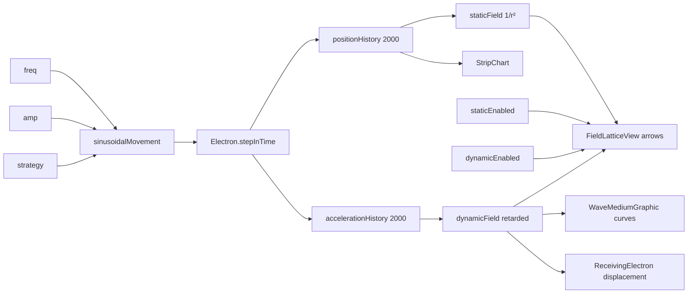
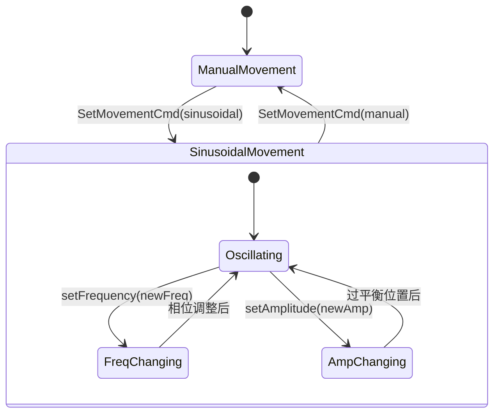

# Radio Waves · Experiment Design Document (EDD)

> **需求 ID**：req-port-radio-waves
> **蓝本**：`c:\workspace\kartosTrunk\kartosTrunk\simulations-java\simulations\radio-waves\` · 57 Java 文件
> **产出触发**：主对话 2026-07-24 · 按 edd-template.md v2.0 12 章全量产出
> **信心度**：90%（Electron / EmfModel / EmfSensingElectron / EmfModule / SinusoidalMovement / ManualMovement / EmfConfig 已读全）
> **数据源**：`PHET_JAVA_ROOT/simulations-java/simulations/radio-waves/src/edu/colorado/kartos/radiowaves/**/*.java`

---

## §1 · 实验概览（Experiment Overview）

### 1.1 学科与知识点定位

| 项 | 值 |
|---|---|
| **学科** | 物理 · 电磁学 · 波动 |
| **主题** | 电磁波的产生机制——加速电荷辐射电磁场 · 近场/远场 · 波的传播延迟 |
| **课标关联** | 高中物理选修"电磁振荡与电磁波"→ LC 振荡电路产生电磁波 · 电磁波的发射与接收 |
| **典型学段** | 高中 11-12 年级 |
| **学习时长（单次）** | 15-20 分钟 |

### 1.2 子屏结构（唯一子屏 · 蓝本 EmfModule）

| 子屏 | 蓝本类 | 教学重点 | 元件 |
|---|---|---|---|
| **EMF** | `EmfModule.java` (19.3 KB) | 电子振荡产生电磁场 · 接收电子感应 · 静态场/动态场对比 · 场与力的两种视角 | TransmitterElectron + ReceivingElectron + WaveMediumGraphic × 2 + FieldLatticeView + StripChart |

### 1.3 教学目标（Bloom 认知层次映射）

| 层次 | 目标 |
|---|---|
| **记忆** | 加速电荷产生电磁辐射 · 电磁波以光速传播 |
| **理解** | 场传播有延迟（retarded field）· 接收电子振荡滞后于发射电子 |
| **应用** | 改变频率/振幅 · 观察接收端波形变化 |
| **分析** | 手动拖动电子 → 观察动态场 vs 静态场的差异 · 理解"加速才辐射" |
| **评价** | 判断"无线电通信 = 天线中的电子振荡"模型的有效性与简化边界 |

---

## §2 · 元件清单（Component Inventory · Q1.A + Q1.B）

### 2.1 核心物理元件（Q1.A）· 4 类

| # | 元件 | 蓝本类 | 职责 | 物理对应物 |
|---|---|---|---|---|
| C1 | **Electron**（发射电子） | `Electron.java` (12.9 KB ★) | **核心模型**：位置历史缓冲 positionHistory[2000] · 加速度历史 · 静态场(`getStaticFieldAt`) · 动态场(`getDynamicFieldAt`) · `recordPosition` 缓冲区移位 | 天线中振荡的电子 |
| C2 | **EmfSensingElectron**（接收电子） | `EmfSensingElectron.java` (3.6 KB) | 继承 Electron · 读取 sourceElectron 的动态场 → Verlet 积分位移 · 无场时自动回弹到原位 | 接收天线中感应的电子 |
| C3 | **Antenna**（天线） | `Antenna.java` (3.3 KB) | 位置约束（PositionConstraint）· 定义电子可沿天线棒运动的方向 | 金属天线导体 |
| C4 | **EmField**（电磁场） | `EmfModel.java` (2.4 KB) | 统领 staticFieldEnabled / dynamicFieldEnabled 开关 · transmittingElectrons 列表 · 频率/振幅广播 | 空间的电磁场抽象 |

**核心算法**：`Electron.getDynamicFieldAt(location)` 是全新物理引擎——与 sound 的 1D 振幅数组和 wave-interference 的 2D 传播器都不同：

```java
// Electron.java: getDynamicFieldAt
// 1. 用 location 到声源的 distance 作为 index 读取 positionHistory[distance]
// 2. 构建垂直于传播方向的场向量（kink model）
// 3. 场强 = acceleration[distance] / sqrt(distance) × dubsonFactor
```

这模拟了**延迟场**（retarded field）——距声源越远，读到的加速度历史越旧，因为场以光速传播需要时间。

### 2.2 辅助表征概念元件（Q1.B）

| # | 概念 | 蓝本类 | 说明 |
|---|---|---|---|
| A1 | **FieldLatticeView** | `FieldLatticeView.java` (22.2 KB) | N×M 箭头矩阵 · 每个箭头 = 该位置的电场矢量 · 支持静态场/动态场/组合三种显示模式 |
| A2 | **WaveMediumGraphic** | `WaveMediumGraphic.java` (7.1 KB) | 波幅曲线图 · TO_RIGHT（向右 800px）/ TO_LEFT（向左 200px）· 将场强映射为 y 偏移画波形 |
| A3 | **StripChart** | `StripChart.java` (5.4 KB) | 滚动波形图 · 发射端+接收端双图 · 实时显示振荡幅度随时间变化 |
| A4 | **EmfControlPanel** | `EmfControlPanel.java` (16.9 KB) | 频率/振幅控件 + 手动/正弦切换 + 场/力视角 + 静态场/动态场开关 |

### 2.3 复用与省略清单

| 类 | Flutter 复刻策略 |
|---|---|
| `Electron.java` 延迟场算法 | ✅ 核心保留 · Dart 实现 · `Float64List(2000)` 替代 `positionHistory[]` |
| `EmfSensingElectron.java` Verlet 积分 | ✅ 保留 · 纯数学 · 1:1 翻译 |
| `SinusoidalMovement / ManualMovement` | ✅ 保留 · Strategy 模式 · 可简化为 Dart enum + switch |
| `Antenna.java` 位置约束 | ✅ 保留为 `PositionConstraint` 接口 |
| `FieldLatticeView (22 KB)` 箭头矩阵 | 🟡 用 `CustomPainter` 替代 · 提前计算箭头缓存避免每帧重算 |
| `StripChart` 滚动波形 | 🟡 可复用 `lib/common/chart/` L0 组件 |
| `EmfControlPanel` | ❌ 用 L0 `KratosSlider` / `KratosRadioGroup` / `PropertyControlPanel` |
| AWT `JDialog` / `JSlider` | ❌ Flutter 原生 widget |

---

## §3 · 参数联动声明（Parameter Coupling · Q5）

### 3.1 Intrinsic 参数

| # | 参数 | 类型 | 范围 | 默认值 | 控件 |
|---|---|---|---|---|---|
| P1 | `frequency` | Intrinsic | 0.02（慢）– 若干 Hz | 0.02 | EmfControlPanel 频率滑块 |
| P2 | `amplitude` | Intrinsic | float | 50（SinusoidalMovement 默认） | EmfControlPanel 振幅滑块 |
| P3 | `movementStrategy` | Intrinsic | {SINUSOIDAL, MANUAL} | MANUAL（初始"Wiggle me"） | SetMovementCmd |
| P4 | `dynamicFieldEnabled` | Intrinsic | bool | true | DynamicFieldIsEnabledCmd |
| P5 | `staticFieldEnabled` | Intrinsic | bool | — | StaticFieldIsEnabledCmd |
| P6 | `fieldSense` | Intrinsic | {SHOW_ELECTRIC_FIELD, SHOW_FORCE_ON_ELECTRON} | SHOW_FORCE_ON_ELECTRON | RadioButton |
| P7 | `fieldDisplay` | Intrinsic | {FULL_FIELD, SINGLE_VECTOR_ROW} | — | EmfControlPanel 切换 |
| P8 | `curveVisible` | Intrinsic | bool | true | 波形曲线开关 |
| P9 | `autoscaleEnabled` | Intrinsic | bool | — | 自动缩放 |
| P10 | `stripChartEnabled` | Intrinsic | bool | false | 弹出滚动波形图窗口 |

### 3.2 Derived 参数

| # | 派生量 | 由何计算 | 蓝本证据 |
|---|---|---|---|
| D1 | `staticFieldStrength` | `getStaticFieldAt(location)` → 库仑定律 `B × 1/r²` | Electron.java L176-184 |
| D2 | `dynamicFieldStrength` | `getDynamicFieldAt(location)` → 延迟场：`acceleration[distance] / sqrt(distance) × dubsonFactor` | Electron.java L202-235 |
| D3 | `receivingElectron displacement` | EmfSensingElectron.stepInTime → Verlet 积分 `y = y + v×dt + a×dt²/2` | EmfSensingElectron.java L57-72 |
| D4 | `WaveMediumGraphic 波形 y` | `fieldStrength × scaleFactor` → 画布偏移 | WaveMediumGraphic 内部 |
| D5 | `FieldLatticeView 箭头` | 每个格点的 `getDynamicFieldAt` / `getStaticFieldAt` → 矢量 → 箭头长度+方向 | FieldLatticeView 采样 |
| D6 | `StripChart data point` | 每秒追加 `electron.getPositionAt(0)` 到图表缓冲区 | StripChartDelegate |

### 3.3 参数联动图



---

## §4 · 元件交互与状态机（Component Interaction · Q3 + Q4）

### 4.1 空间关系（Q3）

**唯一子屏 · EMF 拓扑**：
```
[发射 Antenna] (125, 200-550)
    │
    ├─ TransmitterElectron 沿天线振荡 (y 方向)
    │   └─ positionHistory[2000] 缓冲区
    │       ├─ 向左 200px → WaveMediumGraphic TO_LEFT
    │       ├─ 向右 800px → WaveMediumGraphic TO_RIGHT
    │       └─ 全场 → FieldLatticeView (N×M 箭头矩阵)
    │
    └─ 距声源 680px 远处
        └─ [接收 Antenna] (805, 200-375)
            └─ ReceivingElectron 沿天线感应
                └─ StripChart 接收端波形
```

### 4.2 相互作用规则（Q4）

#### R1 · Electron.stepInTime 核心循环

```java
// Electron.java L92-116
prevPosition = currentPosition;
movementStrategy.stepInTime(this, dt);  // ManualMovement 或 SinusoidalMovement
velocity = movementStrategy.getVelocity(this);
recordPosition(currentPosition);        // 右移 positionHistory + accelerationHistory
```

#### R2 · recordPosition 缓冲区移位

```java
// Electron.java L122-147 · s_retardedFieldLength = 2000 · s_stepSize = speedOfLight
for (i = 1999; i >= s_stepSize; i--) {
    positionHistory[i] = positionHistory[i - s_stepSize];      // 右移
    accelerationHistory[i] = accelerationHistory[i - s_stepSize];
}
// 生成新元素
positionHistory[0..stepSize-1] = currentPosition;
accelerationHistory[0] = movementStrategy.getAcceleration(this) * s_B;
```

#### R3 · getDynamicFieldAt 延迟场（核心物理）

```
distance = location.distance(origin);   // 到声源距离
generatingPos = positionHistory[distance];   // 从历史缓冲区取"过去"的位置
direction = perpendicular(generatingPos → location);  // kink model 垂直方向
magnitude = acceleration[distance] / sqrt(distance) × dubsonFactor;
return direction × magnitude;
```

**物理含义**：`positionHistory[100]` = 100 个光速步长前电子的位置 · 那个时刻的加速度决定现在到达这个距离的场强。这实现了**延迟场传播**。

#### R4 · 频率/振幅平滑切换

```java
// Electron.java L98-116
// 频率切换 → 调整相位保持波形连续
phi = runningTime × (oldFreq / newFreq - 1);
// 振幅切换 → 等到电子穿过平衡位置(y=originY)时才切换
if ((prevY - startY) × (currY - startY) ≤ 0) → 切换振幅
```

#### R5 · EmfSensingElectron 响应

```
if (sourceElectron.isFieldOff(location)) → 弹回原位（v.y = (startY - currentY) / 30）
else if (sinusoidal) → displacement = (sourcePosition - startY) × 0.4
else (manual) → Verlet: y += v×dt + a×dt²/2; v += (a + aPrev)/2 × dt
```

#### R6 · 场显示模式

| mode | FieldLatticeView | WaveMediumGraphic |
|---|---|---|
| FULL_FIELD | 显示全场箭头 | 显示 |
| SINGLE_VECTOR_ROW | 只显示一行箭头（CENTERED 或 PINNED 偏移） | 显示 |

### 4.3 关键状态机



---

## §5 · 实验流程与教学脚本（Experiment Flow · Q6 + Q7）

### 5.1 实验目标（Q6）

- Q: 为什么正弦振荡的电子会产生波？→ A: 加速电荷辐射电磁场——电子上下振荡=持续加速=持续辐射
- Q: 静态场和动态场有什么区别？→ A: 静态场随 r² 衰减（库仑定律）· 动态场随 r 更慢衰减（辐射场 ~ 1/r）· 动态场有传播延迟
- Q: 为什么接收电子也振荡？→ A: 到达接收天线的交变电场驱动电子运动（法拉第感应）
- Q: 手动拖动电子"快拉"和"慢拉"有什么不同？→ A: 快拉=大加速度=强辐射 · 慢拉=小加速度≈静态场 · 匀速=不辐射
- Q: 频率改变对接收信号有什么影响？→ A: 接收端频率跟随发射端 · 但延迟距离/光速时间后收到

### 5.2 推荐教学脚本（Q7）

| 步骤 | 操作 | 观察 | 讲授点 |
|---|---|---|---|
| 1 | 点击 WiggleMe → 切换到正弦模式 | 电子开始振荡 · 动态场箭头出现 · 右侧波形曲线波动 | 加速电荷产生电磁波 |
| 2 | 调频率滑块 | 箭头间距变密/疏 · 波形周期变短/长 | 频率决定波长 · f↑→λ↓ |
| 3 | 调振幅滑块 | 箭头变长/短 · 波形幅度变大/小 | 振幅决定场强 |
| 4 | 切换到静态场视图 | 箭头指向电子当前位置 · 无波形传播 | 静态场 ≈ 库仑场 · 不传播 |
| 5 | 切换到动态场视图 | 箭头形成波状 · 传播延迟可见 | 动态场 = 辐射场 · 以光速传播 |
| 6 | 切换到手动模式 · 快速拖动电子上下 | 强箭头出现 · 波形有尖峰 | 大加速度 = 强辐射 |
| 7 | 缓慢拖动 | 箭头弱 · 几乎无波形 | 小加速度 ≈ 无辐射 · 加速才辐射 |
| 8 | 打开 StripChart | 发射端+接收端双波形 · 接收端延迟可见 | 传播延迟 = 距离/光速 |
| 9 | 切换场/力视角 | 箭头方向翻转（E 场 vs 电子受力方向） | E 场方向 vs 力方向（F=qE，电子 q<0） |

### 5.3 反直觉现象清单

1. **匀速运动不辐射**：学生可能以为"电子在动就有波"——只有**加速**才辐射，匀速运动只有静态场（库仑场随 r² 衰减）
2. **场传播有时间延迟**：接收端看到发射端"过去"的运动状态——延迟 = 距离/光速
3. **手动模式下的"kick"**：快速拖动比正弦振荡产生更强的瞬时辐射（大加速度）
4. **近场 ≠ 远场**：动态场衰减 ~ 1/√r（蓝本用），不是 Coulomb 的 1/r²

---

## §6 · 预期现象声明（Phenomena Declaration · Q8 · 必答）

### 6.1 视觉现象

| # | 现象 | 触发条件 | 表征 | 蓝本证据 |
|---|---|---|---|---|
| Ph1 | **箭头矩阵波动** | 正弦模式 + dynamicFieldEnabled | FieldLatticeView 中箭头形成正弦波状排列 | FieldLatticeView 每帧采样 getDynamicFieldAt |
| Ph2 | **静态场箭头指向电子** | staticFieldEnabled | 箭头从电子当前位置辐射 · 长度随 r² 衰减 | getStaticFieldAt |
| Ph3 | **波形曲线向右传播** | WaveMediumGraphic TO_RIGHT | 电子 y 位置映射为曲线偏移 · 向右滚动 | WaveMediumGraphic 每 tick 读 positionHistory |
| Ph4 | **接收电子跟随振荡** | 正弦模式 · 发射端振荡 | 接收电子沿天线棒上下微动 · 幅度 = 发射端 × 0.4 | EmfSensingElectron.stepInTime |
| Ph5 | **Wiggle Me 动画** | 初始手动模式 | "Wiggle Me" 文字 + 箭头从左侧向电子移动 | wiggleMeGraphic |
| Ph6 | **StripChart 双波形** | stripChartEnabled=true | 弹窗显示发射端+接收端实时波形 · 接收端有相位滞后 | StripChartDelegate |

### 6.2 无现象声明

- ❌ 无磁场分量可视化（虽名 EMF，仅显示 E 场或力 · B 场不显示）
- ❌ 无三维辐射图样（偶极子辐射花瓣图不显示 · 蓝本是 2D 截面）
- ❌ 无 Poynting 矢量 / 能量流可视化
- ❌ 无真实声音输出（不同于 sound sim）

### 6.3 特殊边界现象

- **distanceFromSource = 0**：`getDynamicFieldAt` 抛异常"Asked for r=0 field"（Electron.java L208）
- **fieldOff**：`isFieldOff` 扫描 accelerationHistory[0..x] · 全部为零则返回 true（EmfSensingElectron 弹回原位）
- **手动模式无场时**：接收电子自动回归原位（`v.y = (startY - currentY) / 30`）

---

## §7 · 学生交互操作（Student Interactions · Q9 · 必答）

| # | 交互 | 触发 UI | 后端反应 |
|---|---|---|---|
| I1 | 拖动频率滑块 | EmfControlPanel 频率 | Electron.setFrequency → SinusoidalMovement 频率更新 → 相位补偿 |
| I2 | 拖动振幅滑块 | EmfControlPanel 振幅 | Electron.setAmplitude → 等过平衡位置后切换 |
| I3 | 切换正弦/手动模式 | SetMovementCmd Button | movementStrategy 切换 · WiggleMe 显示/隐藏 |
| I4 | **手动拖动电子** | Mouse drag on TransmitterElectronGraphic | ManualMovement.setPosition → 加速度=速度差分/Δt |
| I5 | 切换静态场 ON/OFF | StaticFieldIsEnabledCmd | EmfModel.staticFieldEnabled → FieldLatticeView 更新 |
| I6 | 切换动态场 ON/OFF | DynamicFieldIsEnabledCmd | EmfModel.dynamicFieldEnabled → FieldLatticeView 更新 |
| I7 | 切换场/力视角 | RadioButton | fieldSense → 箭头方向翻转 · WaveMediumGraphic 颜色变化 |
| I8 | 切换全矢量/单行矢量 | EmfControlPanel 切换 | fieldDisplay → FieldLatticeView 重绘 |
| I9 | 打开/关闭 StripChart | Button → JDialog | setStripChartEnabled → 新线程 StripChartDelegate |
| I10 | 切换曲线可见性 | Checkbox | WaveMediumGraphic 显隐 |

### 7.2 无操作场景

- ❌ 不允许拖动接收电子位置（固定在距发射端 680px 处）
- ❌ 不允许改变天线长度（Antenna 固定）
- ❌ 不允许改变光速参数（`s_speedOfLight` 硬编码在 RadioWavesApplication 中）

---

## §8 · 实验改造与扩展（Adaptation & Organization · Q10）

### 8.1 学科正确性矩阵

| 维度 | 正确性 | 说明 |
|---|---|---|
| **延迟场传播** | ✅ 正确 | positionHistory 缓冲区准确表征场以光速传播的延迟 |
| **kink model** | 🟡 教学简化 | 场方向用垂直于传播方向的"kink"近似 · 真实偶极子辐射场更复杂 |
| **加速度 = 场强** | ✅ 正确 | Maxwell 方程中辐射场 ∝ 加速度投影 |
| **衰减因子** | 🚨 蓝本用 `1/sqrt(r)` | 真实远场为 `1/r` · 蓝本注释"这是为了视觉效果"（Electron.java L219-227） |
| **接收电子响应** | 🟡 简化 | 正弦模式直接 `dy = (sourcePosition - startY) × 0.4` · 不做真实感应积分 |

### 8.2 复刻改进机会

| # | 改进点 | 复杂度 |
|---|---|---|
| M1 | 修正衰减因子 `1/sqrt(r)` → `1/r`（远场）· 可做成可切换的教学选项 | 低 |
| M2 | 添加磁场分量可视化（B 场垂直于 E 场和传播方向） | 中 |
| M3 | 添加偶极子辐射花瓣图（3D polar plot 降维 2D） | 中 |
| M4 | 暴露接收电子位置可拖拽（让学生观察不同距离的延迟差异） | 低 |

### 8.3 与其他 sim 的组织关系

| 相邻 sim | 关系 |
|---|---|
| **sound** | 共同的波传播概念 · sound 是标量波（1D 振幅）· radio-waves 是矢量波（2D 场） |
| **wave-interference** | 共享 Oscillator 源概念 · wave-interference 的 Oscillator 是通用抽象 · radio-waves 的 Electron + SinusoidalMovement 是特化实现 |

### 8.4 EGPSpace 合规性

✅ 蓝本已分离：Electron/EmfModel（Model）→ FieldLatticeView/WaveMediumGraphic（View）· Flutter 复刻保持此分离

### 8.5 元件化绘制合规性

```
lib/radio_waves/
├── model/
│   ├── electron.dart              (PositionHistory buffer + getDynamicFieldAt)
│   ├── sensing_electron.dart      (Verlet 积分响应)
│   ├── emf_model.dart             (统领 static/dynamic toggle)
│   ├── antenna.dart               (位置约束)
│   └── movement_strategy.dart     (Sinusoidal / Manual)
├── view/
│   ├── painters/
│   │   ├── field_lattice_painter.dart   (箭头矩阵 · 从 Model 采样)
│   │   ├── wave_medium_painter.dart     (波形曲线)
│   │   └── electron_painter.dart
│   └── widgets/
│       └── emf_control_panel.dart       (L0 PropertyControlPanel)
└── controller/
    └── radio_waves_controller.dart
```

---

## §9 · 可配置化声明（Configuration-Driven · v2.0）

### 9.1 配置化边界

| 类别 | 归属 | 说明 |
|---|---|---|
| 物理常数（s_B=1000, s_staticFieldScale=50, s_retardedFieldLength=2000） | 🔒 代码 | 场强映射系数 |
| 初始状态（frequency, amplitude, movementStrategy, field 开关） | ✅ JSON | 教学可配置 |
| fieldSense / fieldDisplay / autoscale | ✅ JSON | UI 偏好 |
| 电子初始位置 + 天线尺寸 | ✅ JSON | 布局可配 |
| 算法流程（延迟场 + Verlet） | 🔒 代码 | 物理正确性 |

### 9.2 scenario 骨架

```jsonc
{
  "scenarioId": "sine-wave-basics",
  "name": "正弦电磁波",
  "screen": "emf",
  "initialParams": {
    "frequency": 0.02,
    "amplitude": 50,
    "movementStrategy": "sinusoidal",
    "dynamicFieldEnabled": true,
    "staticFieldEnabled": false,
    "fieldSense": "force_on_electron"
  },
  "paramRanges": {
    "frequency": {"min": 0.005, "max": 0.1, "step": 0.001},
    "amplitude": {"min": 10, "max": 100, "step": 5}
  }
}
```

### 9.3 配置化 DoD

- [ ] `assets/scenarios/radio_waves/manifest.json` ≥ 2 scenario
- [ ] `schemas/radio_waves_scenario.schema.json`
- [ ] `lib/radio_waves/config/radio_waves_scenario.dart` fromJson/toJson 单测
- [ ] UI 参数面板 fromScenarioParams
- [ ] 加载失败降级

---

## §10 · AI 可生成化声明（AI-Generatable · v2.0）

### 10.1 AI 生成友好度

| 维度 | 评分 | 说明 |
|---|---|---|
| 元件类型少 | ⭐⭐⭐⭐⭐ | 仅 4 类 · 单子屏 |
| 参数值离散 | ⭐⭐⭐⭐ | freq 步进 0.001 · amp 步进 5 |
| 教学目标可枚举 | ⭐⭐⭐⭐ | 静态/动态/手动 3 方向 |
| 反直觉现象丰富 | ⭐⭐⭐⭐⭐ | 匀速不辐射 + 延迟场 + 近远场差异 |
| 有无时序编排 | ⭐⭐⭐⭐⭐ | 纯静态初值 + 学生调节 |

**综合评估**：AI 生成成本**最低**（与 color-vision 同级 · 理由：单子屏 + 最少参数）

### 10.2 AI 生成 DoD

- [ ] `docs/prompts/radio_waves_scenario.md` ≥ 3 few-shot
- [ ] LLM 生成 ≥ 5 scenario · 100% schema

---

## §11 · 通用化组件清单（Common Abstraction Checklist · v2.0）

### 11.1 L0 复用

| 组件 | L0 路径 | 必用/可选 |
|---|---|---|
| KratosSlider（频率/振幅） | `lib/common/controlkartosatos_slider.dart` | 必用 |
| KratosRadioGroup（正弦/手动 · 场/力 · 全矢量/单行） | `lib/common/controlkartosatos_radio_group.dart` | 必用 |
| PropertyControlPanel | `lib/common/widgets/property_control_panel.dart` | 必用 |
| SimulationClock | `lib/common/simulation_clock.dart` | 必用 |
| ScenarioManagerBase | `lib/common/scenario/` | 必用（P2 后） |
| Chart（StripChart） | `lib/common/chart/` 或 W0-1 草案 | 必用 |

### 11.2 L1 候选

| 组件 | 使用者 | 触发 |
|---|---|---|
| PositionHistory 缓冲区（延迟场引擎） | 1/3 | sound 的 Wavefront 缓冲区是同类 · 但场矢量 vs 标量差异大 · 不急着抽 |
| FieldLatticeView 箭头矩阵 | 1/3 | wave-interference 的 ColorGrid 是同类（两者都是 2D 场可视化）· 待 wave-interference 开工后比较 |

### 11.3 sim 专属

| 组件 | 理由 |
|---|---|
| `getDynamicFieldAt` kink model | 电磁学特化 · 不可上抽 |
| `EmfSensingElectron` Verlet 响应 | 接收电子特化 |

---

## §12 · 质量属性声明（Quality Attributes · v2.0）

### 12.1 测试目标

| 类型 | 目标 | 关键类 |
|---|---|---|
| Unit | ≥ 80% | Electron.stepInTime · recordPosition · getDynamicFieldAt · getStaticFieldAt · EmfSensingElectron Verlet |
| Widget | ≥ 3 | EmfControlPanel · FieldLatticeView repaint |
| Integration | ≥ 2 scenario | 正弦→手动切换 · 频率振幅联动 |

### 12.2 性能

- 60 fps（16.67 ms/帧）
- 劣化场景：FULL_FIELD 模式（N×M 箭头采样 · 建议预计算）< 10 ms/帧
- Electron.positionHistory 固定 2000 · Float64List 预分配

### 12.3-12.5

- 状态持久化：不保留（每次从 default 开始）
- i18n：~30 键（来自 RadioWavesResources.properties）→ Flutter .arb
- 可访问性：电磁场可视化对色盲友好（箭头长度 + 方向 + 颜色三重编码）

---

## §附录 · Gate 映射

| EDD 章 | Gate | 状态 |
|---|---|---|
| §2 | C27 元件唯一性 | ✅ 4 类 |
| §3 | C30/D23 Intrinsic/Derived | ✅ 10 Intrinsic + 6 Derived |
| §4 | C28 相互作用完备 | ✅ 6 规则 + 状态机 |
| §5 | C29 教学目标可达 | ✅ 9 步脚本 |
| §6 | C31 Q8 必答 | ✅ 6 视觉 + 无声明 + 边界 |
| §7 | C32 Q9 必答 | ✅ 10 交互 |
| §8 | D26/D27 Q10 完备 | ✅ 5 行矩阵 + 4 改进 |

---

## 变更历史

> 2026-07-24 by 主对话（用户 B+C 批量产出）：
> 第 3 个完整 EDD · 12 章全量。数据源：Electron/EmfModel/EmfSensingElectron/EmfModule/SinusoidalMovement/ManualMovement/EmfConfig 已读全。
> 核心洞见：Electron.getDynamicFieldAt 实现独特的延迟场引擎——positionHistory[2000] 缓冲区 + kink model 场方向近似。