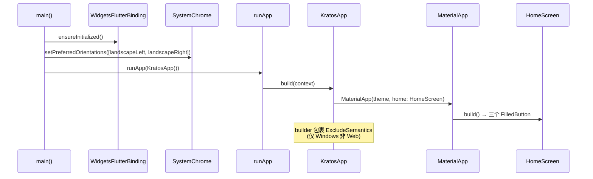
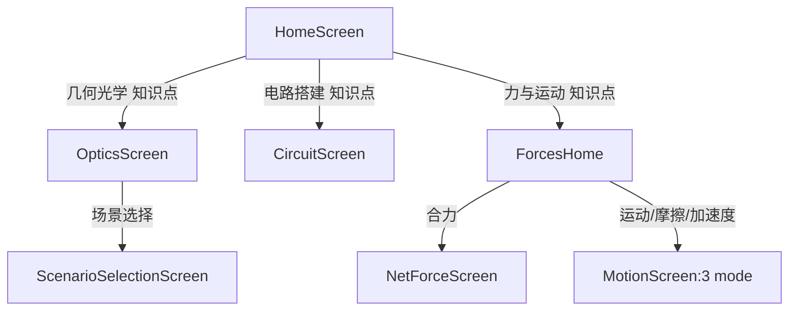

# 应用入口与导航流程

> 来源: 首次扫描 | 创建时间: 2026-07-17

## 启动链路

```
main() (lib/main.dart:7)
  └─ WidgetsFlutterBinding.ensureInitialized()
  └─ SystemChrome.setPreferredOrientations([landscapeLeft, landscapeRight])  // 强制横屏
  └─ runApp(const KratosApp())
       └─ MaterialApp(home: const HomeScreen())  (lib/main.dart:23-56)
```

`KratosApp.build` 配置主题：

- `ThemeData.useMaterial3: true`，seed 色 `0xFF1177AA`
- `scaffoldBackgroundColor: 0xFFF6FAFC`
- `fontFamilyFallback`: 中文字体回退链（Microsoft YaHei / PingFang SC / Noto Sans CJK SC / Arial）
- Windows 平台用 `ExcludeSemantics` 包一层（非 Web 且 Windows 时）

## 应用启动生命周期

下图展示从 `main()` 到首屏 `HomeScreen` 构建的完整时序（按 `lib/main.dart:7-56` 实际代码）：



## 导航模型

所有子页面通过 `Navigator.push(MaterialPageRoute(...))` 标准路由进入，无命名路由 / 无路由表。返回靠系统 back。

> ⚠️ 修正：`HomeScreen` 的三个 `FilledButton`（`lib/screens/home_screen.dart:39-138`）**直接 push** 到 `OpticsScreen` / `CircuitScreen` / `ForcesHome`。`ScenarioSelectionScreen` 不是 home 的直接子页，而是 `OpticsScreen` 内部的场景选择子流程（归属 optics 模块，详见 [systems/optics-module.md](../systems/optics-module.md)）。



## 关键文件

| 文件 | 角色 |
|---|---|
| `lib/main.dart` | 入口，强制横屏 + 主题 |
| `lib/screens/home_screen.dart` | 三大模块入口按钮（`FilledButton`，各带主题色） |
| `lib/screens/optics_screen.dart` | 光学主屏（`OpticsScreen`） |
| `lib/screens/circuit_screen.dart` | 电路主屏（`CircuitScreen`） |
| `lib/forces/screens/forces_home.dart` | 力与运动主页（4 模式 GridView） |

## 跨引用

- 模块详情: [systems/module-index.md](../systems/module-index.md)
- 拖拽基础设施: [frontend/drag-drop-workspace.md](../frontend/drag-drop-workspace.md)

---

*关键源文件: `lib/main.dart`, `lib/screens/home_screen.dart`, `lib/screens/optics_screen.dart`, `lib/screens/circuit_screen.dart`, `lib/forces/screens/forces_home.dart`*
