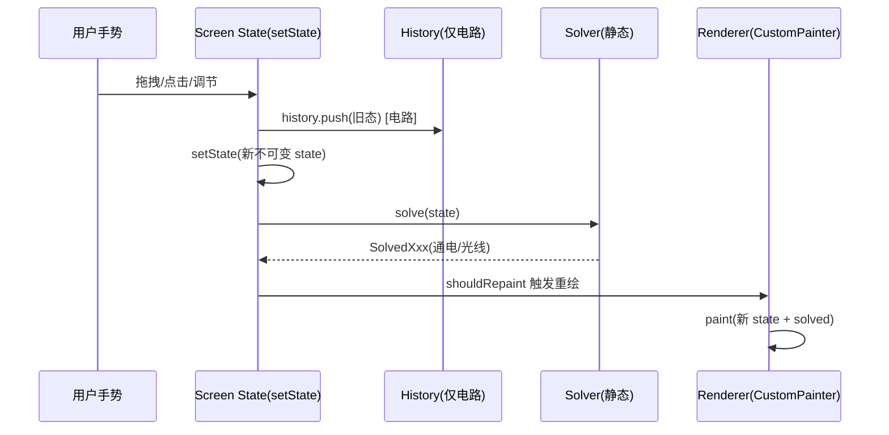

# 通用状态更新闭环（State → Solve → Render）

> 来源: 首次扫描 | 创建时间: 2026-07-17
> 变更: 2026-07-17 移除 `CircuitSolverV2` 的 fallback 行行（同步删除）。

电路与光学两个 Screen 共享同一套**不可变状态 → 求解 → 重绘**交互闭环。这是理解全部交互代码的核心模式。

## 闭环模式（mermaid）



## 电路实现（`CircuitScreen._update`）

```dart
void _update(CircuitState next, {bool sound=false}) {
  _history.push(_state);                       // 1. 入历史栈
  setState(() { _state = next; _solved = CircuitSolver.solve(next); });  // 2+3
  if (sound) _sfx?.tap();                      // 4. 可选音效
}
```

- 所有交互（增删元件、拖拽、开关、缩放、清空）统一走 `_update`，保证历史/求解/重绘一致。
- undo/redo：`_history.undo(_state)` → `setState` + `CircuitSolver.solve(p)`（不重复入栈）。

## 光学实现（`OpticsScreen._solve`）

```dart
void _solve() => setState(() => _solved = _solver.solve(_world));
```

- 光学无 undo/redo 栈（截至当前扫描）；每次放置/移动/删除后 `_solve()`。
- 放置前经 `ScenarioRuntimePolicy.canAdd/canRemove/canMove` 校验（`optics_screen.dart:73`）。

## 异常与失败路径

本项目是纯本地 Flutter 应用，**无网络 / 超时 / 重试**路径；异常路径集中在"求解失败回退"与"约束校验拒绝"两类：

| 场景 | 触发 | 处理 | 代码位置 |
|---|---|---|---|
| 光学放置被约束拒绝 | `ScenarioRuntimePolicy.canAdd/canRemove/canMove` 返回 false | 交互**不修改** `OpticsWorld`，无异常；右侧 `_RightPanel` 实时显示约束违反 | `lib/optics/config/scenario_runtime_policy.dart` + `optics_screen.dart` |
| 电路历史栈越界 | `undo` 在空栈 / `redo` 在空栈调用 | `CircuitHistory` 内部判空返回原态，不抛异常 | `lib/models/circuit_history.dart` |

> 主流程电路求解走 `CircuitSolver`（BFS 连通图，纯逻辑无外部依赖），无外部异常路径。

## 渲染分离原则

- **状态层**只持有数据（`CircuitState` / `OpticsWorld`）+ `solved` 结果。
- **渲染层**是 `StatelessWidget`/`CustomPainter`，从 `solved` 读结果纯绘制，不持有可变交互态。
- **事件层**（`GestureDetector` / `KeyboardListener`）只改状态，不改绘制。

## 关键文件

| 文件 | 角色 |
|---|---|
| `lib/screens/circuit_screen.dart:57` | `_update`（闭环入口） |
| `lib/screens/optics_screen.dart` | `_solve` + `_onComponentDrop`（校验+放置） |
| `lib/models/circuit_solver.dart` | 电路求解 |
| `lib/optics/solvers/optics_solver.dart` | 光学求解 |
| `lib/services/sound_effects.dart` | 音效服务（`SoundEffects.tap/dispose`） |

## 跨引用

- 电路模块: [systems/circuit-module.md](../systems/circuit-module.md)
- 光学模块: [systems/optics-module.md](../systems/optics-module.md)
- 引入新交互: [conventions/add-interaction.md](../conventions/add-interaction.md)
