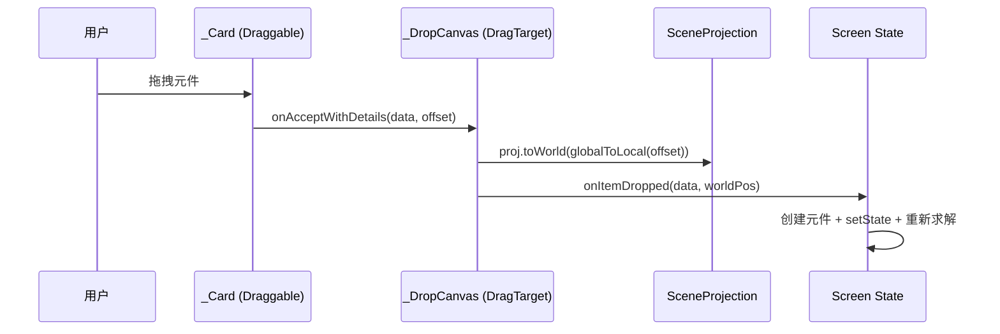

# 拖拽工作区与坐标投影系统

> 来源: 首次扫描 | 创建时间: 2026-07-17

电路与光学两个模块共用同一套**拖拽放置 + 画布投影**基础设施，位于 `lib/widgets/drag_drop_workspace.dart`。理解这是读懂两个 Screen 的前提。

## 核心组件 `DragDropWorkspace<T>`

泛型 `T` = 拖拽元件的数据类型（电路用 `ComponentType`，光学用 `String`）。

| 字段 | 类型 | 说明 |
|---|---|---|
| `items` | `List<DragItem<T>>` | 元件库卡片 |
| `canvasBuilder` | `Widget Function(BuildContext, SceneProjection, Size)` | 画布构建器，注入当前投影 + 画布尺寸 |
| `onItemDropped` | `void Function(T, Offset)` | 放置回调，参数是**世界坐标** |
| `layout` | `DragDropLayout.sideTray / bottomTray` | 侧边栏 / 底部托盘 |
| `scale` | `double` | 世界→屏幕缩放（光学传 20，电路默认 1） |
| `rightPanel` / `bottomPanel` | `Widget?` | 右侧/底部附加面板 |

- 侧栏布局：`Row[ tray | canvas | rightPanel ]`
- 底部布局：`Column[ canvas | bottomPanel | tray ]`

## 坐标投影 `SceneProjection`（已统一 · 2026-08-24）

> **已统一**（req-unify-projection-layer）：原两套平行投影（`CanvasProjection` + `SceneProjection`×2 处重复定义）合并为公共层唯一类 **`SceneProjection`**（`lib/common/geometry/projection.dart`）。下表保留历史语义供追溯。

| 历史类 | 原位置 | 语义（现由 SceneProjection 参数承载） |
|---|---|---|
| `CanvasProjection`（已删） | 原 drag_drop_workspace.dart:16-22 | `origin=(w/2, h*0.55)`；`toScreen = origin + w*scale`；无 zoom |
| `SceneProjection`（重复定义已删） | 原 circuit_canvas.dart:5-11（死文件已删）+ 原 circuit_screen.dart:1156-1172 | origin 调用方传入 + zoom 可选 |

统一后消费模式（详见 `shared-abstraction-plan.md` 候选 10）：
- **circuit 范式（推荐）**：`DropCanvas(projectionFactory: (sz) => SceneProjection(origin: ..., zoom: ...))`——渲染/hitTest/拖放落点共用同一投影实例
- **optics 范式（光轴类）**：不传工厂，默认工厂 origin=(w/2, h*0.55) + `scale` 参数

### Change-1 (2026-08-11) · 混用两套投影的原点/缩放不一致实证（拖放错位）→ 已根治

> 来源: `req-ui-interaction-polish` · Major-1 · 踩坑单一源在 `../notes.md`（2026-08-11 坑 1）。
> **根治**: `req-unify-projection-layer` MT-4（2026-08-24）——DropCanvas 增加 `projectionFactory`，circuit 渲染/hitTest/拖放共用同一投影实例，workaround 整体删除。

- **现象**：电路屏拖放元件后错位、点选不中。
- **根因**：`_DropCanvas` 放置路径用 `CanvasProjection`（origin=(W/2, H×0.55)），而电路渲染/hitTest 用 `SceneProjection`（origin=(W/2, H/2)）——**origin 不同 + 缩放硬编码 `zoom:1` 而渲染用 `_state.zoom`（0.6~2.0）**。
- **当时的解决**（已删除）：`_onComponentDrop` 把 `CanvasProjection` 的 world 转回 screenLocal，再用当前 `_state.zoom` 构造 `SceneProjection` 转 world。
- **根治后**：`DropCanvas.projectionFactory` 注入，拖放落点与渲染天然同坐标系，无需任何转换。
- **通用教训**（仍然有效）：涉及投影/命中坐标换算时，**缩放系数必须从组件内部状态读取，不可用默认值硬编码**；更根本的是**不要混用两套投影**。

## 拖放数据流（mermaid）



## 关键文件

| 文件 | 内容 |
|---|---|
| `lib/common/widgets/drag_drop_workspace.dart` | `DragItem`、`DragDropLayout`、`DragTray`、`DragItemCard`、`DropCanvas`（含 `projectionFactory`）、`DragDropWorkspace` |
| `lib/common/geometry/projection.dart` | `SceneProjection` 统一投影类（唯一定义） |
| `lib/common/geometry/hit_test.dart` | `pointToSegmentDistance` 线段命中几何纯函数 |
| `lib/circuit/screens/circuit_screen.dart` | circuit 消费方（projectionFactory 注入 + `_hitTestWire` 编排） |
| `lib/optics/screens/optics_screen.dart` | 光学 `_OpticsScene` 使用默认工厂投影（0.55 光轴） |

## 设计要点

- `_DropCanvas` 用 `LayoutBuilder` 拿画布尺寸，经 `projectionFactory`（或默认工厂）构建 `SceneProjection` 后传给 `canvasBuilder`（第三参数为画布尺寸）。
- 放置时 `box.globalToLocal(d.offset)` 转成画布局部坐标，再 `proj.toWorld` 转世界坐标 —— **回调里拿到的永远是 world 坐标**。
- 元件图标用 `IgnorePointer` 包裹，避免拦截画布手势（点击/拖拽穿透到 `GestureDetector`）。

## 事件（拖放完整生命周期）

拖放是 Flutter `Draggable` + `DragTarget` 原生机制，本项目封装在 `drag_drop_workspace.dart`：

```
_Card (Draggable<T>)               _DropCanvas (DragTarget<T>)
  ├ data: item.data (T)              onWillAcceptWithDetails: (_) => true
  ├ feedback: card()  ← 拖起时浮起      onAcceptWithDetails: (d) {
  ├ childWhenDragging: Opacity(0.4)      final box = ctx.findRenderObject();
  └ child: card()  ← 原位半透明            onItemDropped(d.data, proj.toWorld(box.globalToLocal(d.offset)));
                                       }
```

- **拖起**：`_Card` 是 `Draggable<T>`，`data` 携带 `T`（电路 `ComponentType` / 光学 `String`）；`feedback` 是拖拽时跟随手指的浮起卡片，`childWhenDragging` 是原位残影（40% 透明）。
- **落下**：`_DropCanvas` 是 `DragTarget<T>`，`onAcceptWithDetails` 拿到 `d.data`(类型 T) 和 `d.offset`(全局坐标)；先 `box.globalToLocal` 转画布局部坐标，再 `proj.toWorld` 转**世界坐标**，最后回调 `onItemDropped(T, worldPos)`。
- **放置高亮**：`DragTarget.builder` 当 `cand.isNotEmpty` 时在 `Stack` 顶层盖一层蓝色半透明蒙版 + "释放以放置元件" 文案。
- **坐标链路**：`global → local（findRenderObject）→ world（SceneProjection.toWorld）`，Screen 拿到的永远是 world 坐标，与缩放/原点无关。

> 事件不跨模块：拖放事件只在 `_DropCanvas` → `onItemDropped` → Screen 私有方法之间流动，**无任何全局事件总线**（项目无 Provider/Riverpod/Stream 共享）。

## UI 框架（渲染技术栈）

本项目 UI 渲染由 4 类 Flutter 原语组合，无第三方 UI 框架（仅 `flutter_svg` 用于 SVG 图标）：

| 原语 | 用途 | 本项目实例 |
|---|---|---|
| `StatelessWidget` | 纯展示/无状态组件 | `DragDropWorkspace`/`_Card`/`_DropCanvas`/`_OpticsScene`/`ComponentIconWidget` 等——**全部无内部状态**，状态上提到 Screen |
| `LayoutBuilder` | 拿父容器约束尺寸 | `_DropCanvas.build` 用 `c.maxWidth/maxHeight` 经工厂构建 `SceneProjection` |
| `Stack` + `Positioned` | 绝对定位叠层（画布 + 元件 + 光线） | 电路 `_buildCanvas`（`circuit_screen.dart:281`）、光学 `_OpticsScene`——元件用 `Positioned` 按 `proj.toScreen` 定位 |
| `CustomPainter` + `CustomPaint` | 命令式 Canvas 绘制（网格/导线/光线/透镜轮廓） | `CircuitPainter`/`_LensPainter`/`_RayPainter`——绘制与命中检测分离 |
| `GestureDetector` | 手势（tap/scale/drag） | 电路/光学画布底层手势，事件穿透到它 |
| `Draggable` / `DragTarget` | 拖放 | `drag_drop_workspace.dart` 的 `_Card`/`_DropCanvas` |
| `SvgPicture.asset` | SVG 图标/图像 | 光学光源（`pencil.svg`）、像的渲染（按 `imageHeight` 动态缩放） |

**核心范式**：`CustomPainter` 负责"画"（世界坐标 → 屏幕坐标由 `SceneProjection` 转换），`Stack` 上的 `Widget` 负责"元件图标/面板"等交互 UI，`GestureDetector` 负责"交互"，三者通过 `SceneProjection` 坐标系统一。命中检测在 Screen 层用 `hitTest`/`_hitTestWire`（世界坐标），不在 Painter 内。

详见 `[frontend/ui-framework.md](ui-framework.md)`（UI 渲染框架专项）。

## 页面导航 / 路由表

Flutter 本项目**无命名路由 / 无路由表**，全部用 `Navigator.push(MaterialPageRoute(builder: (_) => XScreen()))`。下表为实际跳转关系（基于 `lib/screens/home_screen.dart:39-138`）：

| 源 Screen | 目标 Screen | 跳转方式 | 携带参数 |
|---|---|---|---|
| `HomeScreen` | `OpticsScreen` | `Navigator.push(MaterialPageRoute)` | 无 |
| `HomeScreen` | `CircuitScreen` | `Navigator.push(MaterialPageRoute)` | 无 |
| `HomeScreen` | `ForcesHome` | `Navigator.push(MaterialPageRoute)` | 无 |
| `ForcesHome` | `NetForceScreen` | `Navigator.push`（合力模式） | 无 |
| `ForcesHome` | `MotionScreen` | `Navigator.push`（运动/摩擦/加速度模式） | 无 |
| `OpticsScreen` | `ScenarioSelectionScreen` | 模块内子流程 | 无 |

> 返回全部依赖系统 back（`AppBar` / 手势），无自定义 pop 逻辑。

## 主题变量

主题在 `KratosApp.build` 的 `MaterialApp(theme:)` 集中配置（`lib/main.dart:31-49`），全 App 共用，无分模块主题：

| 变量 | 值 | 代码位置 | 说明 |
|---|---|---|---|
| `useMaterial3` | `true` | `lib/main.dart:38` | 启用 Material 3 |
| `seedColor` | `0xFF1177AA` | `lib/main.dart:33` | 主色种子（生成整体配色） |
| `scaffoldBackgroundColor` | `0xFFF6FAFC` | `lib/main.dart:39` | 页面背景色 |
| `fontFamilyFallback` | `[Microsoft YaHei, PingFang SC, Noto Sans CJK SC, Arial]` | `lib/main.dart:40-45` | 中文回退字体链 |
| `debugShowCheckedModeBanner` | `false` | `lib/main.dart:32` | 隐藏 debug 角标 |

> 各模块 Screen 的 `FilledButton` 用硬编码 `backgroundColor`（光学 `0xFF1177AA`、电路 `0xFF0C4A6E`、力与运动 `0xFF166534`，见 `home_screen.dart:97/118/139`），与 seedColor 同源但不走主题 token。

## 状态管理与不可变模式

本项目**无全局状态管理库**（无 Provider/Bloc/Riverpod），状态管理是**每个 Screen 自持不可变状态 + setState 重绘**的极简模式：

| Screen | 持有状态 | 状态类 | 更新方式 |
|---|---|---|---|
| `OpticsScreen` | 光学世界 | `OpticsWorld`（`lib/optics/models/optics_world.dart`） | `world.copyWith(...)` → `setState` |
| `CircuitScreen` | 电路状态 | `CircuitState`（`lib/models/circuit_state.dart`） | `state.copyWith(...)` → `setState` |
| `ForcesHome` / `MotionScreen` / `NetForceScreen` | 力学状态 | `ForcesSimulation`（`lib/forces/models/forces_simulation.dart`） | `sim.copyWith(...)` → `setState` |

**模式要点**（从三个模块归纳，非猜测）：

- 所有状态类标注 `@immutable`，修改一律走 `copyWith` 返回新实例，绝不原地改字段。
- `setState` 内同步调用求解器（`OpticalSolver.solve(world)` / `CircuitSolver.solve(state)` / `ForcesSimulation` 内部步进），求解结果只读、无副作用。
- `shouldRepaint` 用引用比较检测状态变更（如 `CircuitPainter`，`lib/widgets/circuit_screen.dart` 内的 `[Fix6a]`），`.length` 无法检测位置变化。

## 跨引用

- 电路 Screen 用法: [systems/circuit-module.md](../systems/circuit-module.md)
- 光学 Screen 用法: [systems/optics-module.md](../systems/optics-module.md)
- 新增元件库卡片模板: [conventions/add-draggable-component.md](../conventions/add-draggable-component.md)
- UI 渲染框架（原语 / CustomPainter 规范）: [ui-framework.md](ui-framework.md)
- 设计主线: [architecture/design-patterns.md](../architecture/design-patterns.md) —— 本组件是**通用化原则的核心载体**（`DragDropWorkspace<T>` 泛型共享，被 optics/circuit 两模块复用，详见"三、通用化"）
