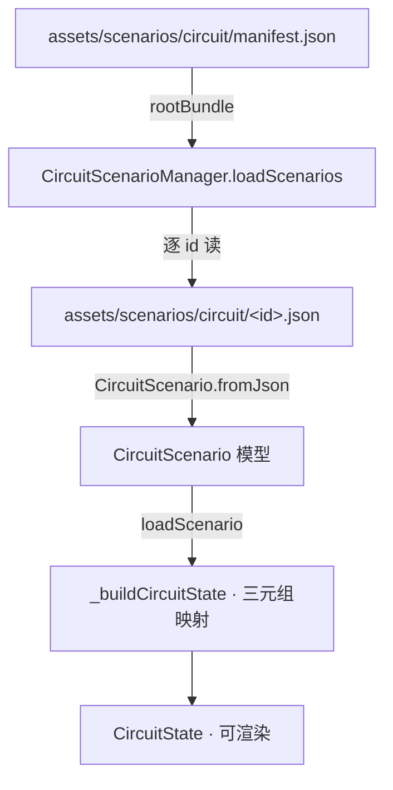
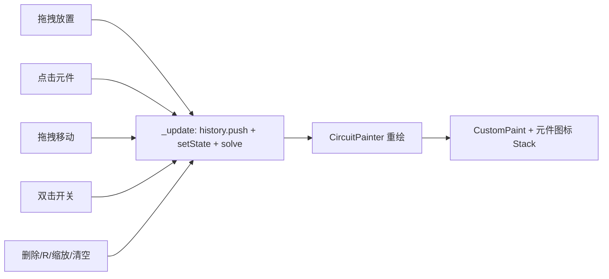

# 电路搭建模块（CircuitScreen）

> 来源: 首次扫描 | 创建时间: 2026-07-17
> 变更: 2026-07-17 删除 `CircuitSolverV2`（428 行 MNA 草稿）与 `ElectronAnimator`（100 行电子动画）两个未接入主流程的实验性组件，详见 `requirements/req-kartosos-dead-code-cleanup/`。
> 变更: 2026-07-20（傍晚）追加"死代码清单"章节——标注 `circuit_element.dart` / `battery.dart` / `vertex.dart` 三个 zero-ref 文件；详见 [architecture/refactor-baseline-plan.md §0.6](../architecture/refactor-baseline-plan.md)。

## 概述

`CircuitScreen`（`lib/screens/circuit_screen.dart`）是一个**交互式电路搭建沙盒**：从底部托盘拖拽元件（电池/电阻/灯泡/开关/保险丝/接地/导线）到画布，求解器实时计算通电状态与灯泡亮度。

## 状态模型（不可变）

`CircuitState`（`lib/models/circuit_state.dart:223`）核心字段：

| 字段 | 类型 | 说明 |
|---|---|---|
| `components` | `List<CircuitComponent>` | 元件实例 |
| `wires` | `List<WireSegment>` | 导线（含 controlPoints 可弯曲） |
| `vertices` | `List<Vertex>` | 连接点（元件端子 +  junctions） |
| `selectedId` | `String?` | 当前选中元件/导线 |
| `zoom` | `double` | 0.6~2.0 |
| 拖拽态字段 | `draggingVertexId` / `dragVertexNewPos` / `draggingControlPointWireId` / `creatingWireStartVertexId` 等 | 交互中间态 |

辅助不可变类：

- `CircuitComponent`（`circuit_state.dart:80`）：`type`、`x/y/rotation/value/isClosed`、`startVertexId/endVertexId`。`width/height` 按 type 推导（wire=100×4，fuse=80，ground=40×30，其他 120×60）。`hitTest` 用 `hitRect`（+40 padding）。
- `WireSegment`（`circuit_state.dart:140`）：`startVertexId/endVertexId` + `controlPoints`（`List<Offset>`，用于弯曲）。提供 `addControlPoint/moveControlPoint/removeControlPoint/buildPath`。
- `Vertex`（`circuit_state.dart:48`）：`isJunction` / `isTerminal`（元件端点不可独立删除）。

### Sentinel copyWith 模式

`CircuitState.copyWith` 所有可空参数默认值为 `_ns`（`_NullSentinel`），用 `identical(selectedId, _ns)` 判断是否用户显式传 null——解决 `null ?? old` 无法真正清空字段的 bug（`circuit_state.dart:230-270`）。**新增可空字段必须照搬此模式**。

## 求解器 `CircuitSolver`（`lib/models/circuit_solver.dart`）

静态纯函数 `solve(CircuitState) → SolvedCircuit`：

1. 无电池 → 全灭。
2. 构建"导线 + 闭合开关"连通图（BFS）。
3. 逐电池：分别以 `endVertex`（正区）和 `startVertex`（负区）做 BFS；元件两端分属正/负区 → 通电。
4. 亮度：欧姆定律 `I = ΣV / ΣR`，`P = I²·R`，温度模型 `T = 300 + P/k`（k=0.1，clamp 0~3000），亮度 `√(T/3000)`。

`solved` 字段：`componentStates`（通电 bool）、`bulbBrightness`（0~1）、`openNodes`、`shortedNodes`。

## 场景配置系统（`lib/circuit/config/` · 2026-07-21 完成）

> **状态**：✅ 已完成 migration，达到 design-patterns.md 的 §C1-§C3 全合规。对标光学 `lib/optics/config/`。

### 核心文件

| 文件 | 角色 |
|---|---|
| `circuit_scenario.dart` | `CircuitScenario`：scenarioId/name/description/version + `CircuitLayout`（components+wires+vertices 三元组）+ optional inventory/constraints/objectives |
| `scenario_manager.dart` | `CircuitScenarioManager`：从 `assets/scenarios/circuit/manifest.json` 加载，`loadScenario(id)` 同步返回 `CircuitState`；含 `validateConstraints` / `checkObjectives` / `getHints` |
| `circuit_constraint.dart` | 3 种约束：`topology`（闭合回路/openNodes）、`componentCount`（min/max）、`componentPresent`（类型必存在） |
| `circuit_inventory.dart` | `CircuitComponentInventory`：元件库存（maxCount/locked/defaultParams）+ `canAdd` 门控 |
| `circuit_learning_objective.dart` | `CircuitLearningObjective`：4 种判据（circuitClosed/componentPowered/bulbBrightness/componentCount）+ hint trigger 求值器（支持 `openNodes > N` / `componentCount(<type>) == N` 等表达式） |

### 3 层拓扑模型

与光学单层 `elements[]` 不同，电路必须用 **3 表关联图** 表达任意拓扑：

| 层 | 类 | JSON 字段 | 说明 |
|---|---|---|---|
| 元件 | `ComponentPlacement`（`circuit_scenario.dart`） | `components[]` | type/x/y/value/startVertexId/endVertexId |
| 导线 | `WirePlacement` | `wires[]` | startVertexId/endVertexId + controlPoints（弯曲） |
| 顶点 | `VertexPlacement` | `vertices[]` | isTerminal（元件端子）/ isJunction（汇合点） |

三层通过 vertex id 互引用，`ScenarioManager._buildCircuitState` 负责 Placement → State 映射。

### AI 生成工具链（§C3 合规）

| 组件 | 路径 | 说明 |
|---|---|---|
| System Prompt | `docs/prompts/circuit_scenario.md`（173 行） | 3 层模型解释 + 7 种元件表 + 4 条拓扑规则 + 2 个 few-shot 样本 + 10 项校验清单 |
| JSON Schema | `schemas/circuit_scenario.schema.json`（Draft 2020-12） | 顶层 + inventory + 3 层 layout + constraints + objectives 全字段约束 |
| 样本池 | `assets/scenarios/circuit/*.json`（7 个） | default / simple-series / parallel-bulbs / controlled-switch / two-batteries / open-circuit-debug / fuse-blown |

> fuse-blown 为真实 LLM 生成产物（仅凭 prompt + schema，非人工手写），通过 `rootBundle` 端到端测试验证。

### 场景清单（manifest.json）

| ID | 拓扑 | 教学价值 |
|---|---|---|
| `default` | 空 | 自由搭建模式 |
| `simple-series` | 3 元件串联 | 基础串联回路 |
| `parallel-bulbs` | 1 电池 + 2 灯泡并联（含 junction 分合） | 分流与并联拓扑 |
| `controlled-switch` | 开关（默认断开）+ 灯泡 | 通断控制概念 |
| `two-batteries` | 2 电池串联（9V+6V） | 电压叠加效应 |
| `open-circuit-debug` | 3 元件 + 2 导线（缺回路） | 开环诊断 |
| `fuse-blown` | 电池 + 保险丝(0.5A) + 灯泡 | 保险丝过流保护 |

### 加载流程

### 合规状态

| 条款 | 状态 | 说明 |
|---|---|---|
| §C1 启动路径 | ✅ | `_loadDefaultScenario` async 加载 + `useScenarioLoader` feature flag |
| §C2 元件规格 | ✅ | inventory.defaultParams 优先 + ComponentTypeLabel 枚举兜底 |
| §C3 AI 可生成 | ✅ | prompt + schema + 7 个 few-shot 样本 + fuse-blown e2e 实证 |

## 交互流程（mermaid）

- `_update`（`circuit_screen.dart:57`）：先 `history.push`，再 `setState` 且同步 `solve`，可选音效。
- 历史：`CircuitHistory` 支持 undo/redo（Ctrl+Z / Ctrl+Shift+Z / Ctrl+Y）。
- 渲染：`CircuitPainter`（`circuit_screen.dart:330+`）画网格、导线、顶点；元件用 `ComponentIconWidget` 以 `Positioned` 叠在 `Stack` 上（`IgnorePointer`）。
- 命中检测：导线用点-线段距离 < 15px（`_hitTestWire`）；元件用 `hitTest`。

### 模块管理（元件生命周期）

元件的增删改查全由 `_CircuitScreenState` 持有，统一经 `_update(next, {sound})` 提交（`circuit_screen.dart:57`）：先 `_history.push(_state)` 入栈，再 `setState` 且同步 `CircuitSolver.solve`。

- **ID 生成**：`_vid()`/`_cid()`/`_wid()` 共享 `_nextId` 自增计数器（`circuit_screen.dart:24-26`），保证元件/顶点/导线 ID 全局唯一。
- **新增**：`_addComponent(type, wp)`（`circuit_screen.dart:62`）——`wire` 走专门分支（建 2 顶点 + `WireSegment`），其余元件走 `else` 分支按 `type.defaultValue` 通用创建（印证 design-patterns 的通用化）。每次新增同时创建 2 个 `Vertex`（`isTerminal:true`），元件与顶点通过 `startVertexId/endVertexId` 关联。
- **移动**：`_onDragMove`（`circuit_screen.dart:108`）按鼠标位移增量同步移动元件及其 2 个端子顶点；`_onDragEnd`（`circuit_screen.dart:131`）提交（进历史栈）。
- **顶点合并（连线核心）**：拖拽顶点松手时若 `_state.findSnapTarget` 命中另一个顶点，调 `_mergeVertices(old, nw)`（`circuit_screen.dart:152`）——把旧顶点的所有 wire/component 引用改指新顶点，并删除旧顶点。这是电路"搭线连通"的实现机制。
- **删除**：`_deleteSelected`（`circuit_screen.dart:146`）区分 wire / component 走不同移除路径；只能删非终端顶点以外的对象。
- **历史栈**：`CircuitHistory`（`circuit_history.dart`，31 行）用 `_past`/`_future` 双栈 + `_maxSize=100` 环形截断；`push` 时清空 `_future`（新操作使 redo 失效）；`undo/redo` 返回上一状态并重新 `solve`。快捷键 `Ctrl+Z`/`Ctrl+Shift+Z`/`Ctrl+Y`（见下「事件」表）。

### 事件（手势 / 键盘 → State 方法映射）

`CircuitScreen` 用 `KeyboardListener` + `GestureDetector` 两类事件源，全部收敛到 `_CircuitScreenState` 的私有方法，**不经过任何全局事件总线**（项目无 Riverpod/Provider）：

| 触发 | 源码位置 | 调用 | 行为 |
|---|---|---|---|
| 拖放元件到画布 | `onItemDropped: _onComponentDrop`（`circuit_screen.dart` build） | `_addComponent` | 新建元件 + 顶点，入栈 |
| 点击元件 | `GestureDetector.onTapUp` → `_onComponentTap`（`circuit_screen.dart:84`） | `setState(copyWith selectedId)` | 选中/取消；**双击开关**（300ms 内同 id 再点）→ `_toggleSwitch` |
| 点击导线 | `_onWireTap`（`circuit_screen.dart:96`） | `_update(copyWith selectedId=wire.id)` | 选中导线 |
| 点击空白 | `_onCanvasTap`（`circuit_screen.dart:82`） | `copyWith(selectedId:null)` | 取消选中 |
| 单指拖拽 | `onScaleStart/onScaleUpdate/onScaleEnd`（`circuit_screen.dart:264-268`） | `_onDragStart/_onDragMove/_onDragEnd` | 移动元件或顶点；双指（`pointerCount>=2`）转为缩放 |
| 删除键 | `KeyboardListener` `Delete`（`circuit_screen.dart:213`） | `_deleteSelected` | 删选中 |
| R 键 | `keyR` | `_rotateSelected` | 元件旋转 90° |
| Esc 键 | `escape` | `copyWith(selectedId:null)` | 取消选中 |
| Ctrl+Z / Ctrl+Shift+Z / Ctrl+Y | `circuit_screen.dart:215-217` | `_undo`/`_redo` | 撤销/重做 |
| 缩放按钮 | AppBar `IconButton` | `_setZoom` | zoom clamp 0.6~2.0 |
| 清空按钮 | AppBar `IconButton` → `_clear`（`circuit_screen.dart:200`） | `showDialog` 确认后 `_update(const CircuitState())` + `_history.clear()` + `_nextId=0` | 重置全部 |

> 事件穿透关键：`_buildCanvas`（`circuit_screen.dart:281`）把 `ComponentIconWidget` 用 `IgnorePointer` 包裹叠在 `CustomPaint` 上，使点击/拖拽穿透到下层 `GestureDetector`——元件层只负责"显示"，交互逻辑全在 `CircuitScreen`。

### 功能组件清单（电路）

| 组件 | 文件 | 职责 |
|---|---|---|
| `CircuitControls` | `widgets/circuit_controls.dart`（60 行） | 底部面板（`bottomPanel`）。选中元件时显示值调节：`battery/resistor` 用 `Slider`（min/max/step 取自 `type.valueMin/valueMax/valueStep`），其余显示只读信息（灯泡亮度/开关状态）。回调 `onValueChanged: _adjustValue` |
| `ComponentIconWidget` | `widgets/component_icon.dart`（94 行） | 元件图标渲染。`_styleMap` 静态映射 7 种 `ComponentType` → 图标/标签/颜色；`_effectiveIcon/_effectiveColor` 根据 `isPowered`/`isClosed` 动态变化（通电变亮、开关闭合变绿）。`dragFeedback` 提供拖拽时的浮起卡片 |
| `CircuitPainter` | `circuit_screen.dart` 内联（见上） | 纯绘制：网格/导线/顶点/选中高亮。`shouldRepaint` 用引用比较（注释 `[Fix6a]`：`.length` 无法检测位置变化） |
| `DragDropWorkspace` | `widgets/drag_drop_workspace.dart` | 共享拖放基础设施（见 [frontend/drag-drop-workspace.md](../frontend/drag-drop-workspace.md)） |

## 关键文件

| 文件 | 角色 |
|---|---|
| `lib/screens/circuit_screen.dart` | Screen + `SceneProjection` + `CircuitPainter` |
| `lib/models/circuit_state.dart` | 状态模型 + 辅助类 |
| `lib/models/circuit_solver.dart` | 连通图求解 + 亮度（主流程） |
| `lib/models/circuit_history.dart` | undo/redo 栈 |
| `lib/widgets/circuit_canvas.dart` | 画布组件（`CircuitCanvas` + `CircuitPainter`，详见下） |
| `lib/widgets/circuit_controls.dart` | 选中元件的值调节面板 |
| `lib/widgets/component_icon.dart` | 元件图标 |
| `lib/widgets/component_tray.dart` | 托盘（实际由 DragDropWorkspace 承载） |

## 死代码清单（2026-07-20 傍晚追加）

> ⚠️ **本节列出的 3 个文件在 `c:\workspace\kratos` 全项目 zero-ref，是历史移植遗留的死代码。已通过 grep + terminal findstr 双工具交叉实证**。详见 [architecture/refactor-baseline-plan.md §0.6](../architecture/refactor-baseline-plan.md)。

| 死文件 | 大小 | 里面装了什么 | 为什么不能与生产代码混用 |
|---|---|---|---|
| `lib/models/circuit_element.dart` | 14.98 KB / 606 行 | `abstract class CircuitElement` + `CircuitElementType` 枚举（含 capacitor / inductor 等 CircuitScreen 未支持的元件） | 生产版用的是 `ComponentType` 枚举（`circuit_state.dart:2`），**不是** `CircuitElementType` |
| `lib/models/battery.dart` | 3.60 KB / 146 行 | `class Battery extends CircuitElement` + PhET 原版字段（`voltageProperty` / `internalResistance` / `isReversible`） | 生产版电池由 `CircuitComponent(type: ComponentType.battery, ...)` 承载（`circuit_state.dart:80`），无独立 `Battery` 类 |
| `lib/models/vertex.dart` | 2.70 KB | 独立 `Vertex` 类 | 生产版 `Vertex` 是 `circuit_state.dart:48` 的内嵌版本，**同名但字段不同**，禁止 import 独立版本 |

**双电路模型风险**：本项目存在两套平行的电路对象模型，只有前者是生产代码——

- 生产版：`ComponentType` 枚举 + `CircuitComponent` @immutable class（`circuit_state.dart`）
- 死代码版：`CircuitElementType` 枚举 + `CircuitElement abstract class` 继承体系（`circuit_element.dart` + `battery.dart` + `vertex.dart`）

**给贡献者的提醒**：若阅读源码时遇到 `CircuitElement` / `Battery` / 独立 `Vertex` 类，**这是死代码**——请去 `circuit_state.dart` 找对应的生产版本。不要在这 3 个死文件里加新元件（详见 [conventions/add-circuit-component.md](../conventions/add-circuit-component.md)）。

**清理状态**：截至 2026-07-20 傍晚，源码尚未清理（曾在 `df833b6` 尝试整体删除 `lib/models/` 但连带删了 5 个活代码文件，已 `7c3c1e3` revert）。精准清理方案见 [refactor-baseline-plan.md §0.6.5](../architecture/refactor-baseline-plan.md)。

### `CircuitCanvas`（`lib/widgets/circuit_canvas.dart`，329 行）

交互画布 + 渲染层，与 `CircuitScreen` 内联 `CircuitPainter` 是**两套并存**的绘制实现：

- `SceneProjection`（本文件定义）：`toScreen`/`toWorld`/`toScreenLength`，`scale:1` + 原点居中 + `zoom`。注意：此投影与 `circuit_screen.dart` 内的 `SceneProjection` **同名但独立定义**，不要混淆。
- `CircuitCanvas.build`：`LayoutBuilder` 取尺寸 → `GestureDetector` 包裹 `CustomPaint(CircuitPainter)` → 为每个 `component` 叠 `Positioned(ComponentIconWidget, IgnorePointer)` → 外层 `DragTarget<ComponentType>` 接收工具箱拖出的元件（`onComponentDrop?.call(type, worldPos)`）。
- `CircuitPainter`：画网格（40px 间隔）、导线（含 `controlPoints` 弯曲路径、选中蓝高亮）、顶点/磁吸指示；`shouldRepaint` 用**引用比较**（state 各字段 `!=` 旧值，注释 `[Fix6a]`：`.length` 无法检测位置变化）。
- 命中检测：`_hitTest` 元件 `hitTest`；`_hitTestWire` 点-线段距离 < 15px。

## 跨引用

- 共享拖拽: [frontend/drag-drop-workspace.md](../frontend/drag-drop-workspace.md)
- 模块索引: [systems/module-index.md](module-index.md)
- 新增元件类型: [conventions/add-circuit-component.md](../conventions/add-circuit-component.md)
- 设计主线: [architecture/design-patterns.md](../architecture/design-patterns.md) —— 本模块体现的四原则：
  - **MVC 分层**：`CircuitState`（Model，不可变）+ `CircuitSolver.solve`（逻辑层/Controller 行为）+ `CircuitPainter`/`DragDropWorkspace`（View）
  - **组件化**：`CircuitComponent`（`circuit_state.dart:80`）+ `CircuitElementType` 枚举（`battery/resistor/lightBulb/switch_/wire/fuse/ground`）+ `ComponentTypeLabel` 扩展（`circuit_state.dart:10-46`）；与光学的 `OpticalElement` 抽象基类**同构但语法不同**（枚举 vs 继承）
  - **通用化**：`DragDropWorkspace<ComponentType>`（`drag_drop_workspace.dart:19`）被本模块复用；`_addComponent` 的 `else` 分支按 `type.defaultValue` 通用创建，新元件通常无需改（见 [conventions/add-circuit-component.md](../conventions/add-circuit-component.md)）
  - **配置化**：✅ 已完成迁移（2026-07-21）。`lib/circuit/config/` 下 5 个文件 + 7 个场景 JSON + AI 工具链（prompt + schema）构成完整配置体系，达到 §C1-§C3 全合规。电路 `useScenarioLoader` feature flag 已接入 `CircuitScenarioManager`，新增实验仅需写 JSON + 注册 manifest。（详见上方「场景配置系统」章节）
