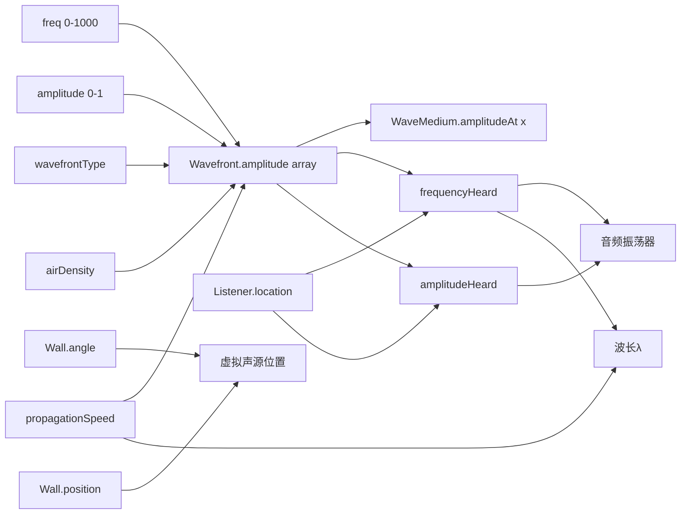
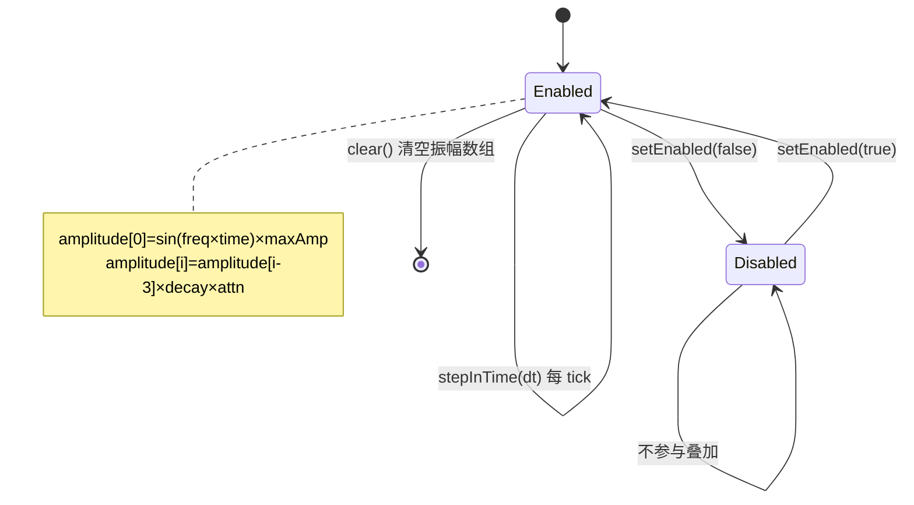

# Sound · Experiment Design Document (EDD)

> **需求 ID**：req-port-sound
> **蓝本**：`c:\workspace\phetTrunk\phetTrunk\simulations-java\simulations\sound\` · 111 Java 文件
> **产出触发**：主对话 2026-07-24 · 按 edd-template.md v2.0 12 章全量产出
> **约束依据**：memory 2q03lm2g §4.6.7 EDD + `edd-template.md` v2.0 §9-§12
> **信心度**：92%（10 model + SoundConfig + 3 关键 Module 已读全 · view 层通过 module 引用间接理解）
> **数据源**：`PHET_JAVA_ROOT/simulations-java/simulations/sound/src/edu/colorado/phet/sound/**/*.java`

---

## §1 · 实验概览（Experiment Overview）

### 1.1 学科与知识点定位

| 项 | 值 |
|---|---|
| **学科** | 物理 · 声学 · 波动 |
| **主题** | 声波的产生、传播与干涉 · 波前扩散 · 介质依赖 · 双源叠加与反射 |
| **课标关联** | 义务教育《物理课程标准》"声现象"主题 → 声音的产生与传播、声波特征 · 高中物理选修"机械振动与机械波"→ 波的干涉、衍射、反射 |
| **典型学段** | 初中 8 年级 - 高中 |
| **学习时长（单次）** | 15-25 分钟 |

### 1.2 五子屏结构（对应蓝本 5 Module）

| 子屏 | 蓝本类 | 教学重点 | 元件数量 |
|---|---|---|---|
| **子屏 1 · Listen**（听音） | `SingleSourceListenModule.java` (4.2 KB) | 单声源 + 可拖动听者 · 频率/振幅与听觉感知 | 1 Speaker + 1 Listener |
| **子屏 2 · Measure**（测量） | `SingleSourceMeasureModule.java` (8.2 KB) | 定量测量波长/频率 · 尺子 + 气压计 | 1 Speaker + 1 MeterStick + 1 DialGauge + 1 Listener |
| **子屏 3 · Box**（真空盒） | `SingleSourceWithBoxModule.java` (14.5 KB) | 声波传播需要介质 · 空气抽走后无声 | 1 Speaker + 1 AirBox + 1 PressureGauge + 1 Listener |
| **子屏 4 · TwoSpeaker**（双源干涉） | `TwoSpeakerInterferenceModule.java` (8.3 KB) | 两列声波叠加 · 干涉图样 | 2 Speaker + 2 SpeakerGraphic + 1 Listener |
| **子屏 5 · Wall**（反射墙） | `WallInterferenceModule.java` (13.5 KB) | 声波反射 · 脉冲模式 · 入射角=反射角 | 1 Speaker + 1 ReflectingWall + 1 Listener |

### 1.3 教学目标（Bloom 认知层次映射）

| 层次 | 目标 |
|---|---|
| **记忆** | 声波需要介质传播 · 频率决定音调 · 振幅决定响度 |
| **理解** | 波前向外扩散时振幅随距离衰减（球面波 `1/r`） |
| **应用** | 给定频率，使用尺子测量波长 · 验证 v=fλ |
| **分析** | 双源干涉的加强/减弱区域分布 · 分析路径差 |
| **评价** | 判断"真空不能传声"是否需要实验验证 · 反射波与直射波的相位关系 |

---

## §2 · 元件清单（Component Inventory · Q1.A + Q1.B）

### 2.1 核心物理元件（Q1.A）· 7 类

| # | 元件 | 蓝本类 | 职责 | 物理对应物 |
|---|---|---|---|---|
| C1 | **Wavefront**（波前） | `Wavefront.java` (7.0 KB ★) | 声波传播的**核心数据结构**：`double[400]` 振幅数组 · 每 tick 右移 + 衰减 · 带有频率/振幅/原点/波前类型 | 声波传播的一维截面 |
| C2 | **WaveMedium**（传播介质） | `WaveMedium.java` (2.9 KB) | 承载 1-2 个 Wavefront · 叠加振幅 · AttenuationFunction 衰减 | 空气/真空（介质抽象） |
| C3 | **SoundModel**（声学总模型） | `SoundModel.java` (3.7 KB) | 统领 primaryWavefront + octaveWavefront · 设置频率/振幅/传播速度 | Speaker 的内部引擎 |
| C4 | **SoundListener**（听者） | `SoundListener.java` (2.2 KB) | 有位置 · 根据与声源距离读取对应 index 的频率/振幅 | 学生耳朵 |
| C5 | **SineWaveFunction**（正弦信号） | `SineWaveFunction.java` (0.8 KB) | `amplitude = sin(freq × time) × maxAmplitude` | 声源的振动模式 |
| C6 | **SphericalWavefront**（球面波衰） | `SphericalWavefront.java` (0.9 KB) | `factor = 1.0 - 0.05 × distance / length` — 振幅随距离线性衰减 | 点声源的几何扩散 |
| C7 | **PlaneWavefront**（平面波） | `PlaneWavefront.java` (0.5 KB) | 无衰减（平面波前不扩散） | 远场近似 / 理想平面波 |

**关键架构差异**：不同于 color-vision 的离散光子粒子模型，sound 的核心是 **1D 振幅数组（长度 400）**，每 tick 整体右移一个 propagationSpeed（=3 像素），新振幅从 SineWaveFunction 生成填入数组头部。这是一种**缓冲区移位**的波动模型。

### 2.2 辅助表征概念元件（Q1.B）· 教学可视化组件

| # | 概念 | 蓝本类 | 说明 |
|---|---|---|---|
| A1 | **BufferedWaveMediumGraphic** | `view/BufferedWaveMediumGraphic.java` (10.2 KB) | 双缓冲渲染波前圆圈/平面 · 支持 opacity/旋转（Wall 反射用） |
| A2 | **WaveMediumGraphic** | `view/WaveMediumGraphic.java` (11.5 KB) | 基础波前绘制 · 挤压带/稀疏带可视化 |
| A3 | **MeterStickGraphic**（尺子） | `view/MeterStickGraphic.java` (1.8 KB) | 5 米尺 · 222 px → 换算 5/222 m/px · 学生用来量波长 |
| A4 | **DialGauge**（气压计） | `view/DialGauge.java` (6.2 KB) | 模拟指针式气压表 · 显示盒内空气密度 |
| A5 | **InteractiveSpeakerGraphic** | `view/InteractiveSpeakerGraphic.java` (2.9 KB) | 可拖拽的 Speaker（TwoSpeaker 模式下上方的 Speaker） |
| A6 | **InterferenceListenerGraphic** | `view/InterferenceListenerGraphic.java` (6.2 KB) | 双源干涉模式下可拖拽的 Listener · 拖拽时实时计算到两源距离差 |
| A7 | **ReflectingWallGraphic** | `view/ReflectingWallGraphic.java` (6.1 KB) | 可旋转 + 可平移的反射墙 · 渲染反射虚拟声源 |
| A8 | **WavefrontOscillator** | `view/WavefrontOscillator.java` (4.2 KB) | 将 Wavefront 振幅数据转换为音频波形 · 驱动 Java Sound API 播放真实声音 |
| A9 | **SoundControlPanel** | `view/SoundControlPanel.java` (6.8 KB) | 频率滑块 + 振幅滑块 · 音频开关面板 |

### 2.3 复用与省略清单

| 类 | Flutter 复刻策略 |
|---|---|
| `SoundModel` → `SoundEngine` | ✅ 保留 · Dart 实现 · 统领 Wavefront 生命周期 |
| `Wavefront.java` 缓冲区移位算法 | ✅ 核心保留 · Flutter 用 `Float64List(400)` 替代 `double[]` |
| `WaveMedium.java` getAmplitudeAt 平均值 | ✅ 保留 · 双源干涉的核心叠加逻辑 |
| `SoundListener.java` stepInTime 频率/振幅读取 | ✅ 保留 · Flutter ChangeNotifier |
| Java Sound API (`WavefrontOscillator`) | ❌ 用 `just_audio` / `flutter_sound` 替代 |
| AWT `JSlider` / `JButton` / `JRadioButton` | ❌ 用 Flutter `PhetSlider` / `PhetRadioGroup`（L0 复用） |
| `BufferedWaveMediumGraphic` 双缓冲 | 🟡 用 Flutter `CustomPainter` + `RepaintBoundary` 天然双缓冲 |
| `SineWaveFunction` | ✅ 保留 · 纯函数 · 1:1 翻译 |
| `SphericalWavefront.computeAmplitudeAtDistance` | ✅ 保留 · 衰减公式（简化版 `1/r` 近似） |

---

## §3 · 参数联动声明（Parameter Coupling · Q5）

### 3.1 Intrinsic 参数（学生可直接调）

| # | 元件 | 参数 | 类型 | 单位/范围 | 默认值 | 控件 |
|---|---|---|---|---|---|---|
| P1 | SoundModel | `frequency` | Intrinsic | 0-1000 Hz | 500 Hz | SoundControlPanel 频率滑块 |
| P2 | SoundModel | `amplitude` | Intrinsic | 0-1.0 | 0.5（默认 5/10） | SoundControlPanel 振幅滑块 |
| P3 | SoundModel | `octaveEnabled` | Intrinsic | bool | false | Checkbox（部分子屏） |
| P4 | SoundModel | `propagationSpeed` | Intrinsic | px/tick | 3（PROPOGATION_SPEED） | 固定（可未来暴露） |
| P5 | Wavefront | `wavefrontType` | Intrinsic | {SPHERICAL, PLANE} | SPHERICAL | 无显式控件（默认球面） |
| P6 | SoundListener | `location` | Intrinsic | 2D Point | 各子屏不同 | 拖拽（部分子屏） |
| P7 | AirBox | `airDensity` | Intrinsic | 0-1 | 1（满空气） | AddAir/RemoveAir 按钮 + 自动抽气 |
| P8 | ReflectingWall | `angle` | Intrinsic | 10°-90° | 60° | WallTiltControlPanel JSlider |
| P9 | ReflectingWall | `position` | Intrinsic | 0-400 px | 170 px（s_wallOffsetX） | WallTranslateControlPanel JSlider |
| P10 | 脉冲模式 | `pulseMode` | Intrinsic | bool | false | PulsePanel RadioButton |

### 3.2 Derived 参数（由 Intrinsic 计算得出 · 严禁作为独立字段存储）

| # | 派生量 | 由何计算 | 公式 | 蓝本证据 |
|---|---|---|---|---|
| D1 | Wavefront.amplitude[i] | SineWaveFunction + time + wavefrontType + attenuationFunction | 每 tick：`amplitude[0] = sin(freq × time) × maxAmplitude` · `amplitude[i] = amplitude[i-3] × sphericalDecay(i) × attenuation(i)` | Wavefront.java L96-130 |
| D2 | WaveMedium.getAmplitudeAt(x) | 所有启用的 Wavefront 在位置 x 的振幅 | `avg(enabledWavefronts.map(wf → wf.amplitude[x]))` | WaveMedium.java L68-79 |
| D3 | SoundListener.frequencyHeard | Wavefront 在 listener-distance 处的频率 | `primaryWavefront.getFrequencyAtTime(distFromSource)` | SoundListener.java L31-33 |
| D4 | SoundListener.amplitudeHeard | Wavefront 在 listener-distance 处的振幅 | `primaryWavefront.getMaxAmplitudeAtTime(distFromSource)` | SoundListener.java L34 |
| D5 | wavelength（波长 · 像素） | propagationSpeed / (timeStep × frequencyAtTime) | `lambda = speed / (s_timeStep × freq) × 6.2` | Wavefront.java L189-195 |
| D6 | 音频振荡器频率 | SoundListener.frequencyHeard | `heardFreq × s_frequencyDisplayFactor`（还原到真实 Hz） | WavefrontOscillator 内部 |
| D7 | 双源干涉相位差 | 两 Wavefront 的 origin 到 Listener 距离差 | `Δpath = |distA - distB|` → 干涉判定 | TwoSpeakerInterferenceModule · InterferenceListenerGraphic |
| D8 | 反射虚拟声源位置 | Speaker 位置对墙的镜像 | `MathUtil.reflectPointAcrossLine(origin, wallMidPoint, -angle)` | WallInterferenceModule.java L86-88 |

### 3.3 参数联动图



---

## §4 · 元件交互与状态机（Component Interaction · Q3 + Q4）

### 4.1 空间关系（Q3）

**子屏 1 · Listen 拓扑**：
```
[Speaker] (100, 248) ──Wavefront[400]──→ [Listener 拖拽]
```

**子屏 3 · Box 拓扑**：
```
[Speaker] (100, 248) ──Wavefront──→ [AirBox 180×350px] ──→ [Listener 固定]
                                       ↑
                                 [DialGauge 气压计]
                                 [RemoveAir / AddAir 按钮]
```

**子屏 4 · TwoSpeaker 拓扑**：
```
[Speaker A] (100, 128) ──Wavefront──╮
                                     ├── WaveMedium 叠加 ──→ [Listener 拖拽]
[Speaker B] (100, 368) ──Wavefront──╯
```

**子屏 5 · Wall 拓扑**：
```
[Speaker] (100, 248) ──直射波──╮
                                ├── 叠加 ──→ [Listener]
[虚拟镜像源] ──反射波──╯
       ↑
[ReflectingWall] (270, 548) · angle=60°
```

### 4.2 相互作用规则（Q4）

#### 规则 R1 · Wavefront.stepInTime 核心循环（Wavefront.java L96-130）

```java
// 每 tick:
time += dt;
stepSize = propagationSpeed;  // = 3

// 1. 右移现有振幅
for (i = 399; i >= 3; i--) {
    amplitude[i] = amplitude[i - 3];                      // 右移 3 个单位
    amplitude[i] = sphericalDecay(amplitude[i], i);       // 球面衰减
    amplitude[i] *= attenuationFunction.getAttenuation(i); // 介质衰减
}

// 2. 生成新波前
amplitude[0..2] = sin(freq × time) × maxAmplitude;
```

#### 规则 R2 · 双源干涉叠加（WaveMedium.java L68-79）

```
amplitudeAt(x) = avg(wf1.amplitude[x], wf2.amplitude[x])  // 仅对 enabled 的 Wavefront
```

**关键**：蓝本用的是**平均值**而非和——这与经典物理的"位移叠加"不同，是教学简化。两个同频同幅同相声源叠加后振幅不变（而非翻倍）。

#### 规则 R3 · 球面波衰减（SphericalWavefront.java L14-21）

```
factor = 1.0 - (0.05 × distance / s_length)  // s_length = 400
amplitude_at_distance = amplitude_origin × factor
```

**教学近似**：线性衰减而非 `1/r²`（能量守恒）或 `1/r`（振幅），在 400px 范围内肉眼区分足够。

#### 规则 R4 · 反射墙镜像（WallInterferenceModule.java L84-88）

```
virtualSource = MathUtil.reflectPointAcrossLine(
    speakerOrigin, wallMidPoint, Math.toRadians(-wallAngle)
)
```

反射波的 BufferedWaveMediumGraphic 以 `wallAngle × 2` 旋转角 + 0.5 透明度绘制。

#### 规则 R5 · 空气密度衰减（SingleSourceWithBoxModule · VariableWaveMediumAttenuationFunction）

```
attenuation(x, y) = {
    if (x, y) inside box: sqrt(1 - (density - 1)²)  // 密度∈[0,1] → 衰减∈[0,1]
    else: 1.0  // 无衰减
}
```

#### 规则 R6 · 脉冲模式（WallInterferenceModule · PulsePanel）

```
if pulseMode:
    amplitude = 0 (常态)
    on "Fire" button: amplitude = savedAmplitude for 6 cycles → then reset to 0
```

### 4.3 Wavefront 状态机



---

## §5 · 实验流程与教学脚本（Experiment Flow · Q6 + Q7）

### 5.1 实验目标（Q6）

**子屏 1 · Listen · 学习问答**：
- Q: 拖近声源，声音变大了吗？→ A: 是——波前振幅随距离衰减
- Q: 调高频率，音调如何变化？→ A: 变高（频率↑ → 波长↓ → 音调↑）
- Q: 调高振幅，响度如何变化？→ A: 变响（振幅直接对应能量）

**子屏 3 · Box · 学习问答**：
- Q: 点击 Remove Air，声音会怎样？→ A: 逐渐变轻，最终消失——真空不能传声
- Q: 再点击 Add Air 呢？→ A: 声音逐渐恢复

**子屏 4 · TwoSpeaker · 学习问答**：
- Q: 两个同频声源叠加，为什么有些位置声音大有些位置声音小？→ A: 路程差 = 整数倍波长 → 加强；路程差 = 半波长奇数倍 → 减弱
- Q: 改变频率，干涉图样如何变化？→ A: 波长变，加强/减弱位置重新分布

**子屏 5 · Wall · 学习问答**：
- Q: 反射波和直射波方向有什么关系？→ A: 入射角=反射角（镜像声源）
- Q: 脉冲模式下，为什么听到两次声音？→ A: 第一次是直射波，第二次是反射波（路程更长）

### 5.2 推荐教学脚本（Q7）

| 步骤 | 屏 | 操作 | 观察 | 讲授点 |
|---|---|---|---|---|
| 1 | Listen | 拖动 Listener 靠近/远离 Speaker | 波前圆圈密度变化 · 波形变 | 声源越近越响 · 波前扩散 |
| 2 | Listen | 调频率滑块 200→800 Hz | 波前间距变密 · 波长缩短 | f↑ → λ↓ · v=fλ |
| 3 | Listen | 调振幅滑块 | 波前明暗变化 · 响度变化 | 振幅决定能量/响度 |
| 4 | 切到 Box | 观察满空气时的波前 | 波前正常通过盒内 | 空气介质传播声波 |
| 5 | Box | 点击 Remove Air | 盒内变暗 · 气压表下降 · 声波渐变弱直至消失 | 真空不能传声 |
| 6 | Box | 点击 Add Air 恢复 | 声波恢复 · 演示可逆 | 介质密度决定传播效率 |
| 7 | 切到 TwoSpeaker | 观察双源波前 | 两套波前同心圆叠加 · 交叉区域有明暗条纹 | 波的叠加原理 |
| 8 | TwoSpeaker | 拖动 Listener 到不同位置 | 某些位置声大/某些位置声小 | 到两源距离差 = 整数倍λ → 加强 |
| 9 | TwoSpeaker | 改变频率 | 干涉条纹重新分布 | λ 变了 → 加强/减弱区移动 |
| 10 | 切到 Wall | 观察直射波 + 反射波 | 两套波前从不同方向来 · 重叠区类似干涉 | 反射 = 虚拟镜像声源 |
| 11 | Wall | 调墙角度 | 反射方向变化 | 入射角=反射角 |
| 12 | Wall | 切换到脉冲模式 · 点 Fire | 先听到第一声 · 片刻后听到回声 | 反射波路程更远 · 速度恒定 → 时间差 |

### 5.3 反直觉现象清单

1. **双源叠加不是"和"而是"平均值"**：蓝本 WaveMedium.getAmplitudeAt 用的是 `amplitude /= wavefrontCount`（平均），不是叠加（和）。学生可能预期两个声源=两倍响度
2. **真空抽气过程中声波渐变弱**：学生可能以为真空是"突然无声"的二进制 · 实际振幅随密度连续变化
3. **反射声源在墙"后面"**：学生倾向于想墙是"反弹"声波 · 镜像声源是等价的几何描述
4. **球面波衰减是线性近似**：非 `1/r²` 能量守恒 · 蓝本用线性因子（0.05 × d / 400）——教师须知这是教学简化

---

## §6 · 预期现象声明（Phenomena Declaration · Q8 · 必答）

### 6.1 视觉现象

| # | 现象 | 触发条件 | 表征 | 蓝本证据 |
|---|---|---|---|---|
| Ph1 | **波前圆圈扩散** | SoundModel 启动 · primaryWavefront enabled | 从 Speaker 向外扩散的同心圆（压缩/稀疏带交替） | BufferedWaveMediumGraphic 双缓冲渲染 |
| Ph2 | **波前间距随频率变化** | 调频率滑块 | 高频 → 圆圈密集；低频 → 圆圈稀疏 | Wavefront.getWavelengthAtTime |
| Ph3 | **波前透明度随距离衰减** | 球面波模式 | 远处圆圈比近处暗/透明 | SphericalWavefront.computeAmplitudeAtDistance |
| Ph4 | **双源干涉条纹** | 两 Wavefront 同时 enabled | 交叉区域出现明暗相间区域（加强/减弱） | WaveMedium.getAmplitudeAt 平均值叠加 |
| Ph5 | **空气盒变暗** | 点击 Remove Air | AirBox 灰度从浅灰→深灰·黑 | AirBoxGraphic.setAirDensity → grayLevel |
| Ph6 | **气压表指针下降** | 抽气 | DialGauge 指针从 1 ATM → 0 | DialGauge 监听 airDensityObservable |
| Ph7 | **反射虚拟波前** | Wall 模式下 Wavefront 穿过墙位置 | 第二套同心圆从镜像位置扩散 · 透明度 0.5 | WallInterferenceModule L84-88 reflectPointAcrossLine |
| Ph8 | **脉冲波短暂传播** | 脉冲模式 + Fire 按钮 | 一小段波前（6 周期）从 Speaker 发出 · 直射→反射→消失 | PulsePanel.producePulse |

### 6.2 听觉现象

| # | 现象 | 触发条件 | 蓝本证据 |
|---|---|---|---|
| Ph9 | **真实声音播放** | 启用音频（AudioControlPanel） | WavefrontOscillator 将振幅数组转为 PCM 音频 → Java Sound API |
| Ph10 | **频率↔音调对应** | 调频率滑块 · 音频开启 | 频率↑ → 音频音调↑ |
| Ph11 | **振幅↔响度对应** | 调振幅滑块 · 音频开启 | 振幅↑ → 音频响度↑ |
| Ph12 | **真空消声** | Remove Air + 音频开启 | 盒内密度↓ → 衰减↑ → 音频输出↓ → 0 |

### 6.3 无声/无温度/无力学现象

- ❌ 无热效应（空气中声波不加热）
- ❌ 无多普勒效应（声源不移动 · 学生可拖 Listener 但不影响频率）
- ❌ 无衍射（波前不绕过障碍物——Wall 是反射，Box 是衰减）
- ❌ 无 speaker 机械运动可视化（SpeakerGraphic 是静态图标）

### 6.4 特殊边界现象

- **frequency=0 时**：SineWaveFunction 返回 0 振幅 · 波前全平 · 无视觉/音频输出
- **PropagationSpeed=3 像素/tick + s_length=400**：最远波前在 400/3≈133 tick 后落到数组尾部消失
- **Octave Wavefront**：频率 = primaryFreq × 2 · 使音频更丰富（模拟泛音）· 但不参与视觉波前绘制

---

## §7 · 学生交互操作（Student Interactions · Q9 · 必答）

### 7.1 各子屏交互清单

#### 子屏 1 · Listen

| # | 交互 | 触发 UI | 后端反应 |
|---|---|---|---|
| I1 | 拖动频率滑块 | SoundControlPanel 频率 | primaryWavefront.frequency 改变 → 波长/音调更新 |
| I2 | 拖动振幅滑块 | SoundControlPanel 振幅 | primaryWavefront.maxAmplitude 改变 → 波前幅度/响度更新 |
| I3 | 拖动 Listener | ListenerGraphic（可拖拽） | SoundListener.location 改变 → frequencyHeard/amplitudeHeard 更新 |
| I4 | 音频开关 | AudioControlPanel 开关 | WavefrontOscillator 启用/禁用 |

#### 子屏 3 · Box

| # | 交互 | 触发 UI | 后端反应 |
|---|---|---|---|
| I5 | 点击 Remove Air | JButton | BoxEvacuator 线程逐步将密度从 1 降到 0 → 衰减增大 → 声波消失 |
| I6 | 点击 Add Air | JButton（抽出后变标签） | 密度逐步恢复 → 衰减减小 → 声波恢复 |
| I7 | 点击 Reset | JButton | 终止抽气线程 · 密度恢复 |
| I8 | 音频开关（切到 Listener 源） | AudioControlPanel | 听者在盒内→密度影响听感 |

#### 子屏 4 · TwoSpeaker

| # | 交互 | 触发 UI | 后端反应 |
|---|---|---|---|
| I9 | 拖动上方 Speaker | InteractiveSpeakerGraphic | audioSourceA 位置改变 → 干涉图样重新计算 |
| I10 | 拖动 Listener | InterferenceListenerGraphic | 实时计算到两源距离差 · rgbAt 返回叠加振幅 |
| I11 | 切换音频源 | RadioButton (SPEAKER_SOURCE / LISTENER_SOURCE) | 切换 speakerListener / headListener |

#### 子屏 5 · Wall

| # | 交互 | 触发 UI | 后端反应 |
|---|---|---|---|
| I12 | 拖动墙角度滑块 | WallTiltControlPanel（10°-90°） | wallAngle 改变 → 反射虚拟声源重新定位 |
| I13 | 拖动墙位置滑块 | WallTranslateControlPanel（0-400 px） | wallGraphic 平移 → 虚拟声源重新定位 |
| I14 | 切换到脉冲模式 | RadioButton | amplitude 清零 · Fire 按钮启用 |
| I15 | 点击 Fire | JButton | producePulse → 6 周期振幅脉冲 → 观察直射+反射两次波 |

### 7.2 无操作场景

- ❌ 不允许拖动 Speaker 位置（除 TwoSpeaker 的上方 Speaker 外 · 其他子屏固定）
- ❌ 不允许调整 propagationSpeed（固定 3px/tick）
- ❌ 不允许切换 Wavefront 类型（SPHERICAL 默认 · PlaneWavefront 存在但 UI 未暴露）
- ❌ 不允许拖动 Box / Wall 位置（Box 固定 · Wall 仅通过滑块平移）

### 7.3 交互引导（首次进入）

- 蓝本无 WiggleMe 机制（sound 比 color-vision 更早的代码 · 2004 年）
- Flutter 复刻建议：五子屏首次进入各显示一个 Tooltip（如 Listen 屏 "拖拽人头听声音"）

---

## §8 · 实验改造与扩展（Adaptation & Organization · Q10）

### 8.1 学科正确性矩阵

| 维度 | 正确性 | 说明 |
|---|---|---|
| **波前传播** | ✅ 正确 | 缓冲区移位模型准确表征 1D 波传播 |
| **球面衰减** | 🟡 线性近似 | 蓝本用 `1-0.05d/400` 线性而非 `1/r` 或 `1/r²`——在 400px 内差异不大 · 教学可接受 |
| **双源叠加** | 🚨 平均值简化 | 蓝本用 `avg(a,b)` 而非 `a+b`——两个同相声源振幅不翻倍 · 与物理叠加偏离 · 但视觉上干涉条纹的位置正确 |
| **真空传声** | ✅ 正确 | 介质衰减=0 时声波完全阻断 |
| **反射镜像** | ✅ 正确 | 几何镜像法是反射的标准简化 |
| **频率-时间关系** | 🟡 因子含魔法数 | `wavelength = speed / (timeStep × freq) × 6.2` · 蓝本注释明确说"不确定为什么 6.2 对，但它奏效"（Wavefront.java L192-193）· Flutter 复刻需重新校准 |

### 8.2 复刻改进机会

| # | 改进点 | 原因 | 复杂度 |
|---|---|---|---|
| M1 | **修正双源叠加为真正的振幅和** | 蓝本的平均值违反物理叠加原理 · 改为 `amplitude = wf1[i] + wf2[i]` 再 clamp | 低 |
| M2 | **暴露 PlaneWavefront 切换** | 蓝本有实现但 UI 不暴露 · 作为教学对照极有价值 | 低 |
| M3 | **添加频谱分析视图** | 显示 Listener 处的频谱（频率-振幅柱状图）· 强化 f↔音调关系 | 中 |
| M4 | **暴露 propagationSpeed 滑块** | 让学生探索"介质中的声速" · 对 Box 屏的教学自然延伸 | 低 |
| M5 | **替换魔法数 6.2 为校准后常数** | 波长的物理准确性 · 需要重新测量 222px=5m 对应关系 | 中 |
| M6 | **添加"波前标记"测距工具** | 让学生在波前上点标记 · 动画追踪 · 定量验证 v=fλ | 中 |
| M7 | **添加第 6 子屏 · Diffraction（衍射）** | 原 sound 蓝本无衍射 · 但 wave-interference 有 · 可作为中间衔接 | 高（超出蓝本） |

### 8.3 与其他 sim 的组织关系

| 相邻 sim | 关系 |
|---|---|
| **wave-interference** | 共享 WaveField 抽象（Wavefront 是 1D → wave-interference 是 2D 场）· sound 是孵化 WaveFieldRenderer L1 候选的**第 1 用户** |
| **radio-waves** | 共享波传播 + 源+接收器模式 · 但 radio-waves 多了电磁场向量（E/B 场）· sound 是标量波（气压） |
| **color-vision** | 无直接共享 · 但 sound 的五子屏结构（Listen/Measure/Box/Interference/Wall）教学脚本编排法可复用到 color-vision 的 RGB/单光双屏 |

**建议纵向组织**：`sound → wave-interference (sound/water/light) → color-vision → radio-waves`

### 8.4 EGPSpace 合规性声明

**结论**：⚠️ **本 sim 涉及波前空间传播 + Listener 位移，必须遵守 EGPSpace 描述/渲染分离**

- Wavefront 振幅数组是纯数据（Model 层描述）· 不依赖任何 Flutter rendering
- BufferedWaveMediumGraphic 消费振幅数组绘制压缩/稀疏带（Render 层）
- Listener 位置 `Point2D.Double` 在 Model 层 · InterferenceListenerGraphic 在 Render 层
- Flutter 版：
  - `SoundEngine`（Dart）管理 Wavefront 数据
  - `WavefrontPainter`（CustomPainter）仅消费振幅数组绘制

### 8.5 元件化绘制合规性声明

✅ 蓝本 view 层已按元件化绘制组织（SpeakerGraphic / BufferedWaveMediumGraphic / ListenerGraphic / ReflectingWallGraphic / DialGauge / MeterStickGraphic 各司其职）

**Flutter 建议架构**：
```
lib/sound/
├── model/
│   ├── sound_engine.dart        (extends ChangeNotifier · 统领 Wavefront/WaveMedium)
│   ├── wavefront.dart           (Float64List(400) + stepInTime + decay)
│   ├── wave_medium.dart         (List<Wavefront> + getAmplitudeAt)
│   ├── sound_listener.dart      (location + frequencyHeard + amplitudeHeard)
│   ├── sine_wave_function.dart  (pure function)
│   ├── attenuation_function.dart (interface + implementations)
│   └── wavefront_type.dart      (interface + Spherical/Plane impl)
├── view/
│   ├── screens/
│   │   ├── listen_screen.dart
│   │   ├── measure_screen.dart
│   │   ├── box_screen.dart
│   │   ├── two_speaker_screen.dart
│   │   └── wall_screen.dart
│   ├── painters/
│   │   ├── wavefront_painter.dart       (消费 Wavefront 振幅数组)
│   │   ├── speaker_painter.dart
│   │   ├── listener_painter.dart
│   │   ├── reflecting_wall_painter.dart
│   │   ├── dial_gauge_painter.dart
│   │   └── meter_stick_painter.dart
│   └── widgets/
│       ├── sound_control_panel.dart     (频率+振幅滑块 · 复用 L0 PhetSlider)
│       ├── audio_control_panel.dart
│       └── box_air_density_control.dart
└── controller/
    └── sound_controller.dart            (Tick loop · SoundEngine.stepInTime + notify)
```

---

## §9 · 可配置化声明（Configuration-Driven · v2.0）

### 9.1 配置化边界表

| 类别 | 归属 | 说明 |
|---|---|---|
| **物理常数**（PROPOGATION_SPEED=3 / s_length=400 / s_timeStep=5 / SPEED_OF_SOUND=335） | 🔒 代码硬编码 | 物理正确性保障 |
| **元件初始状态**（frequency=500 / amplitude=0.5 / 各子屏 Speaker/Listener/Wall 位置） | ✅ JSON | 不同教学从不同起点开始 |
| **元件可调范围**（freq 0-1000 / amp 0-1 / wallAngle 10-90） | ✅ JSON | 不同学段可收窄范围 |
| **子屏选择**（Listen/Measure/Box/TwoSpeaker/Wall） | ✅ JSON | 每个 scenario 锁定一个子屏 + 初值 |
| **教学目标**（successCriteria + hints） | ✅ JSON | 每 scenario 不同 |
| **Wavefront 算法流程**（stepInTime 移位 + 衰减） | 🔒 代码 | 不可通过 JSON 改物理 |
| **音频输出**（WavefrontOscillator 逻辑） | 🔒 代码 | 平台差异 · 不可配置 |

### 9.2 提议的 scenario 目录结构

```
assets/scenarios/sound/
├── manifest.json
├── listen-default.json           # Listen 屏 · 默认 · 自由探索
├── listen-high-low-pitch.json    # 高低频率对比
├── box-vacuum-demo.json          # Box 屏 · 真空演示
├── box-partial-vacuum.json       # Box 屏 · 部分真空（半密度）
├── two-speaker-interference.json # TwoSpeaker 屏 · 干涉探索
├── two-speaker-quiz.json         # TwoSpeaker 屏 · 猜加强/减弱位置
├── wall-reflection.json          # Wall 屏 · 反射基础
└── wall-pulse-echo.json          # Wall 屏 · 脉冲回声
```

### 9.3 scenario JSON 契约骨架

```jsonc
{
  "scenarioId": "box-vacuum-demo",
  "name": "真空不能传声",
  "description": "观察空气盒被抽真空时声波逐渐消失的过程",
  "screen": "box",
  "initialParams": {
    "frequency": 500,
    "amplitude": 0.7,
    "airDensity": 1.0,
    "octaveEnabled": true,
    "speakerPosition": {"x": 100, "y": 248},
    "listenerPosition": {"x": 350, "y": 248}
  },
  "paramRanges": {
    "frequency": {"min": 0, "max": 1000, "step": 10, "unit": "Hz"},
    "amplitude": {"min": 0, "max": 1, "step": 0.05, "unit": ""},
    "airDensity": {"min": 0, "max": 1, "step": 0.01, "unit": ""}
  },
  "successCriteria": [
    {
      "id": "sc-1",
      "type": "amplitudeHeardReached",
      "description": "当空气密度降至 0 时，Listener 听到的振幅应为 0",
      "params": {"targetAmplitude": 0, "tolerance": 0.05}
    }
  ],
  "hints": [
    {"trigger": "airDensity == 1.0", "message": "点击 Remove Air 开始抽真空"},
    {"trigger": "amplitudeHeard < 0.1", "message": "声波几乎消失了——真空不能传声！"}
  ]
}
```

### 9.4 ScenarioManagerBase 对接

- 依赖：`req-refactor-scenario-manager-common`（P2 债务）
- Dart 模型：`lib/sound/config/sound_scenario.dart`
- 加载器：`lib/sound/config/sound_scenario_manager.dart extends ScenarioManagerBase`

### 9.5 配置化验收标准（DoD）

- [ ] `assets/scenarios/sound/manifest.json` 存在 · ≥ 3 scenario
- [ ] `schemas/sound_scenario.schema.json` 存在 · CI 校验
- [ ] `lib/sound/config/sound_scenario.dart` fromJson/toJson 单测
- [ ] UI 参数面板通过 PropertyControlPanel.fromScenarioParams 生成
- [ ] 子屏切换后初值从 JSON 加载
- [ ] 加载失败降级为 listen-default

---

## §10 · AI 可生成化声明（AI-Generatable · v2.0）

### 10.1 AI 生成友好度评分

| 维度 | 评分 | 说明 |
|---|---|---|
| **元件类型少** | ⭐⭐⭐⭐ | 7 类物理元件 · 比 color-vision 多但组合仍有限 |
| **参数值离散** | ⭐⭐⭐⭐ | freq 步进 10Hz · amp 步进 0.05 · wallAngle 步进 1° |
| **教学目标可枚举** | ⭐⭐⭐⭐ | 频率/振幅/干涉/真空/反射 5 方向 |
| **反直觉现象丰富** | ⭐⭐⭐⭐⭐ | 平均值叠加 + 线性衰减 + 真空渐变 3 个陷阱 |
| **无时序编排** | ⭐⭐⭐⭐ | 除脉冲模式外均为静态初值 + 学生调节 · 脉冲是固定 6 周期 |
| **物理边界明确** | ⭐⭐⭐⭐ | s_length=400 限制波前范围 · freq 0-1000 有上限 |

**综合评估**：AI 生成成本**中等**（仅次于 color-vision · 五子屏选择增加组合复杂度 · 但每子屏内部参数简单）

### 10.2 提议的 AI 生成 prompt 骨架

1. **Role** · "You are a sound/acoustics experiment designer for PhET Flutter port"
2. **Model Overview** · Wavefront 缓冲区模型 + SoundListener 频率/振幅读取
3. **Screen Modes** · Listen/Measure/Box/TwoSpeaker/Wall 五屏差异
4. **Physical Constants**（AI 不得改）· PROPOGATION_SPEED=3 / s_length=400 / SPEED_OF_SOUND=335
5. **Few-Shot Examples** · ≥ 3 例（真空 · 干涉 · 反射）
6. **successCriteria Types** · amplitudeHeardReached / frequencyHeardReached / interferencePatternDetected
7. **Output Format** · Only JSON · 严格 schema

### 10.3 AI 生成能力矩阵

| 分类 | AI 生成任务 | 输入示例 | 期待输出 |
|---|---|---|---|
| C1 · 基础演示 | "生成一个 Listen 屏自由探索" | 教师提示 | JSON · freq=500 · amp=0.5 · Listener 可拖拽 |
| C2 · 真空教学 | "生成 Box 屏真空→恢复→再真空 3 场景" | 教师提示 | 3 JSON · 密度初值 1.0/0.0/0.3 |
| C3 · 干涉挑战 | "生成 5 个猜加强/减弱位置的 TwoSpeaker 场景" | 不同 freq | 5 JSON · 不同频率 · Listener 预设位置 · successCriteria=interferencePatternDetected |
| C4 · 反射序列 | "生成 pulse mode + continuous mode 对照组" | 教师提示 | 2 JSON · 同一 Wall 角度 · 不同模式 |

### 10.4 三层校验

1. **Schema** · JSON 通过 `schemas/sound_scenario.schema.json`
2. **物理约束** · frequency ∈ [0,1000] · wallAngle ∈ [10,90] · airDensity ∈ [0,1]
3. **教学有效性** · successCriteria 是否可达

### 10.5 AI 可生成化验收标准（DoD）

- [ ] `docs/prompts/sound_scenario.md` 存在 · 完整 9 段
- [ ] ≥ 3 few-shot examples
- [ ] AI 不可修改常数清单明确列出
- [ ] Validation Checklist ≥ 6 条
- [ ] LLM 生成 ≥ 5 scenario · 100% schema 通过

---

## §11 · 通用化组件清单（Common Abstraction Checklist · v2.0）

### 11.1 复用自 lib/common/ 的组件

| 组件 | 来源路径 | 必用/可选 | 理由 |
|---|---|---|---|
| PhetSlider | `lib/common/controls/phet_slider.dart` | 必用 | 频率/振幅/墙角度/墙位置滑块 |
| PhetRadioGroup | `lib/common/controls/phet_radio_group.dart` | 必用 | 子屏切换 / 脉冲/连续模式切换 |
| PropertyControlPanel | `lib/common/widgets/property_control_panel.dart` | 必用 | 右侧参数面板 fromScenarioParams |
| TimeControlBar | `lib/common/widgets/time_control_bar.dart` | 必用 | 播放/暂停/重置 |
| SimulationClock | `lib/common/simulation_clock.dart` | 必用 | Tick 驱动 Wavefront.stepInTime |
| ScenarioManagerBase | `lib/common/scenario/scenario_manager_base.dart` | 必用（P2 完工后） | 场景加载 |
| PhetComboBox | `lib/common/controls/phet_combo_box.dart` | 可选 | 若暴露 wavefrontType 切换 |

### 11.2 待抽出候选（3-Time Rule 监控）

| 组件 | 当前路径 | 使用者计数 | 触发条件 | 评估 |
|---|---|---|---|---|
| WaveFieldRenderer | `lib/sound/painters/wavefront_painter.dart` | 1/3 | 等 wave-interference 开工（第 2 用户） | 预留 · 1D 波前 → 2D 场可能差异大 |
| DialGauge | `lib/sound/painters/dial_gauge_painter.dart` | 1/3 | 等 box 等子屏暴露后 | 若未来 sim 也需要指针仪表 → 上抽 |
| MeterStick | `lib/sound/painters/meter_stick_painter.dart` | 1/3 | 等 measure 类子屏在其他 sim 出现 | 若未出现 → 保留 sim 专属 |

### 11.3 sim 专属保留

| 组件 | 保留理由 |
|---|---|
| SoundEngine（含 Wavefront 缓冲区移位算法） | 声波特化的 1D 振幅数组模型 · wave-interference 是 2D 场 · 不通用 |
| WavefrontOscillator → Flutter audio output | 平台特化（just_audio） · 不可上抽 |
| BoxEvacuator（抽真空线程逻辑） | 声学特化的动画效果 · 其他 sim 不涉及 |

### 11.4 与 shared-abstraction-plan.md 联动

- 本 sim 涉及的 L0 层：PhetSlider / PhetRadioGroup / PropertyControlPanel / TimeControlBar / SimulationClock
- 本 sim 涉及的 L1 层（已孵化）：WaveFieldRenderer（标记第 1/3 用户 · wave-interference 将触发第 2 用户评估）
- 本 sim 涉及的 L2 层：SoundEngine 缓冲区模型 / WavefrontOscillator 音频输出

---

## §12 · 质量属性声明（Quality Attributes · v2.0）

### 12.1 测试目标

| 测试类型 | 覆盖率目标 | 关键被测类 |
|---|---|---|
| Unit Test | ≥ 80% | SoundEngine.stepInTime · Wavefront 移位+衰减 · SineWaveFunction · SphericalWavefront.computeAmplitudeAtDistance · WaveMedium.getAmplitudeAt |
| Widget Test | ≥ 5 关键 widget | SoundControlPanel · 五子屏各自的 scaffold 组件 |
| Golden Test | ≥ 5 状态截图 | 五子屏默认状态各一张 |
| Integration | ≥ 3 完整 scenario | 真空抽取流程 · 双源干涉拖拽 · 反射脉冲 |

### 12.2 性能目标

- **目标帧率**：60 fps（16.67 ms/帧）
- **劣化场景枚举**：
  - 双源干涉（2 Wavefront × 400 元素叠加 + 双缓冲绘制）：< 8 ms/帧
  - 反射模式（2 Wavefront + Wall 重绘虚拟源）：< 8 ms/帧
- **粒子/元件池上限**：Wavefront.amplitude 固定 400 长度 · Float64List 预分配

### 12.3 状态持久化策略

| 场景 | 保留什么 | 存储方式 |
|---|---|---|
| 子屏切换 | 不保留（每子屏独立模型） | — |
| App 重启 | 不保留（每次从 default 开始） | — |
| Scenario 切换 | 不保留（新 scenario 覆盖） | — |

### 12.4 i18n 键位规划

- 预估键数量：~50（5 子屏标题 + 控件标签 + 帮助文本 + 度量单位）
- 文本来源：蓝本 `SoundResources.java`（properties 文件驱动的 i18n）→ Flutter `.arb`
- 多语言优先级：zh_CN > en_US

### 12.5 可访问性声明

- **听觉实验无障碍**：本 sim 是声音主题 · 音频输出对听障学生天然不友好 · 必须提供：
  - **视觉替代表征**：波前振幅可视化（压缩/稀疏带）· 频率数字显示 · 振幅刻度
  - **触觉反馈**：Listener 距声源距离 → 振动强度（如 Android haptic）
- **屏幕阅读器**：滑块值变化播报（如 "频率 500 赫兹"）
- **触控目标**：≥ 48×48 dp（Material 规范）

---

## §附录 A · EDD 到闸门（Gate）的映射

| EDD 章节 | Gate 检查项 | 通过条件 |
|---|---|---|
| §2 元件清单 | C27（元件唯一性） | 7 物理元件 · C1-C7 各唯一 ✅ |
| §3 参数联动 | C30/D23（Intrinsic vs Derived） | 10 Intrinsic + 8 Derived · Derived 无独立字段 ✅ |
| §4 元件交互 | C28（相互作用完备） | 6 条规则 R1-R6 + 状态机 ✅ |
| §5 教学流程 | C29（教学目标可达） | 5 子屏 × ≥ 2 Q/A + 12 步脚本 ✅ |
| §6 现象声明 | C31（Q8 必答） | 8 视觉 + 4 听觉 + 无声明 + 边界 ✅ |
| §7 学生交互 | C32（Q9 必答） | 15 种交互 I1-I15 · 覆盖 5 子屏全参数 ✅ |
| §8 改造与组织 | D26/D27（Q10 完备） | 学科矩阵 7 行 + 7 改进 + 3 相邻 sim + EGPSpace/元件化 ✅ |
| §9 可配置化 | 项目四原则第 4 条 | 边界表 + scenario 骨架 + DoD 6 条 ✅ |
| §10 AI 可生成化 | 项目四原则加成 | 友好度 6 维 + prompt 骨架 + 能力矩阵 + 校验 ✅ |
| §11 通用化组件清单 | 项目四原则第 3 条 | L0 复用 7 项 + L1 候选 3 项 + L2 专属 3 项 ✅ |
| §12 质量属性 | 测试/性能/i18n | 4 类测试目标 + 帧率预算 + 持久化策略 + i18n + 可访问性 ✅ |

---

## §附录 B · 后续需求任务拆分建议

| Loop # | 目标 | 产物 | 时间 | 依赖 |
|---|---|---|---|---|
| L1 | 创建 scenario schema + prompt | `schemas/sound_scenario.schema.json` + `docs/prompts/sound_scenario.md` + `assets/scenarios/sound/{manifest,listen-default}.json` | 60 min | P2 完成 |
| L2 | SoundEngine + Wavefront + WaveMedium 核心模型 | `lib/sound/model/*.dart` + 单测 | 90 min | L1 |
| L3 | Wavefront.stepInTime 缓冲区移位 + 衰减 | 单测覆盖 Spherical/Plane 两种 + 边界 | 30 min | L2 |
| L4 | SoundListener + 音频输出接入 | `just_audio` 集成 + 频率振幅映射 | 60 min | L2 |
| L5 | Scenario 数据模型 + Manager | `config/sound_scenario.dart` + `config/sound_scenario_manager.dart` | 60 min | L1 |
| L6 | Listen 屏 UI（Speaker + Listener + 波前） | 可运行 · screenshot | 60 min | L3+L4+L5 |
| L7 | Box 屏 UI（AirBox + DialGauge + 真空动画） | 可运行 · screenshot | 60 min | L6 |
| L8 | TwoSpeaker 屏 UI（双源干涉 + 可拖拽） | 可运行 · screenshot | 60 min | L6 |
| L9 | Wall + 脉冲模式 UI | 可运行 · screenshot | 60 min | L6 |
| L10 | WavefrontPainter 性能优化（60 FPS） | 双源 + 反射 两种劣化场景验证 | 30 min | L6-L9 |
| L11 | AI 生成回归测试 | LLM 生成 5 个 scenario · 100% schema | 30 min | L5+L1 |

**总预算**：约 9-10 小时 · 11 loop（不含 P2 债务）· 每个 loop 单一改动 · 单一 commit

---

## 变更历史

> 2026-07-24 by 主对话（用户触发 sound 完整 EDD）：
> 第二个 sim 完整 EDD 文档 · 严格遵循 edd-template.md v2.0 12 章全量填充。
> - 数据源：实测 `PHET_JAVA_ROOT/simulations-java/simulations/sound/src/` 10 model + SoundConfig + 3 关键 Module 已读全
> - 核心架构洞见：1D 振幅数组缓冲区移位模型（而非粒子/离散）· 双源用平均值叠加（教学简化）
> - 五子屏（Listen/Measure/Box/TwoSpeaker/Wall）全分解
> - 发现魔法数（6.2 波长因子 · 球面线性衰减 · 平均值叠加）标注为复刻改进项
> - §9-§12 v2.0 四原则全覆盖
> - 附录 B 11 loop 任务拆分
