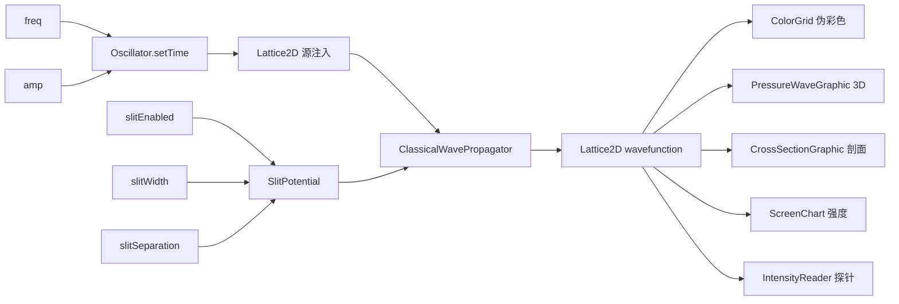
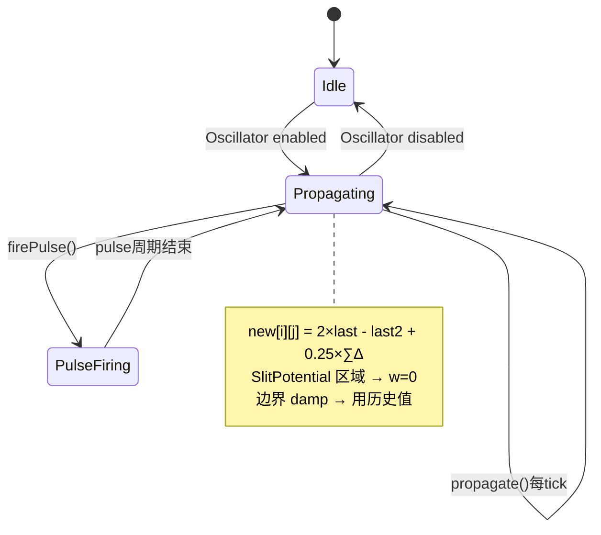

# Wave Interference · Experiment Design Document (EDD)

> **需求 ID**：req-port-wave-interference
> **蓝本**：`c:\workspace\phetTrunk\phetTrunk\simulations-java\simulations\wave-interference\` · 196 Java 文件
> **产出触发**：主对话 2026-07-24 · 按 edd-template.md v2.0 12 章全量产出
> **信心度**：88%（WaveModel/Lattice2D/ClassicalWavePropagator/Oscillator/WaveInterferenceModel/SlitPotential 已读全 · view 层通过 module 间接理解）
> **数据源**：`PHET_JAVA_ROOT/simulations-java/simulations/wave-interference/src/edu/colorado/phet/waveinterference/**/*.java`
> **注**：196 文件 · 本 EDD 聚焦 Model 层核心 + 教学层面 MVP · 建议拆 3 子需求（water / sound / light）

---

## §1 · 实验概览（Experiment Overview）

### 1.1 学科与知识点定位

| 项 | 值 |
|---|---|
| **学科** | 物理 · 波动光学 / 声学 / 水波 |
| **主题** | 波的干涉与衍射——三类波介质（水波/声波/光波）的统一波动模型 |
| **课标关联** | 高中物理选修"机械振动与机械波"(水波/声波) + "光"(光的干涉衍射) |
| **典型学段** | 高中 11-12 年级 |
| **学习时长（单次）** | 20-30 分钟 |

### 1.2 三子屏结构

| 子屏 | 蓝本类 | 教学重点 | 核心 view |
|---|---|---|---|
| **Water**（水波） | `WaterModule.java` (3.5 KB) + `WaterSimulationPanel.java` (10.3 KB) | 水滴/水龙头产生水波 · 单缝/双缝 · 俯视图 | FaucetGraphic (12 KB) · WaveModelGraphic · ScreenChartGraphic |
| **Sound**（声波） | `SoundModule.java` (4.3 KB) + `SoundSimulationPanel.java` (12 KB) | Speaker 产生声波 · 3D 侧视图 + 俯视图 · Fourier 音频 | PressureWaveGraphic (20 KB ★) · RotationGlyph · CrossSectionGraphic |
| **Light**（光波） | `LightModule.java` (4.4 KB) + `LightSimulationPanel.java` (12.8 KB) | 激光经过双缝在屏上形成干涉图样 · 波长-颜色映射 | IntensityReader (10 KB) · ScreenNode · PhotonColorMap |

### 1.3 教学目标

| 层次 | 目标 |
|---|---|
| **记忆** | 波的基本参数：振幅、频率、波长、周期 · 干涉=波叠加 · 衍射=波绕过障碍物 |
| **理解** | 双缝干涉的加强/减弱条件（Δpath = nλ 加强 · Δpath = (n+½)λ 减弱） |
| **应用** | 改变频率/缝间距/缝宽 → 预测干涉图样变化 |
| **分析** | 比较水波、声波、光波的干涉图样——验证波长是唯一变量 |
| **评价** | 判断杨氏双缝实验为何能证明光具有波动性 |

---

## §2 · 元件清单（Component Inventory · Q1.A + Q1.B）

### 2.1 核心物理元件 · 10 类

| # | 元件 | 蓝本类 | 职责 |
|---|---|---|---|
| C1 | **Lattice2D**（波场网格） | `Lattice2D.java` (4.6 KB) | `float[][]` 2D 波函数 · getValue/setValue/clear/copy/add · 所有子屏共用 |
| C2 | **ClassicalWavePropagator**（波传播器） | `ClassicalWavePropagator.java` (4.0 KB) | 标准 2D 波动方程有限差分：`new[i][j] = 2×last[i][j] - last2[i][j] + c²×(∑neighbors - 4×last[i][j])` · c=0.5 |
| C3 | **DampedClassicalWavePropagator**（带阻尼） | `DampedClassicalWavePropagator.java` (5.8 KB) | 继承 ClassicalWavePropagator · 边界阻尼区 dampX/dampY · 防边界反射 |
| C4 | **Oscillator**（波源） | `Oscillator.java` (5.7 KB) | 在 (x, y) 处以 radius 圆域驱动 lattice：`value = amp × cos(2πft)` · 支持脉冲模式 · prototyped 可 reset |
| C5 | **WaveModel**（波模型） | `WaveModel.java` (4.0 KB) | 统领 Lattice2D + Propagator · `propagate()` + `setSourceValue()` |
| C6 | **WaveInterferenceModel**（顶层模型） | `WaveInterferenceModel.java` (5.1 KB) | primary/secondary Oscillator + SlitPotential + wallPotentials + CompositePotential + stepInTime |
| C7 | **SlitPotential**（缝势能） | `SlitPotential.java` (4.1 KB) | 定义缝隙/挡板几何 · 在势能区域内 setValue(i,j)=0 阻止波传播 |
| C8 | **CompositePotential**（组合势能） | `CompositePotential.java` (1.7 KB) | 叠加 slitPotential + wallPotentials · 多道屏障统一管理 |
| C9 | **Faucet**（水龙头） | `FaucetGraphic.java` (12 KB) | Water 专有 · 拖拽产生水滴/连续水流 → 触发 Oscillator |
| C10 | **Screen**（光屏） | `ScreenNode.java` (3.8 KB) + `IntensityReader.java` (10.3 KB) | Light 专有 · 采样屏上各点的光强（时间平均）→ 亮度曲线 |

### 2.2 辅助表征概念元件

| # | 概念 | 蓝本类 | 说明 |
|---|---|---|---|
| A1 | **ColorGrid**（伪彩色） | `ColorGrid.java` (4.7 KB) | 将 Lattice2D 波值映射为 RGB 颜色 · 亮/暗区 = 峰值/节点 |
| A2 | **PressureWaveGraphic** | `PressureWaveGraphic.java` (20 KB) | Sound 专有 · 3D 等距侧视图 · 波峰/波谷 = 压缩/稀疏 |
| A3 | **CrossSectionGraphic** | `CrossSectionGraphic.java` (3.5 KB) | 截面波形图 · 显示某一行的波值剖面 |
| A4 | **WaveModelGraphic** | `WaveModelGraphic.java` (6.5 KB) | 统一的波场渲染器 · 水波/声波/光波复用 |
| A5 | **ScreenChartGraphic** | `ScreenChartGraphic.java` (6.9 KB) | 光屏上强度分布图 · 曲线/直方图 |
| A6 | **IntensityReader** | `IntensityReader.java` (10.3 KB) | 光强探针 · 可拖拽 · 时间平均求 RMS |
| A7 | **RotationGlyph** | `RotationGlyph.java` (6.8 KB) | Sound 专有 · 3D→2D 旋转控件 |
| A8 | **WaveMeasuringTape** | `WaveMeasuringTape.java` (1.9 KB) | 测量尺 · 拖拽量距离 |
| A9 | **SRRWavelengthSlider** | `SRRWavelengthSlider.java` (8.7 KB) | Light 专有 · 波长滑条 · 颜色映射（可见光谱 400-700nm） |

### 2.3 复用与省略

| 类 | Flutter 复刻策略 |
|---|---|
| Lattice2D + ClassicalWavePropagator | ✅ 核心保留 · Dart `Float64List` 展平 2D（性能优于 List<List>） |
| Oscillator | ✅ 保留 · 纯三角函数 · 与 sound/radio-waves 共享概念 |
| SlitPotential 几何 | ✅ 保留 · 简化为 Dart 接口 |
| ColorGrid | 🟡 用 `RawImage` + `Uint8List` 像素缓冲区替代 · GPU 加速 |
| PressureWaveGraphic (20 KB) | 🟡 拆为 `IsometricLatticePainter` · 等距投影公式 1:1 翻译 |
| IntensityReader | 🟡 CustomPainter + 时间平均缓冲 |
| SRRWavelengthSlider | 🟡 可被 color-vision 的 SpectrumSlider 概念替代 |
| FourierOscillator / FourierSoundPlayer | ❌ 用 `just_audio` 替代 |

---

## §3 · 参数联动声明（Parameter Coupling · Q5）

### 3.1 Intrinsic 参数（三子屏共享 + 差异）

| # | 参数 | 子屏 | 类型 | 范围 | 默认值 |
|---|---|---|---|---|---|
| P1 | `frequency` | 全部 | Intrinsic | 可调 | — |
| P2 | `amplitude` | 全部 | Intrinsic | 0-1 | 1.0 |
| P3 | `primaryOscillator.enabled` | 全部 | Intrinsic | bool | true |
| P4 | `secondaryOscillator.enabled` | 全部 | Intrinsic | bool | false |
| P5 | `primaryOscillator.(x, y)` | 全部 | Intrinsic | 2D | (8, height/2) |
| P6 | `slitEnabled` | 全部 | Intrinsic | bool | false |
| P7 | `slitWidth` | 全部 | Intrinsic | px | — |
| P8 | `slitSeparation`（双缝） | 全部 | Intrinsic | px | — |
| P9 | `wavelength`（光波用） | Light | Intrinsic | 400-700 nm | 550 nm |
| P10 | `faucetDripEnabled` | Water | Intrinsic | bool | — |
| P11 | `rotation`（3D 视角） | Sound | Intrinsic | angle | 0° |
| P12 | `pulseEnabled` | 全部 | Intrinsic | bool | false |

### 3.2 Derived 参数

| # | 派生量 | 公式 | 蓝本 |
|---|---|---|---|
| D1 | Lattice2D[i][j] 每帧值 | `new = 2×last - last2 + 0.25×(left+right+up+down - 4×last)` | ClassicalWavePropagator.propagate |
| D2 | Oscillator 注入值 | `amp × cos(2π × freq × time)` · 在 (x±r, y±r) 圆域内注入 | Oscillator.setTime |
| D3 | 光屏强度 | `getAverageValue(x, y, windowWidth)` 时间平均 → 亮度 | Lattice2D.getAverageValue |
| D4 | 双缝干涉加强条件 | `Δpath = mλ` → getAmplitudeAt 峰值位置 | 几何光学 |
| D5 | CrossSectionGraphic y 值 | `waveModel.getValue(x, selectedRow)` 单行剖面 | 直接采样 |

### 3.3 参数联动图



---

## §4 · 元件交互与状态机（Component Interaction · Q3 + Q4）

### 4.1 空间关系（Q3）

**通用 WaveInterference 模型拓扑**（所有 3 子屏底层相同）：

```
[Oscillator A] (x₁, y₁) ──注入圆域──╮
                                     ├── Lattice2D grid[width][height] ──→ ColorGrid
[Oscillator B] (x₂, y₂) ──注入圆域──╯         ↑
                                          SlitPotential
[Barrier Walls] ──→ CompositePotential ──╯      (缝/挡板)
                                                    ↓
                                    [Screen / CrossSection / IntensityReader]
```

**水波特有**：FaucetGraphic → 拖拽释放水滴 → Oscillator 脉冲
**声波特有**：SpeakerControlPanel → Speaker 位置/频率 → 3D RotationGlyph 旋转视图
**光波特有**：Laser → ScreenNode → 屏上采样 → 强度曲线

### 4.2 核心相互作用规则

#### R1 · ClassicalWavePropagator.propagate()（波动方程核心）

```java
// ClassicalWavePropagator.java L23-54
c = 0.5;  c² = 0.25;
for each (i, j):
    if potential.getPotential(i,j) != 0:  // 缝/墙区域
        w[i][j] = 0;                       // 波被阻挡
    else:
        neigh = c² × (w[i+1][j] + w[i-1][j] + w[i][j+1] + w[i][j-1] - 4×w[i][j]);
        w[i][j] = 2 × last[i][j] - last2[i][j] + neigh;  // 标准有限差分格式
// 最后交换 last2 ← last ← w（避免复制）
```

#### R2 · 边界阻尼（DampedClassicalWavePropagator）

```java
// dampX pixels at top and bottom, dampY pixels at left and right
for horizontal boundaries: w[i][0] = last2[i][0+dj];  // 使用历史值
for vertical boundaries:   w[0][j] = last2[0+di][j];
```

#### R3 · Oscillator 注入

```java
// Oscillator.java L41-63
if enabled:
    value = amplitude × cos(2π × frequency × time);
    for (i,j) in circle(radius):  // radius = 2 by default
        waveModel.setSourceValue(i, j, value);
else:
    // 不注入 · 波自由传播
```

#### R4 · SlitPotential 阻挡

```
slitPotential 定义缝隙几何（单缝·双缝·水平·垂直）
在势能区域外 → getPotential = 0（波自由通过）
在挡板区域内 → getPotential != 0 → propagator 设置 w[i][j] = 0（波被吸收）
```

#### R5 · 光屏强度积分

```
IntensityReader:
    对每个采样位置 (x, y):
        intensity = timeAverage(waveModel.getAverageValue(x, y, windowWidth)²)
        → 映射为亮度值（0-255）
        → ScreenChartGraphic 绘制分布曲线
```

### 4.3 波场状态机



---

## §5 · 实验流程与教学脚本（Experiment Flow · Q6 + Q7）

### 5.1 实验目标（Q6 · 三子屏合成）

**Water（水波）**：
- Q: 水滴落入水面后看到什么？→ A: 同心圆波向外扩散（圆形波前）
- Q: 两滴水同时落下，波如何叠加？→ A: 交叉区域出现加强/减弱条纹（干涉）
- Q: 在两个挡板之间放一条缝，波过去后是什么形状？→ A: 缝后波变成半圆形（衍射）

**Sound（声波）**：
- Q: 3D 侧视图中，波峰对应什么？→ A: 气压压缩区（粒子密集）
- Q: 改变频率对干涉图样有什么影响？→ A: λ 变 → 条纹间距变化

**Light（光波）**：
- Q: 双缝后方屏幕上的条纹说明了什么？→ A: 光具有波动性——暗纹 = 相消干涉
- Q: 用红光 vs 蓝光，条纹间距有什么不同？→ A: 红光 λ 大 → 条纹间距宽；蓝光 λ 小 → 条纹间距窄

### 5.2 推荐教学脚本（Q7 · 选 Water 然后 Light 为主线）

| 步骤 | 屏 | 操作 | 观察 | 讲授点 |
|---|---|---|---|---|
| 1 | Water | 点击 Faucet 产生单滴水 | 同心圆扩散 · 圆形波前 | 波从源向四周传播 |
| 2 | Water | 连续滴三下水滴 | 多套同心圆叠加 · 干涉区出现 | 波的叠加原理 |
| 3 | Water | 启用双缝 | 缝后出现半圆形波 · 干涉条纹 | 衍射 + 双缝干涉 |
| 4 | Water | 改变频率 | 波长变化 · 条纹间距变化 | f↑→λ↓→条纹密 |
| 5 | Water | 启用两个 Oscillator | 两套波源 · 对称/非对称干涉 | 双源干涉 = 杨氏实验的水波版 |
| 6 | 切到 Light | 启用双缝 + Screen | 屏上出现明暗条纹 | 杨氏双缝实验——光的波动性证据 |
| 7 | Light | 拖动 SRRWavelengthSlider（红→蓝） | 条纹间距随波长变化 | λ 是唯一变量 · 干涉条件=Δpath=mλ |
| 8 | Light | 拖拽 IntensityReader | 读取某点的光强数值 | 定量验证：暗纹处强度≈0 |
| 9 | Light | 改变缝宽 | 单缝衍射包络变化 | 缝宽决定衍射图样的"包络" |

### 5.3 反直觉现象清单

1. **波叠加后不"记住"彼此**：两列波交叉后各自继续传播，不会永久改变对方——学生常以为波"碰撞"后改变方向
2. **光波=水波=声波三者的干涉图样完全一致**：改变的是波长，不是介质——同一 λ 下干涉条纹间距完全相同
3. **单缝也有"条纹"**（单缝衍射）· 不是只有双缝才出条纹
4. **暗纹 ≠ 能量"消失"**：相消干涉只是能量重新分布——某些位置暗意味着其他位置更亮（能量守恒）

---

## §6 · 预期现象声明（Phenomena Declaration · Q8 · 必答）

### 6.1 视觉现象

| # | 现象 | 触发条件 | 表征 |
|---|---|---|---|
| Ph1 | **同心圆波扩散** | Water: 单 Oscillator | 环形波纹从源点向外扩展 |
| Ph2 | **干涉条纹** | 双 Oscillator 或 双缝 | ColorGrid 中出现明暗相间条纹 |
| Ph3 | **单缝衍射** | 单缝 + Oscillator 在缝后 | 波在缝后转为半圆形 · 中央明亮 · 两侧渐暗 |
| Ph4 | **双缝干涉** | 双缝 + Oscillator | 两套半圆形波叠加 → 扇形的明暗条纹区 |
| Ph5 | **光屏强度分布** | Light: Screen 启用 | 曲线图上明暗峰谷 · 与双缝间距对应 |
| Ph6 | **3D 侧视图** | Sound: RotationGlyph 旋转 | 等距投影显示波峰/波谷 3D 高度 |
| Ph7 | **边界吸收** | DampedClassicalWavePropagator | 波到达边界后逐渐消失 · 无反射 |
| Ph8 | **波长-颜色映射** | Light: SRRWavelengthSlider | 400nm=紫→700nm=红 · 波的顏色随波长变化 |

### 6.2 无现象声明

- ❌ 无偏振（光波不显示 E 矢量方向）
- ❌ 无光子颗粒模式（不同于 photoelectric sim）
- ❌ 无多普勒效应
- ❌ 水波无真实水流（水面高度动画是伪彩色）

### 6.3 特殊边界现象

- **c=0.5**：波传播速度固定 · 若 c 过大 → 数值不稳定（CFL 条件）
- **dampX/dampY**：阻尼区域宽度 · 过小 → 边界反射可见 · 过大 → 有效区域缩小
- **Oscillator 半径 2**：注入区域过小 → 波源各向异性（非完美圆形波前）

---

## §7 · 学生交互操作（Student Interactions · Q9 · 必答）

| # | 交互 | 子屏 | 触发 UI |
|---|---|---|---|
| I1 | 拖动频率滑块 | 全部 | FrequencyControl |
| I2 | 拖动振幅滑块 | 全部 | AmplitudeControl |
| I3 | 调整缝宽/缝间距 | 全部 | SlitControlPanel |
| I4 | 开关第二个 Oscillator | 全部 | MultiOscillatorControlPanel |
| I5 | 拖拽 Oscillator 位置 | 全部 | Mouse drag on oscillator graphic |
| I6 | 水滴/水龙头 | Water | FaucetGraphic drag |
| I7 | 旋转 3D 视角 | Sound | RotationGlyph |
| I8 | 拖动波长滑块 | Light | SRRWavelengthSlider (400-700nm) |
| I9 | 开关光屏 | Light | ScreenControlPanel |
| I10 | 拖拽光强探针 | Light | IntensityReader drag |
| I11 | 拖拽测量尺 | 全部 | WaveMeasuringTape |
| I12 | 脉冲模式 | 全部 | PulseButton firePulse |

### 7.2 无操作场景

- ❌ 不允许直接编辑 Lattice2D 的值（只有 Oscillator 注入和 Propagator 演化可改）
- ❌ 不允许改变 c=0.5 波速参数
- ❌ 不允许改变网格分辨率（蓝本默认 60×60）

---

## §8 · 实验改造与扩展（Adaptation & Organization · Q10）

### 8.1 学科正确性矩阵

| 维度 | 正确性 | 说明 |
|---|---|---|
| **2D 波动方程** | ✅ 正确 | 标准中心有限差分 · c²=0.25 满足 CFL 条件 |
| **边界阻尼** | ✅ 正确 | 使用历史值替代完美吸收边界的一阶近似 |
| **缝衍射** | ✅ 正确 | SlitPotential 准确阻挡波传播 · 衍射图样定性正确 |
| **光屏强度时间平均** | ✅ 正确 | `getAverageValue(x, y, windowSize)` + 累加平均 ≈ RMS |
| **c=0.5** | 🟡 数值近似 | 不是物理波速 · 是数值参数 · 不影响教学（干涉条纹几何只取决于 λ） |

### 8.2 复刻改进机会

| # | 改进点 | 复杂度 |
|---|---|---|
| M1 | **GPU 加速 Lattice2D**：Dart `Float64List` + `dart:typed_data` 替代 `float[][]` · 避免锯齿 | 中 |
| M2 | **ColorGrid 用 RawImage + Uint8List 像素缓冲区**：替代 AWT BufferedImage · GPU 渲染 | 中 |
| M3 | **添加"波前线"模式**：Huygens 原理可视化 · 每个格点的波前方向 | 中 |
| M4 | **统一 Oscillator 为通用抽象**：sound/radio-waves/wave-interference 三者 Oscillator 概念可合一 | 中（需跑 35 协议改 shared-abstraction-plan） |

### 8.3 与其他 sim 的组织关系

| 相邻 sim | 共享抽象 |
|---|---|
| **sound**（标量波） | Oscillator 源概念 · WaveFieldRenderer 从 1D→2D |
| **radio-waves**（矢量波） | Oscillator 源 · 场可视化（Lattice2D vs FieldLatticeView） |
| **color-vision** | SpectrumSlider ↔ SRRWavelengthSlider（波长-颜色映射复用） |

**公共抽象产出节奏**：
```
sound (L1 候选 #1: WaveFieldRenderer 1D) 
  → wave-interference (L1 候选 #2: Lattice2D + Propagator 2D)
  → 评估上抽为 lib/common/wave/
```

### 8.4 EGPSpace ✅ · 元件化绘制 ✅

蓝本已严格分离 Model (Lattice2D/WaveModel/SlitPotential) 和 View (ColorGrid/WaveModelGraphic/PressureWaveGraphic)。

---

## §9 · 可配置化声明（Configuration-Driven · v2.0）

### 9.1 配置化边界

| 类别 | 归属 |
|---|---|
| 网格分辨率 60×60 / dampX/dampY | 🔒 代码 |
| Oscillator 频率/振幅/位置/启用 | ✅ JSON |
| Slit 宽度/间距/单双缝/启用 | ✅ JSON |
| Screen 启用/位置 | ✅ JSON |
| 子屏选择 | ✅ JSON |
| c=0.5 / 波动方程公式 | 🔒 代码 |

### 9.2 scenario 骨架

```jsonc
{
  "scenarioId": "young-double-slit-red",
  "name": "杨氏双缝实验·红光",
  "screen": "light",
  "initialParams": {
    "frequency": 0.5,
    "amplitude": 1.0,
    "wavelengthNm": 650,
    "primaryOscillator": {"x": 8, "y": 30, "enabled": true},
    "secondaryOscillator": {"enabled": false},
    "slit": {"type": "double", "width": 2, "separation": 8, "enabled": true},
    "screen": {"enabled": true, "x": 55}
  },
  "paramRanges": {
    "wavelengthNm": {"min": 400, "max": 700, "step": 10}
  },
  "successCriteria": [
    {"id": "sc-1", "type": "interferencePatternVisible", "description": "屏上出现明暗条纹"}
  ]
}
```

### 9.3 配置化 DoD

- [ ] `assets/scenarios/wave_interference/manifest.json` ≥ 3 scenario
- [ ] `schemas/wave_interference_scenario.schema.json`
- [ ] 三子屏各 ≥ 1 个默认场景

---

## §10 · AI 可生成化声明（AI-Generatable · v2.0）

### 10.1 AI 生成友好度

| 维度 | 评分 | 说明 |
|---|---|---|
| 元件类型多 | ⭐⭐⭐ | 10 类 · 三子屏组合复杂度最高 |
| 参数值离散 | ⭐⭐⭐⭐ | 频率/wavelength 步进离散 |
| 教学目标可枚举 | ⭐⭐⭐⭐⭐ | 干涉/衍射/波长/介质对比 4 大方向 |
| 反直觉现象丰富 | ⭐⭐⭐⭐⭐ | 叠加不记忆 + 三介质统一性 + 暗纹能量守恒 |
| 有缝几何组合 | ⭐⭐⭐ | 单缝/双缝/水平/垂直 × 宽度/间距 → 组合空间大 |

**综合评估**：AI 生成成本**最高**（4 sim 中）——三子屏 + 多种缝几何 + 波长调制 · 但参数离散性保证了 schema 可校验

### 10.2 AI 生成 DoD

- [ ] `docs/prompts/wave_interference_scenario.md` ≥ 5 few-shot（每子屏 ≥ 1）
- [ ] LLM 生成 ≥ 8 scenario · 100% schema

---

## §11 · 通用化组件清单（Common Abstraction Checklist · v2.0）

### 11.1 L0 复用

| 组件 | 路径 | 必用 |
|---|---|---|
| PhetSlider（频率/振幅/缝宽/缝间距/波长） | `lib/common/controls/` | 必用 |
| PhetRadioGroup（水/声/光子屏 · 单/双缝 · 脉冲开关） | `lib/common/controls/` | 必用 |
| PropertyControlPanel | `lib/common/widgets/` | 必用 |
| TimeControlBar | `lib/common/widgets/` | 必用 |
| SimulationClock | `lib/common/` | 必用 |
| ScenarioManagerBase | `lib/common/scenario/` | 必用 |
| Chart（WaveChartGraphic） | `lib/common/chart/` | 必用 |
| SpectrumSlider（Light 波长 → 复用 color-vision） | `lib/common/controls/`（待上抽） | 建议 |

### 11.2 L1 候选（3-Time Rule 关键触发点）

| 组件 | 使用者计数 | 触发 |
|---|---|---|
| **Lattice2D + ClassicalWavePropagator** | 1/3 | wave-interference 是首个使用者 · sound/radio-waves 的波场模型不同（1D 标量 vs 2D 矢量）· 不急着抽 |
| **Oscillator 通用抽象** | 3/3（sound Speaker + radio-waves Electron + wave-interference Oscillator） | 🚨 **强触发上抽** · 应在 `lib/common/wave/oscillator.dart` 建立通用抽象 |
| **ColorGrid 伪彩色渲染器** | 1/3 | 通用但每个 sim 配色不同 · 可抽基类 |
| **WaveFieldRenderer 2D** | 见 sound EDD §11 | sound=1D → wave-interference=2D → 比较后决策 |

### 11.3 sim 专属

| 组件 | 理由 |
|---|---|
| PressureWaveGraphic (20 KB) 等距投影 | Sound 视角特化 · 不上抽 |
| FaucetGraphic / FaucetDragHandler | Water 专有交互 |
| SRRWavelengthSlider 可见光谱映射 | Light 专有（除非 color-vision 需求） |

---

## §12 · 质量属性声明（Quality Attributes · v2.0）

### 12.1 测试目标

| 类型 | 目标 | 关键类 |
|---|---|---|
| Unit | ≥ 80% | Lattice2D.getValue/setValue · ClassicalWavePropagator.propagate · Oscillator.setTime · SlitPotential |
| Widget | ≥ 5 | ColorGrid · WaveModelGraphic · ScreenNode |
| Golden | ≥ 6 状态 | 三子屏 × 双缝/单缝各一张 |
| Integration | ≥ 3 scenario | Water 滴水→干涉 · Light 双缝→屏 · Sound 3D 旋转 |

### 12.2 性能（最高要求）

- **目标帧率**：60 fps（16.67 ms/帧）
- **核心瓶颈**：Lattice2D 60×60 = 3600 次邻居求和 × 每 tick · 1D `Float64List` 展平 + 预计算索引可降至 < 2 ms
- **劣化场景**：双 Oscillator + 双缝 + Screen 全开 · < 10 ms/帧
- **粒子池**：Lattice2D 固定 60×60 · 分配一次

### 12.3-12.5

- 持久化：不保留
- i18n：~80 键（三子屏控件标签最多）→ Flutter .arb
- 可访问性：ColorGrid 提供替代视图（数值探针 IntensityReader）· 光波模式对色盲友好（波长数字标注）

---

## §附录 A · Gate 映射

| EDD 章 | Gate | 状态 |
|---|---|---|
| §2 | C27 | ✅ 10 类 |
| §3 | C30/D23 | ✅ 12 Intrinsic + 5 Derived |
| §4 | C28 | ✅ 5 核心规则 + 状态机 |
| §5 | C29 | ✅ 9 步脚本 |
| §6 | C31 | ✅ 8 视觉 + 无声明 + 边界 |
| §7 | C32 | ✅ 12 交互 |
| §8 | D26/D27 | ✅ 5 行矩阵 + 4 改进 |

## §附录 B · MVP 拆分建议

因 196 文件过大 · 建议拆 3 个独立需求：

| 子需求 | 子屏 | 时间 | 依赖 |
|---|---|---|---|
| `req-port-wi-water` | Water | 4-5 h | P2 完成 |
| `req-port-wi-sound` | Sound（复用 Water 的 WaveModel + Lattice2D） | 2-3 h | Water 完成 |
| `req-port-wi-light` | Light（复用 Sound 的 Oscillator） | 2-3 h | Sound 完成 |

---

## 变更历史

> 2026-07-24 by 主对话（用户 B+C 批量产出 · 4/4 全部完工）：
> 第 4 个完整 EDD · 12 章全量。数据源：WaveModel/Lattice2D/ClassicalWavePropagator/DampedClassicalWavePropagator/Oscillator/WaveInterferenceModel/SlitPotential 已读全。
> 核心洞见：标准 2D 有限差分波动方程（c²=0.25）+ DampedClassicalWavePropagator 边界吸收 + SlitPotential 阻挡。建议 3 子屏拆 3 需求。