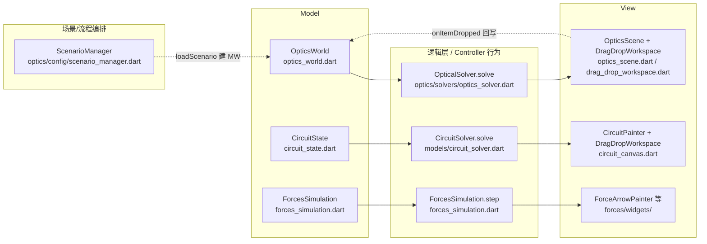

# 架构设计原则（MVC / 组件化 / 通用化 / 配置化）

> 来源: 首次扫描 + 源码核对（`lib/` 52 个 .dart） | 创建时间: 2026-07-17

本项目（`geometric_optics`，Flutter/Dart 纯本地教学模拟 App）的架构不是"三个并列 Screen 的简单堆砌"，而是围绕四条统一的设计原则组织的。现有知识库把不可变/copyWith/Sentinel/求解器分离作为"设计风格"零散提及，本文将其提升为**顶层设计主线**，便于后续扩展新模块/新元件时复用同一套范式。

---

## 一、MVC 分层

每个知识点模块（光学 / 电路 / 力与运动）内部都遵循 **Model — Solver(Controller 逻辑) — View** 的分离：



**分层契约**（从源码归纳，非猜测）：

| 角色 | 职责 | 不可变约定 | 代码位置 |
|---|---|---|---|
| Model | 持有世界状态，零行为或仅纯函数 | `@immutable` + `copyWith` | `optics_world.dart:1`、`circuit_state.dart:1` |
| Solver | 纯函数 `solve(state) → result`，无副作用、不持有状态 | 无状态 | `optics/solvers/optics_solver.dart`、`circuit_solver.dart` |
| View | 只读 Model/Solver 结果做 `CustomPainter` 绘制 + 手势 | 无状态（Stateless 或 Painter） | `optics_scene.dart`、`circuit_canvas.dart` |
| Controller | 编排"加载场景 → 建 Model → 校验约束 → 判目标" | 持有当前场景引用 | `scenario_manager.dart:8` |

> 关键点：`DragDropWorkspace`（View 基础设施）**不持有业务状态**，只通过 `onItemDropped(T data, Offset worldPos)` 回调把"用户放下了什么、在哪"抛给外部 Screen 处理（`drag_drop_workspace.dart:114-118`）。这是 MVC 中 View 不反向依赖 Model 的典型体现。

---

## 二、组件化（元件继承体系）

光学模块的"元件"是**组件化抽象基类 + 多子类继承**的典型实现，电路模块用**枚举 + 数据类**走同源思路。

### 光学：抽象基类 + 模板方法

`OpticalElement` 是 `@immutable` 抽象基类（`optical_element.dart:103`），定义元件统一契约：

| 方法 | 角色 | 默认实现 |
|---|---|---|
| `interact(List<Ray>, OpticsWorld) → InteractionResult` | 光线与元件交互（核心） | 子类必须实现 |
| `intersect(Ray) → OpticalHit?` | 命中检测 | 默认 `null`（不参与追迹） |
| `interactAt(Ray, hit, world)` | 单光线交互 | 默认复用 `interact` |
| `paint(Canvas, Paint, world)` | 渲染 | 子类必须实现 |
| `copyWith(...)` | 不可变拷贝 | 子类必须实现 |

4 个具体元件继承同一契约：`LensElement` / `MirrorElement` / `LightSourceElement` / `ScreenElement`（`optics/models/`）。

### 电路：枚举 + 数据类

`CircuitComponent` 用 `@immutable` + `copyWith` + `CircuitElementType` 枚举（`circuit_element.dart`），与光学 `OpticalElementType` 同构——**两个模块用不同语法（继承 vs 枚举）实现了同一组件化意图**。

> 组件化的收益：新增一种元件只需 (1) 加枚举值或子类 + (2) 在 `ScenarioManager._createElementFromPlacement` 的 `switch` 加一个 `case`（`scenario_manager.dart:108-140`），渲染与交互逻辑各自闭环，不污染其他元件。

---

## 三、通用化（泛型共享 + 通用工厂）

### 泛型共享组件 `DragDropWorkspace<T>`

拖拽工作区是**泛型化**的共享基础设施，被光学（`T=String`）与电路（`T=ComponentType`）两个模块复用，靠类型参数化避免复制粘贴：

- `DragDropWorkspace<T extends Object>`（`drag_drop_workspace.dart:19`）
- `DragItem<T>` 携带 `data: T`（`drag_drop_workspace.dart:2-7`）
- 调用方只需提供 `items: List<DragItem<T>>`、`canvasBuilder`、`onItemDropped`，布局（`sideTray`/`bottomTray`）由枚举切换

### 通用工厂分支

电路模块 `_addComponent` 的 `else` 分支**按 `type.defaultValue` 通用创建元件**，新元件通常无需改这分支（`circuit_screen.dart`，见 [conventions/add-circuit-component.md](../../conventions/add-circuit-component.md)），这是"配置/枚举驱动 + 通用兜底"的通用化手法。

### 通用场景编排

`ScenarioManager` 不写死任何场景，统一从 `assets/scenarios/*.json` 加载、校验、判目标（`scenario_manager.dart:11-58`），光学三域（透镜/镜子/组合）共用同一套编排代码。

---

## 四、配置化（JSON 驱动 + 数据模型）

新场景 / 新元件规格 / 约束 / 目标**全部由 JSON 配置驱动**，代码只写"读取与执行"逻辑，不写死业务数据。

```mermaid
flowchart TD
    A[assets/scenarios/manifest.json] -->|列出 id| B[ScenarioManager.loadScenarios]
    B -->|逐 id 读| C[assets/scenarios/&lt;id&gt;.json]
    C -->|LabScenario.fromJson| D[LabScenario 模型]
    D --> E[initialLayout → 建 OpticsWorld]
    D --> F[ComponentInventory.fromJson\n可用元件+maxCount+locked+defaultParams]
    D --> G[Constraint 列表\nvalidate(world)]
    D --> H[LearningObjective\ncheckAchieved(world, solved)]
    D --> I[GameRules\n固定计分公式]
```

| 配置维度 | 载体 | 反序列化入口 | 代码位置 |
|---|---|---|---|
| 场景清单 | `manifest.json` | `loadScenarios` | `scenario_manager.dart:14` |
| 元件库存 | `<id>.json` 内 `inventory` | `ComponentInventory.fromJson` | `component_inventory.dart:54` |
| 初始布局 | `<id>.json` 内 `initialLayout` | `loadScenario` | `scenario_manager.dart:90` |
| 约束 | `<id>.json` 内 `constraints` | `Constraint.fromJson` | `constraint.dart` |
| 教学目标 | `<id>.json` 内 `objectives` | `LearningObjective.fromJson` | `learning_objective.dart` |
| 计分规则 | `game_rules.dart`（固定公式） | 常量 | `game_rules.dart` |

> 配置化的收益：新增一个光学实验 = 写一份 JSON（含元件、约束、目标），**零代码改动**即可上线；教学作者（非开发者）也能产出内容。

---

### 配置化 · 项目硬约束（2026-07-20 起生效）

> 本条款把配置化从"光学的实现选择"升级为**项目基本框架**。所有模块（含未来新模块）必须遵守。授权来源：2026-07-20 用户拍板 Q1=A · Q2=B · Q3=C · Q4=C；配套 [ai-generation-readiness.md](ai-generation-readiness.md) 同步升为 `status=adopted-framework-standard`。

#### 条款 §C1：模块启动路径

任何 `*Screen`（当前 3 个 + 未来任意个）的 `initState` 必须走以下形态之一：

```dart
// 形态 A：加载 scenario JSON（默认路径）
final scenario = await ScenarioManager.load(widget.scenarioId);
_state = scenario.buildInitialState();

// 形态 B：空白/自由模式（必须以 scenarioId==null 显式声明）
if (widget.scenarioId == null) {
  _state = const XxxState();  // 允许，但空白模式本身也是 scenario 的一种
}
```

**禁止**：直接 `_state = const XxxState(硬编码值)` 且无 scenarioId 通道——这是 forces 现状的反模式。

#### 条款 §C2：元件规格来源

元件的 `defaultValue / valueMin / valueMax / valueStep / label / unit` 必须优先从 scenario JSON 的 `inventory.availableComponents[type].defaultParams` 读取。枚举扩展（如 `ComponentTypeLabel`）可作为**兜底默认值**，但不得作为**唯一定义源**。

#### 条款 §C3：AI 可生成性

每个模块的 scenario JSON 必须能被离线 LLM 生成（Q2=β 模型）。落地要求：
- 提供 `docs/prompts/<module>_scenario.md`（system prompt + few-shot 样本）
- 提供 `schemas/<module>_scenario.schema.json`（JSON Schema 校验）
- 现有 scenario 样本 ≥ 3 个（few-shot 下限）

详见 [ai-generation-readiness.md](ai-generation-readiness.md)。

#### 条款 §C4：豁免流程

暂时无法遵守 §C1-§C3 的模块必须：
1. 在模块索引 [systems/module-index.md](../systems/module-index.md) 的"配置化对照表"标注 `⚠️ 豁免中`
2. 在 `context/project/phet/notes.md` 记录豁免理由 + 计划恢复的需求 ID
3. 建立配套的 `req-*-config-migration` 需求登记（例：`req-phet-circuit-config-json`）

**未登记豁免的硬编码模块视为架构违规**，`code-reviewer` 拦。

---

### 各模块合规现状（迁移锁项）

| 模块 | §C1 启动路径 | §C2 元件规格 | §C3 AI 可生成 | 合规状态 | 迁移需求 |
|---|---|---|---|---|---|
| optics | ✅ ScenarioManager | ✅ inventory.defaultParams | ✅ prompts + schema + 3 samples | 🟢 合规 | 已迁移（2026-07-21，AI 工具链补齐） |
| circuit | ✅ ScenarioManager | ✅ inventory.defaultParams + ComponentTypeLabel 兜底 | ✅ prompts + schema + 7 samples | 🟢 合规 | 已迁移（2026-07-21） |
| forces | ✅ ScenarioManager | ✅ JSON initialParams + objects/pullers | ✅ prompts + schema + 5 samples | 🟢 合规 | 已迁移（2026-07-21） |

> ✅ **状态**：截至 2026-07-21，三模块均已完成 §C1-§C3 全合规迁移。**新增功能不得加剧硬编码**（如新增元件类型必须同步走 scenario 通道，不能只改枚举）。

---

## 四原则协同关系

| 原则 | 支撑的扩展场景 | 瓶颈点（改哪） |
|---|---|---|
| MVC 分层 | 换渲染方式 / 加新求解算法 | View 与 Solver 解耦，互不影响 |
| 组件化 | 加新元件类型 | `OpticalElement` 子类 + `ScenarioManager` switch case |
| 通用化 | 第三/四个模块复用拖拽工作区 | `DragDropWorkspace<T>` 已泛化，无需改 |
| 配置化 | 加新实验 / 新教学目标 | 仅写 JSON，零代码 |

---

*关键源文件: `lib/widgets/drag_drop_workspace.dart`（`DragDropWorkspace<T>`/`DragItem<T>`）, `lib/optics/models/optical_element.dart`（`OpticalElement` 抽象基类）, `lib/optics/config/scenario_manager.dart`（`ScenarioManager` 通用编排）, `lib/optics/config/component_inventory.dart`（`ComponentInventory.fromJson`）, `lib/models/circuit_element.dart`, `lib/models/circuit_state.dart`（`@immutable` + Sentinel copyWith）, `lib/optics/config/lab_scenario.dart`*
