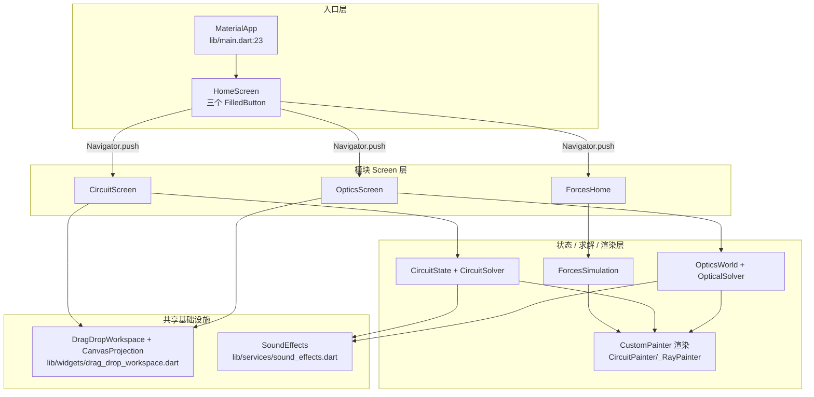

# 项目总览：geometric_optics (phet)

> 来源: 首次扫描（`C:\workspace\phet`）| 创建时间: 2026-07-17
> 变更: 2026-07-17 移除未接入主流程的 `ElectronAnimator`（架构图 L4 + 目录树 services/），总文件数 52 → 50。

`geometric_optics` 是一个原生 Flutter 几何光学 / 电路 / 力学学习模拟应用（PhET 风格教学 App），语言为 **Dart**，运行目标包含 Web / Android / iOS / Windows / macOS / Linux。

## 关键事实（已验证）

| 项 | 值 | 来源 |
|---|---|---|
| 包名 | `geometric_optics` | `pubspec.yaml:2` |
| Dart SDK | `^3.11.1` | `pubspec.yaml:24` |
| Flutter 依赖 | `flutter` SDK | `pubspec.yaml` dependencies |
| 第三方依赖 | `cupertino_icons ^1.0.8`、`flutter_svg ^2.3.0`、`audioplayers ^6.7.1` | `pubspec.yaml` dependencies |
| 入口 | `lib/main.dart` → `GeometricOpticsApp`（MaterialApp）→ `HomeScreen` | `lib/main.dart:7-56` |
| 源码规模 | 50 个 `.dart` 文件，约 7849 行（抽样估算，仅 `lib/`，不含测试） | 扫描统计 |

## 三大功能模块

应用由 `HomeScreen` 分发到三个并列的知识点模块：

| 模块 | 入口 Screen | 核心目录 | 说明 |
|---|---|---|---|
| 几何光学 | `OpticsScreen` | `lib/optics/` | 透镜/平面镜/凹面镜成像，光线追迹，场景化教学 |
| 电路搭建 | `CircuitScreen` | `lib/models/` + `lib/widgets/`（`circuit_*`） | 拖拽搭建电路，图论求解通电状态与灯泡亮度 |
| 力与运动 | `ForcesHome` → `NetForceScreen` / `MotionScreen` | `lib/forces/` | 1D 牛顿力学模拟（合力/运动/摩擦/加速度） |

## 架构分层

下图展示应用自顶向下的四层结构，以及共享基础设施被三个模块复用的关系：



**分层约束**（从源码归纳，非猜测）：

- 入口层只负责构建 `MaterialApp` 与主题（`lib/main.dart:31-49`），**不持有任何业务状态**。
- 每个模块 Screen 持有自己的不可变状态（`OpticsScreen` 持 `OpticsWorld`、`CircuitScreen` 持 `CircuitState`、`ForcesHome` 持 `ForcesSimulation`），状态变更经 `copyWith` 返回新实例后 `setState`。
- 求解器是纯函数（`OpticalSolver.solve(world)` / `CircuitSolver.solve(state)`），**不持有状态、不产生副作用**，渲染层只读求解结果。
- `DragDropWorkspace` 被光学与电路两个模块复用，是理解两个 Screen 交互机制的前提（详见 [frontend/drag-drop-workspace.md](../frontend/drag-drop-workspace.md)）。

## 顶层目录结构（actual）

```
lib/
├── main.dart                  ← 入口，构建 MaterialApp
├── screens/                   ← 共享屏幕：home / circuit / optics / scenario_selection
├── models/                    ← 电路领域模型（circuit_state/solver/history 等）+ optics_state
├── services/                  ← 横切服务：sound_effects
├── widgets/                   ← 共享组件：drag_drop_workspace / circuit_* / optics_scene / objective_panel
├── forces/                    ← 力与运动模块（config/models/screens/widgets 子目录）
└── optics/                    ← 几何光学模块（config/models/physics/solvers/widgets 子目录）
```

## 设计风格（已验证）

- **不可变状态 + copyWith 模式**：`CircuitState`、`OpticsWorld`、`CircuitComponent`、`WireSegment`、`Vertex` 均标注 `@immutable`，所有修改通过 `copyWith` 返回新实例（`lib/models/circuit_state.dart`）。
- **Sentinel 模式**：`CircuitState.copyWith` 用 `_NullSentinel` 区分"未提供"与"显式传 null"，修复 `null ?? old` 无法清空的经典 bug（`lib/models/circuit_state.dart:230-270`）。

> 上述不可变/copyWith/Sentinel/求解器分离，是本项目四条统一设计原则（**MVC 分层 / 组件化 / 通用化 / 配置化**）在模块内的具体体现。完整主线见 [architecture/design-patterns.md](design-patterns.md)。
- **求解器与状态分离**：`CircuitSolver.solve(state)` / `OpticalSolver.solve(world)` 静态方法，无副作用，纯函数式产出 `SolvedCircuit` / `SolvedOptics`（`lib/models/circuit_solver.dart:5`、`lib/optics/solvers/optics_solver.dart:31`）。
- **绘图与交互分离**：渲染用 `CustomPainter`（如 `CircuitPainter`、`_RayPainter`），交互手势在 `GestureDetector`/`KeyboardListener` 层处理。

## 跨引用

- 业务代码根: `C:\workspace\phet\lib`
- 外部资产（SVG/场景 JSON）: `C:\workspace\phet\assets`（场景配置在 `assets/scenarios/manifest.json` + 各 `<id>.json`，由 `ScenarioManager.loadScenarios` 加载）
- 关联知识库: [architecture/app-entry.md](app-entry.md) · [systems/module-index.md](../systems/module-index.md) · [frontend/drag-drop-workspace.md](../frontend/drag-drop-workspace.md)

---

*关键源文件: `lib/main.dart`, `lib/screens/home_screen.dart`, `lib/screens/optics_screen.dart`, `lib/screens/circuit_screen.dart`, `lib/forces/screens/forces_home.dart`, `lib/widgets/drag_drop_workspace.dart`*
