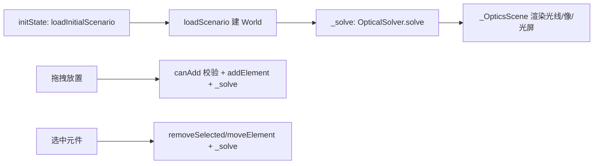

# 几何光学模块（OpticsScreen）

> 来源: 首次扫描 | 创建时间: 2026-07-17

## 概述

`OpticsScreen`（`lib/screens/optics_screen.dart`）是透镜/平面镜/凹面镜成像模拟器，支持拖拽元件、实时光线追迹、场景化教学目标。

## 状态模型 `OpticsWorld`（`lib/optics/models/optics_world.dart`）

不可变，`copyWith` 风格。核心字段：`elements`（`List<OpticalElement>`）、`selectedId`、`zoom`、`showVirtualImage/showFocalPoints/showLabels`。

关键方法：`sortedElements`（按 x 排序 = 光线传播顺序）、`getElementById`、`addElement/removeElement/updateElement/moveElement`。

## 元件抽象 `OpticalElement`（`lib/optics/models/optical_element.dart`）

`abstract class`，不可变。核心 API：

| 方法 | 说明 |
|---|---|
| `interact(List<Ray>, OpticsWorld) → InteractionResult` | 批量光线交互（默认实现） |
| `intersect(Ray) → OpticalHit?` | 命中检测（默认返回 null） |
| `interactAt(Ray, hit, world)` | 单光线交互（默认复用 `interact`） |
| `hitTest(Offset)` | 矩形命中（中心 + width/height） |
| `paint(Canvas, Paint, world)` | 渲染 |
| `copyWith(...)` | 不可变拷贝 |

枚举：`OpticalElementType`(lens/mirror/lightSource/screen/candle/prism，含 `parseType`)、`LensType`(convex/concave)、`MirrorType`(concave/convex/plane)、`SourceType`(object/point/parallel)、`RayMode`(edge/principal/many/none)。

子类（`lib/optics/models/`）：`LensElement`(`.create(id, position, lensType, focalLength)`)、`MirrorElement`、`LightSourceElement`(`objectHeight`)、`ScreenElement`。

## 求解器 `OpticalSolver`（`lib/optics/solvers/optics_solver.dart`）

`solve(OpticsWorld) → SolvedOptics`：

1. 取首个 `LightSourceElement` 为物。
2. `_computeImageChain`：按 x 排序透镜，逐片用薄透镜公式 `_lensFormula(u, f)`（`1/v = 1/f - 1/u`，clamp ±999）计算像距/放大率/虚实，链式传递 `curObj = imgPt`。
3. `_drawLensRays`：**经典二光线法**——平行光过焦点 + 中心光不偏折，汇聚到像点；虚像时用 `virtualPoints` 画虚线。
4. `_collectScreenHits`：检测光线穿过 `ScreenElement` 的交点。

产出 `SolvedOptics`：`rays` / `virtualRays` / `imageInfo`(ImageInfo) / `imageStages` / `screenHits`。

## 场景配置系统（`lib/optics/config/`）

| 文件 | 角色 |
|---|---|
| `scenario_manager.dart` | `ScenarioManager`：从 `assets/scenarios/manifest.json` + `<id>.json` 加载；`loadScenario(id)` 按 `initialLayout` 建初始世界；`validateConstraints` / `checkObjectives` |
| `lab_scenario.dart` | `LabScenario`：domain / ui / initialLayout / inventory / constraints / objectives |
| `constraint.dart` | `Constraint` + `ConstraintViolation`，`validate(OpticsWorld)` |
| `learning_objective.dart` | `LearningObjective` + `SuccessCriterion` + `checkAchieved` |
| `component_inventory.dart` | 元件规格 + `defaultParams` |
| `game_rules.dart` | `GameRules`（enabled / timeLimit / scoreFormula / penalties），固定计分：`100 - 0.5*秒 - 10*违规数` |
| `scenario_runtime_policy.dart` | `ScenarioRuntimePolicy`：`canAdd/canRemove/canMove` 运行时编辑约束 |
| `learning_objective` / `scenario_runtime_policy` / `scenario_manager` 协同驱动右栏 `_RightPanel`（教学目标 + 约束校验） |

### AI 生成工具链（§C3 合规 · 2026-07-21）

光学模块符合 [design-patterns.md §C3](../architecture/design-patterns.md#配置化--项目硬约束2026-07-20-起生效) 的 AI 可生成性要求：

| 资产 | 位置 | 用途 |
|---|---|---|
| System Prompt | `C:\workspace\phet\docs\prompts\optics_scenario.md`（277 行） | 教 LLM 光学 scenario 字段结构 + 6 种元件 + 3 类约束 + 3 类成功标准 |
| JSON Schema | `C:\workspace\phet\schemas\optics_scenario.schema.json`（177 行） | 校验 LLM 输出结构合法性（Draft 2020-12） |
| Few-shot 样本 | `assets/scenarios/{basic-lens-imaging,lens-combination,mirror-imaging}.json` | 3 个真实场景作 few-shot 输入 |

**AI 生成流程**（B 模式 · 人工粘贴）：读 prompt + schema + 3 samples → 输入需求 → LLM 输出 JSON → `flutter run` 验证 → 加入 manifest。

## 简化版状态/求解器（平行旧实现，`lib/models/`，非 `lib/optics/`）

`lib/models/` 下存在一套**早于 `lib/optics/` 的简化光学层**，基于 `OpticsState`（单透镜或单镜面，非多元件 `OpticsWorld`）。两者并存，主流程用 `lib/optics/`（见上文）。

### `OpticsState`（`lib/models/optics_state.dart`，121 行）

`@immutable`，单滑块式状态机：

- 枚举：`SimMode`(lens/mirror)、`LensKind`(convex/concave)、`MirrorKind`(concave/convex/plane)、`RayMode`(edge/principal/many/none)，各带 `label` 扩展。
- 字段：`mode`/`lensKind`/`mirrorKind`/`rayMode`/`radius`(80)/`refractiveIndex`(1.5)/`diameter`(80)/`objectX`(-185)/`objectHeight`(78)/ 一组 `show*` 开关 / `dragLocked` / `zoom`。
- `copyWith`（不可变更新）；`resetForMode(SimMode)`：切到 lens 用默认，切到 mirror 用 `radius:180, objectX:-170, mirrorKind:concave`；`resetCurrent()` 同 mode 重置。

### `OpticsSolver`（`lib/models/optics_solver.dart`，218 行）

`solve(OpticsState) → SolvedOptics`，**实际几何计算委托给 `OpticsMath`**（见下），自身只做光线采样与绘制路径：

- `_solveLens`：`focalLength = sign * radius / (2·max(0.1, n-1))`（凸正凹负）；`objectDistance = elementX(-objectX)`；`_imageDistance` 同 `OpticsMath.imageDistance`；放大率 `m = -v/u`；`isVirtual = v<0`。
- `_solveMirror`：`focalLength` 凹 `radius/2`、凸 `-radius/2`、平面 `∞`；平面时 `imageDistance = -objectDistance`、`isVirtual = true`。
- 光线：`_lensRays`/`_mirrorRays` 按 `rayMode` 采样 y（`edge`=[-r,0,r]、`principal`=±0.72r、`many`=7 条、`none`=无）；实像走 `object→element→image→extendFrom(image,…)`；虚像走 `object→element→extendFrom`，`virtualPoints=[element, image]`。
- 几何辅助 `_extendFrom` 与 `OpticsMath.extendFrom` **逻辑相同、独立实现**。

### `OpticsMath`（`lib/optics/physics/optics_math.dart`，74 行）

`OpticsSolver`（`lib/models/`）与 `OpticalSolver`（`lib/optics/`）**共用的几何底层**（纯静态工具类，构造器私有）：

| 方法 | 作用 |
|---|---|
| `imageDistance(o, f)` | 薄透镜像距 `1/(1/f - 1/o)`，接近平行（denom<0.002）返回 ±999 |
| `extendFrom(start, dir, len)` | 沿 `dir` 单位化延伸 `len` 长度（画光线延长线） |
| `directionTo(from, to)` | 单位方向向量（零向量兜底 `(1,0)`） |
| `edgeSamples(halfAperture)` | 返回 `[-half, 0, half]` 边缘光线采样 |
| `lensImage({lensX, lensY, objectPoint, focalLength})` | 返回 `LensImageGeometry`（像距/放大率/像点/虚实），`lib/optics/` 的链式求解依赖它 |

## 交互流程（mermaid）

- 右侧面板 `_RightPanel`（`optics_screen.dart` 内）展示教学目标和约束状态（`c.validate(world)` 实时判定）。
- 渲染层（`_OpticsScene` / `_RayPainter` / `_LensIcon` 等）全为 `IgnorePointer`，事件穿透到 `GestureDetector`（tap 选中、单指拖拽移动元件）。

### 模块管理（场景闸门 + 元件生命周期）

光学模块的"模块管理"分两层：**场景级**（`ScenarioManager` 加载/校验）与**元件级**（`OpticsWorld` 不可变集合操作）。

- **场景加载闸门**：`initState` → `_loadInitialScenario`（`optics_screen.dart:58`）`await _scenarioManager.loadScenarios()` 后 `loadScenario(id ?? 'basic-lens-imaging')` 建 `OpticsWorld`；失败则降级为 `OpticsWorld.empty()`。**所有元件增删改都先过 `ScenarioRuntimePolicy`**（getter `_policy`，`optics_screen.dart:53`）：
  - `_onComponentDrop`（`optics_screen.dart:67`）：先 `type = switch(typeId)` 把拖放字符串映射成 `OpticalElementType`，再 `_policy.canAdd(type, _world)` 校验通过才创建（`LensElement.create`/`MirrorElement.create` 等），最后 `world.addElement(element)` + `_solve()`。
  - `_removeSelected`（`optics_screen.dart:89`）：`_policy.canRemove(el)` 拦截则直接 return。
  - `_moveElement`（`optics_screen.dart:95`）：`_policy.canMove(el)` 拦截则直接 return。
  - 这是 design-patterns「配置化」的落地：场景的 `canAdd/canRemove/canMove` 约束在 JSON 里定义，代码只读不写。
- **元件 ID**：`final idx = _world.elements.length + 1`，ID 形如 `lens_1`/`mirror_2`/`light_3`（`optics_screen.dart:74-82`）——非全局计数器，依赖当前数量，故不支持并发删除后复用安全（已知简化点）。
- **求解触发**：所有变更后统一 `_solve()` → `setState(() => _solved = _solver.solve(_world))`，求解结果 `SolvedOptics?` 只读、无副作用。

### 事件（手势 → 回调映射）

光学模块**无键盘快捷键**，事件源只有 `DragDropWorkspace` 的拖放 + `_OpticsScene` 的 `GestureDetector`（`optics_screen.dart` 内 `_OpticsScene.build`）：

| 触发 | 源码位置 | 调用 | 行为 |
|---|---|---|---|
| 拖放元件 | `onItemDropped: _onComponentDrop` | `_onComponentDrop`（`optics_screen.dart:67`） | 类型映射 + `canAdd` 闸门 + `addElement` + `_solve` |
| 点击元件 | `_OpticsScene.onTapUp`（`optics_screen.dart:_OpticsScene`） | `_selectElement(e.id)` | 倒序遍历 `world.elements` 命中 `hitTest`，选中/取消 |
| 点击空白 | 同上，无命中 | `_selectElement(null)` | 取消选中 |
| 单指拖拽元件 | `onScaleUpdate`（`optics_screen.dart` 内 `_OpticsScene`） | `onElementDrag(selectedId, toWorld(...))` | `focalPointDelta.distance < 4.0` 视为抖动跳过；双指（`pointerCount>=2`）直接 return（光学不支持缩放） |
| 切换场景 | AppBar `folder_open` 图标 → `_showScenarioPicker`（`optics_screen.dart:148`） | `Navigator.push(ScenarioSelectionScreen)` | 选后 `loadScenario(r)` 重建世界 |
| 删除按钮 | AppBar `delete_outline` | `_removeSelected` | `canRemove` 闸门 + `removeElement` |
| 重置按钮 | AppBar `restart_alt` | `setState(OpticsWorld.empty())` | 清空世界（不经历史栈） |

> 事件穿透关键：`_OpticsScene` 的渲染层（光线/像/光屏）用 `IgnorePointer` 包裹，使 tap/drag 穿透到下层 `GestureDetector` 与 `DragTarget`——与电路模块同构。

### 功能组件清单（光学）

| 组件 | 文件 | 职责 |
|---|---|---|
| `_OpticsScene` | `optics_screen.dart` 内（StatelessWidget） | 场景内容根：光轴背景（`Container` 蓝线）+ `Stack`（元件 widget + `IgnorePointer` 光线层）。持有 `onElementTap/onElementDrag` 回调 |
| `_LensIcon` / `_LensPainter` | 同上 | 透镜视觉：`_LensPainter` 用 `Path.cubicTo` 画凸/凹透镜轮廓（中间半宽 `eqW` 凸大凹小），`shouldRepaint` 按 `convex/color` 比较 |
| `_MirrorIcon` / `_SourceIcon` / `_ScreenIcon` | 同上 | 镜面/光源/光屏视觉（`SourceIcon` 用 `SvgPicture.asset('assets/images/pencil.svg')`，高度 `objectHeight*10`） |
| `_RayPainter` | 同上（CustomPainter） | 光线绘制：实线（`ray.points`）绿/黑，虚线（`virtualPoints`）蓝虚线（`_drawDashed` 手绘 6px 线段 + 10px 间隔）；`shouldRepaint` 按 `ray != old.ray` |
| `_RightPanel` | 同上（StatelessWidget） | 右侧 250px 面板：上「教学目标」（`LabScenario.objectives.successCriteria`）、下「约束条件」（`Constraint.validate(world)` 实时判定，满足蓝/不满足橙）。由 `DragDropWorkspace.rightPanel` 注入 |
| `DragDropWorkspace` | `widgets/drag_drop_workspace.dart` | 共享拖放基础设施（`scale:20`，光轴在 55% 高度） |

## 关键文件

| 文件 | 角色 |
|---|---|
| `lib/screens/optics_screen.dart` | Screen + `_OpticsScene` + 所有图标/绘制 widget |
| `lib/optics/models/optics_world.dart` | 状态 |
| `lib/optics/models/optical_element.dart` | 元件抽象 + 枚举 |
| `lib/optics/models/lens_element.dart` 等 | 具体元件 |
| `lib/optics/solvers/optics_solver.dart` | 光线追迹 |
| `lib/optics/physics/optics_math.dart` | 几何底层（`OpticsMath`，详见上文"简化版状态/求解器"） |
| `lib/optics/config/*` | 场景/约束/目标/规则 |

## 跨引用

- 共享拖拽: [frontend/drag-drop-workspace.md](../frontend/drag-drop-workspace.md)
- 模块索引: [systems/module-index.md](module-index.md)
- 设计主线: [architecture/design-patterns.md](../architecture/design-patterns.md) —— 本模块是四原则的**完整样板**：
  - **MVC 分层**：`OpticsWorld`（`optics_world.dart`，Model）+ `OpticalSolver.solve`（`optics/solvers/optics_solver.dart`，逻辑层/Controller 行为）+ `_OpticsScene`/`DragDropWorkspace`（View）
  - **组件化**：`OpticalElement` 抽象基类（`optical_element.dart:103`）+ 4 子类（`LensElement`/`MirrorElement`/`LightSourceElement`/`ScreenElement`），统一 `interact/intersect/paint/copyWith` 契约
  - **通用化**：`DragDropWorkspace<String>`（`drag_drop_workspace.dart:19`）被本模块复用；`ScenarioManager`（`scenario_manager.dart:11-58`）通用编排三域（透镜/镜子/组合）
  - **配置化**：**全量接入**——`assets/scenarios/*.json` 经 `LabScenario.fromJson` / `ComponentInventory.fromJson` / `Constraint.fromJson` / `LearningObjective.fromJson` 驱动，新增实验零代码（见 design-patterns.md "四、配置化"）
