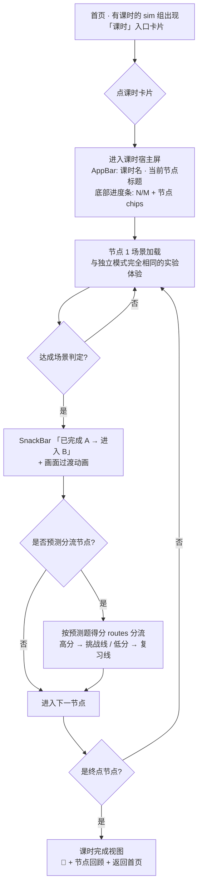
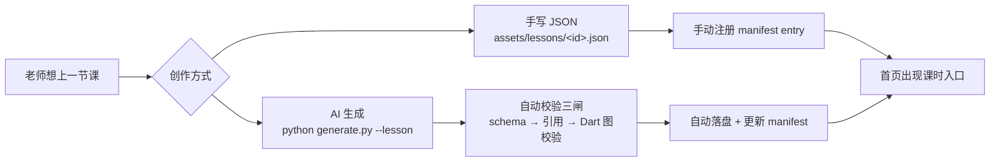

# 教学剧本（lesson-plan）交互与操作流程

> 基于已实现并通过测试的真实行为（req-lesson-runtime · P1+P2+P3 · 全量 461 通过）。
> 本文档面向「使用者」——学生怎么走完一节课、老师怎么创作一个剧本。

---

## 1. 学生侧：走完一节剧本课

### 1.1 整体流程



### 1.2 逐步操作说明

| 步骤 | 操作 | 系统响应 |
|---|---|---|
| 1. 找入口 | 首页电路组见「开关与电路诊断」、色觉组见「RGB 加色法」等课时卡片（与普通 sim 入口并列） | 无课时 sim 组不显示入口，界面与今天完全一致 |
| 2. 进入课时 | 点击课时卡片 | 自动加载剧本 → 课时宿主屏（顶部课时名+节点标题，底部进度条） |
| 3. 完成节点实验 | 在场景中做实验（操作元件/调参数/完成挑战） | 场景达成判定 → 弹出「✅ 已完成「节点A」→ 进入「节点B」」提示 + 画面平滑过渡到下一节点 |
| 4. 预测分流（条件课时） | 在做中学抽屉完成预测题（先猜后验） | 答完按得分路由：≥阈值走挑战线，否则走复习线（两条路最终汇合） |
| 5. 前置解锁 | 到达带 🔒 锁定的节点 | 未解锁节点灰显锁定；点击提示「节点未解锁」；完成前置节点后自动解锁 |
| 6. 重玩/跳转 | 点击进度条上**已解锁**的节点 chips | 直接跳到该节点重玩（已完成节点可重复实验） |
| 7. 课时完成 | 走完最后一个实验节点 | 完成视图：🎉 + 课时名 + 各节点回顾（✓ 清单）+「返回首页」按钮 |
| 8. 返回 | 点击「返回首页」 | 回到首页（进度不保存——内存态，退出即重新开始） |

### 1.3 进度条交互（关键控件）

```
┌──────────────────────────────────────────────────┐
│ 开关与电路诊断 · 电路诊断挑战        2/3          │ ← 第一行：当前节点标题 + 进度
│ [✓ 开关控制电路] [▶ 电路诊断挑战] [🔒 观察保险丝] │ ← 第二行：节点 chips（横向滚动）
└──────────────────────────────────────────────────┘
```

- **✓ 绿** = 已完成节点（可点击重玩）
- **▶ 蓝** = 当前节点
- **🔒 灰** = 未解锁节点（点击 →「节点未解锁」提示）
- 未完成未锁定节点 = 淡灰（点击跳转）

### 1.4 剧本模式的特殊行为

- **场景切换被禁用**：剧本模式下 circuit 屏的 AppBar 场景下拉、rgb 屏的场景菜单均隐藏——学生无法在节点内逃出剧本编排
- **跨 sim 课时**：一节课可混排 circuit + color_vision 场景（如「电与光的探索」），节点切换时自动换到对应 sim 的实验界面

---

## 2. 老师侧：创作一个剧本

### 2.1 两条创作路径



### 2.2 路径 A：手写剧本 JSON

在 `assets/lessons/<lesson-id>.json` 写一份剧本（**只引用既有场景，不复制场景数据**）：

```json
{
  "lessonId": "circuit-ohm-diagnosis",
  "name": "欧姆定律与电路诊断",
  "description": "探究 → 按预测表现分流挑战/复习 → 汇合",
  "entry": "n1",
  "nodes": [
    { "id": "n1", "title": "欧姆定律探究（含预测）",
      "scenario": { "sim": "circuit", "scenarioId": "simple-series" },
      "advance": { "type": "routes", "routes": [
        { "to": "n2-hunt", "when": { "type": "predictionScore",
          "params": { "nodeId": "n1", "metric": "ratio", "operator": "gte", "threshold": 0.5 } } },
        { "to": "n2-review", "when": null }
      ] } },
    { "id": "n2-hunt", "title": "挑战线",
      "scenario": { "sim": "circuit", "scenarioId": "open-circuit-debug" },
      "unlock": { "type": "nodeCompleted", "params": { "nodeId": "n1" } },
      "advance": { "type": "onCompleted", "to": "n-end" } },
    { "id": "n-end", "title": "课时完成", "scenario": null, "unlock": null, "advance": null }
  ]
}
```

然后手动在 `assets/lessons/manifest.json` 的 `lessons` 数组加一条 entry：
```json
{ "id": "circuit-ohm-diagnosis", "file": "circuit-ohm-diagnosis.json",
  "name": "欧姆定律与电路诊断", "sim": "circuit" }
```

**三种编排原语**（节点的 `advance`）：

| 原语 | 写法 | 用途 |
|---|---|---|
| 线性顺延 | `"advance": {"type": "next"}` | 按 nodes 数组顺序进下一个 |
| 完成跳转 | `"advance": {"type": "onCompleted", "to": "n2"}` | 显式指定完成后的目标节点 |
| 条件分流 | `"advance": {"type": "routes", "routes": [{when, to}…, {when: null, to}]}` | 按条件（预测得分/节点完成）分流，末项为兜底 |

**前置解锁**（节点的 `unlock`）：`unlock: 条件树` 或 `null`（无门禁）。条件叶子三选一：`nodeCompleted`（节点完成）/ `predictionScore`（预测得分）/ `scenarioSuccess`（场景判定达成）。

### 2.3 路径 B：AI 生成（推荐）

```bash
# 生成并写入（LLM 模式需 DEEPSEEK_API_KEY；或先看 prompt 手动喂）
python scripts/ai_scenario_gen/generate.py --lesson \
    --topic "我想上一节 40 分钟的欧姆定律课：先串联再并联，预测好的去挑战差的去复习" \
    --write

# 不写盘，只看 prompt 内容
python scripts/ai_scenario_gen/generate.py --lesson --topic "..." --print-prompt

# 手动把 LLM 输出喂给脚本（无 key 场景）
python scripts/ai_scenario_gen/generate.py --lesson --topic "..." --from-stdin
```

脚本自动完成：
1. 从 8 份 sim manifest 收集**可用场景清单**（自动剔除判定不可完成的场景，注入 prompt 防 AI 引用幻觉）
2. 调用 LLM 生成剧本 JSON
3. **三道校验闸**：JSON Schema 结构 → 场景引用存在性 → Dart 全量图校验（可达性/边界/引用）
4. 通过后写入 `assets/lessons/<lessonId>.json` + 自动更新 `manifest.json`（sim 字段按入口节点自动派生）

### 2.4 发布后的自动防线（无需老师操作）

| 防线 | 机制 |
|---|---|
| 引用守卫测试 | CI 断言每个剧本引用的场景都存在且可完成——场景被删/改名 → 测试红灯 |
| 运行时降级 | 剧本解析失败 → 该课时从入口隐藏（SnackBar「课时暂不可用」），其他课时与独立模式不受影响 |
| 结构校验 | schema 拦截拼错字段（additionalProperties: false） |

---

## 3. 关键设计约束（创作者须知）

- **终点节点**：每份剧本必须有一个 `scenario == null` 且 `advance == null` 的节点（课时完成）——学生进入它即完成课时
- **兜底路由必须存在**：`routes` 末项 `when` 必须为 null
- **场景只能引用已注册 sim**（当前 `circuit` / `color_vision`）且判定可完成（跨 sim 混排允许）
- **叶子三件套必填**：`id` / `type` / `description`
- **进度不持久化**：课时进度为内存态，退出重进 = 重新开始（P5 持久化未做，属独立决策）
- 创作后建议跑一次 `flutter run` 手动冒烟（走完一条课时验证端到端）
